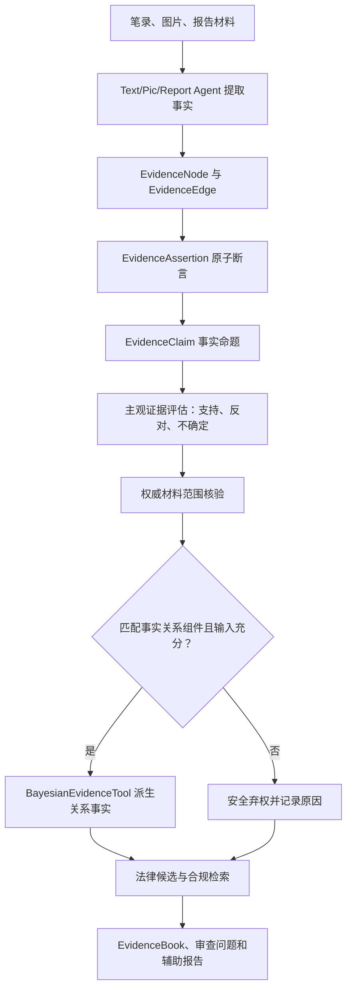

# Case Agent Demo

一个用于案件笔录、图片证据、报告材料和法律知识库协同分析的多 Agent demo。当前版本为 `v0.56.0`。

## 核心能力

- 读取 `evidence_vault` 中的笔录、证据图片、报告图片；
- 使用 Qwen Vision 描述图片证据并识别图片文字；
- 使用 DeepSeek 文本模型 profile 区分高/低推理任务；
- `TextAgent` 按单份笔录独立提取结构化事实，不把原始笔录全文写入 Case Graph；
- `PicAgent` / `ReportImageAgent` 对图片和报告材料先提炼证据事实，再入图；
- 构建兼容旧接口的 EvidenceGraph，包含 facts、nodes、edges、claims；
- 使用 ConfidenceEngine 为 EvidenceClaim 计算可解释综合置信度；
- 使用 SubjectiveEvidenceEngine 区分支持、反对、不确定和冲突；
- 使用范围受限的权威锚定处理经人工核验的专业意见；
- 使用注册表驱动的 `BayesianEvidenceTool` 执行六种同级、可组合的事实关系组件；
- 按事件、行为人和目标隔离贝叶斯 run，并记录参数哈希和输入来源；
- `ConflictAgent` 独立检测笔录、图片、报告之间的矛盾；
- 使用 LegalKnowledgeBaseTool 支持 PDF/txt/md/jsonl 入库、条文切片、软删除、更新、FTS5 与中文语义向量混合检索；
- 使用 Domain Affinity 对法律知识和案件事实进行领域相关度排序；
- FinalConflictAgent 输出证据冲突、证据不足、法律依据缺失、报告越界、低置信图片等审查问题；
- Judge Agent 负责反方 challenge；
- Review Agent 负责边界复核。

## 快速运行

```powershell
cd F:\汇报\Va1ha11a_demo
pip install -e .
python -m pytest -p no:cacheprovider tests -q
python -m case_agent_demo.cli --sample
```

## 配置真实模型

```powershell
Copy-Item config/api_keys.example.toml config/api_keys.toml
```

填写 `config/api_keys.toml` 后运行：

```powershell
python -m case_agent_demo.cli --evidence-dir evidence_vault
```

`--case-type` 仅用于兼容旧调用，不是运行前置条件。

## Prompt

Prompt 位于：

```text
config/prompts/
```

修改 prompt 后重新运行即可。

## 主要文档

- [环境配置](ENVIRONMENT.md)
- [项目介绍](项目介绍.md)
- [用户手册](用户手册.md)
- [技术手册](技术手册.md)
- [流程说明](WORKFLOW.md)

## 研判报告格式

报告类材料放入 `evidence_vault/report_images/`。该目录支持图片、Word 和 PDF：图片默认调用 Qwen 视觉模型，`.docx` 直接读取文本，`.pdf` 优先读取文本层；扫描版 PDF 请在 `evidence_vault/extracted/` 放入同名 `.txt`。

## 当前法律 RAG

`law_DB/` 中的《中华人民共和国刑法》《中华人民共和国治安管理处罚法》和《中华人民共和国刑事诉讼法》已经按条文入库。索引位于 `legal_knowledge/index/legal_kb.sqlite3`，使用 SQLite FTS5、`BAAI/bge-small-zh-v1.5` 本地中文向量、领域亲和度和检索目的共同排序；每个结果保留法律名称、条号、PDF 页码、文件哈希和分项得分。

```powershell
pip install -e ".[rag]"
python -m case_agent_demo.legal_kb_cli --root legal_knowledge ingest --source law_DB --embedding-provider fastembed
python -m case_agent_demo.legal_kb_cli --root legal_knowledge search "盗窃他人财物，如何区分治安处罚和刑事责任"
```

`LegalRetrievalTool.retrieve(payload)` 旧接口继续可用；Reasoning 与 FinalConflict 使用同一检索和回退路径。刑诉法已经补充证明标准和非法证据排除等程序依据，但当前语料仍未覆盖全部司法解释、证据规定、鉴定标准和地方裁量规范。

## v0.56 贝叶斯模型

模型注册表位于 `config/bayesian_models/registry.json`，包含 `conduct_result`、`property_taking`、`public_order`、`public_safety`、`status_duty` 和 `deception_disposition`。所有组件优先级均为 `0`，只推断事实关系，不推断法律责任或处罚。

当前参数状态为 `expert_prior_unvalidated`。统计采集模板位于 `docs/statistics/bayesian_parameter_collection_template.xlsx`，参数只允许离线校准和版本审批。

## v0.56 案件中立运行

当前实现不再要求人工指定案件类型，`--case-type` 仅作为兼容性提示：

```powershell
python -m case_agent_demo.cli --evidence-dir evidence_vault
```

系统先从报警、报案、证人陈述、行为人陈述和客观材料中提取原子事实，再形成 `EvidenceClaim`、证据评估、法律候选和 `EvidenceBook`。报警人控诉是优先的事实线索；证人肯定陈述、行为人自认和客观记录也可以形成正向锚点。单纯否认、猜测或“不记得”不能启动正向贝叶斯推理。

注册表当前包含 6 个可组合的事实关系组件：`conduct_result`、`property_taking`、`public_order`、`public_safety`、`status_duty`、`deception_disposition`。它们不是 6 类案件白名单，也不参与罪名分类；运行时只按 Claim 谓词、事件、主体和目标选择。注册表外的新事实仍会生成 Claim 和证据册，并返回 `no_matching_relation_component` 安全弃权，不会被硬套进最相近组件。

`EvidenceBook` 汇总涉案人员及角色、控诉内容、事实命题、时间地点、指认记录、客观情况、支持/反对/不确定材料、法律候选、贝叶斯运行与弃权原因。结论表达的是“现有证据支持、反对或不足以确认某项事实”，不是违法犯罪成立或处罚结论。

`law_DB/` 当前有 3 部 PDF，最新索引为 3 个文档、957 个条文块：

- 《中华人民共和国刑法》：505 个条文块；
- 《中华人民共和国治安管理处罚法》：144 个条文块；
- 《中华人民共和国刑事诉讼法》：308 个条文块。

索引清单和源文件哈希见 `legal_knowledge/metadata/corpus_manifest.json`。当前六个回放样本（五个传统场景和一个无人工案件类型的开放事实场景）只用于回归验收，不代表系统只能处理这些情形。

## 当前处理流程



报警人控诉是优先线索，但不是预设为真的结论。证人肯定陈述、行为人自认、监控、交易记录、鉴定和其他客观材料也可以提供正向支持；行为人否认、相反证言和反向客观记录进入反对证据；“不知道”“记不清”“无法确认”进入不确定证据。

## EvidenceBook 输出

`WorkflowResult.evidence_book` 是当前最适合人工复核的结构化输出，包含：

| 字段 | 内容 |
| --- | --- |
| `participants` | 涉案人员及其报警人、被指称行为人、证人、受影响人员等角色 |
| `allegations` | 谁指称谁实施了什么行为，以及时间、地点、对象 |
| `fact_findings` | 每项 Claim 的支持、反对、不确定材料及当前状态 |
| `objective_circumstances` | 监控、交易、鉴定、登记、图片等客观情况 |
| `identifications` | 辨认人、被辨认对象、时间地点和原始材料 |
| `legal_candidates` | 可能相关的法律条款及检索依据，不是最终法律适用结论 |
| `bayesian_runs` | 实际运行的关系组件、输入 Claim、参数版本和派生值 |
| `bayesian_abstentions` | 未运行的原因，例如无匹配组件或缺少必需输入 |
| `missing_evidence` | 围绕争议或证据不足事实生成的补证方向 |

## 贝叶斯安全弃权

贝叶斯 Tool 只有在事实谓词匹配、存在正向锚点且必需输入齐备时才运行。三类主要弃权原因是：

- `no_matching_relation_component`：当前注册表没有适用的跨 Claim 关系组件；
- `missing_allegation_anchor`：匹配了组件，但没有获得正向支持的锚点事实，字段名为兼容保留；
- `missing_required_inputs`：已有锚点，但缺少组件声明的关键事实输入。

弃权不表示“没有违法行为”，只表示当前不能可靠计算跨事实派生值。系统仍保留 EvidenceGraph、Claim 评估、RAG 候选、EvidenceBook 和人工补证入口。

## 当前验证

```powershell
python -m pytest -q -p no:cacheprovider
python -m case_agent_demo.case_replay --root 测试用例
python -m case_agent_demo.legal_kb_cli --root legal_knowledge stats
```

当前工作区核验结果为 228 项测试通过、6 个真实 workflow 回放通过，法律索引为 3 个文档、957 个条文块。回放用例用于防止回归，不构成案件支持范围白名单。

## 结论边界

本项目回答的是“现有材料对某项事实命题形成何种支持、反对或不确定状态”，并给出可追溯的事实关系与法律候选。它不输出有罪概率，不替代有权机关作出违法犯罪成立、责任承担或处罚决定。
