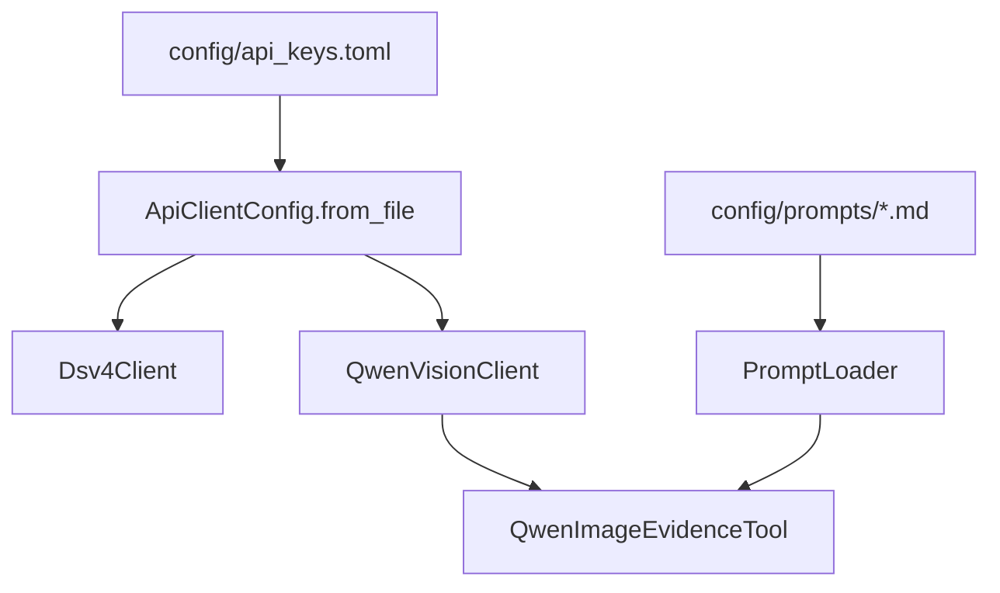
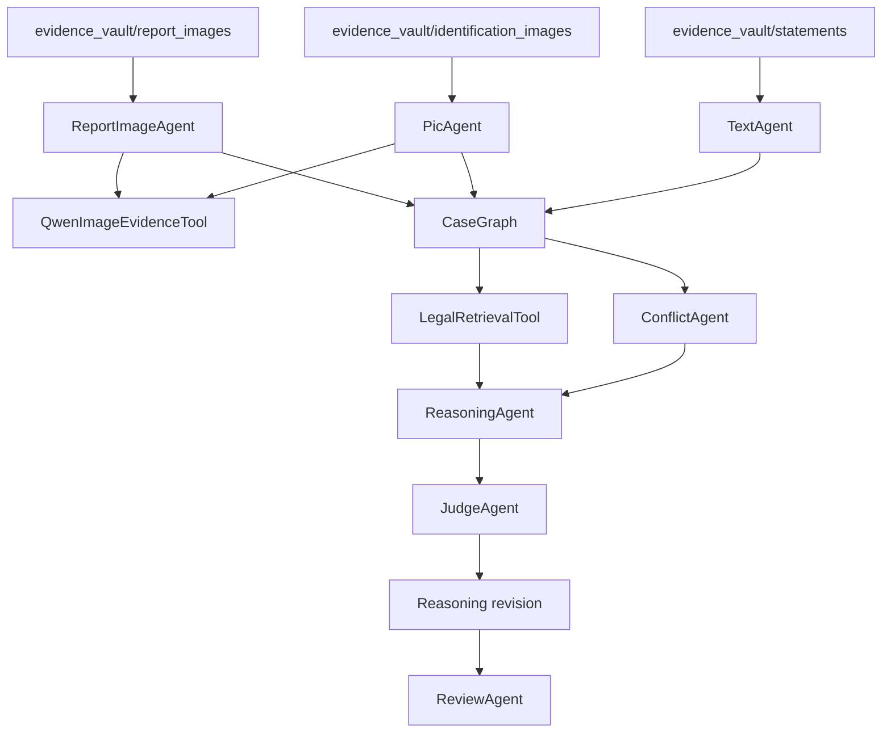

# 项目技术架构

## 7. Agent Runtime 与上下文隔离

本分支新增 `AgentRuntime`，用于统一处理 prompt 加载、OpenAI-compatible 调用、JSON 解析和 fallback。文本类 agent 可以选择注入 runtime；未注入 runtime、API 不可用或返回内容无法解析时，系统回退到现有规则逻辑，保证 demo 可离线运行。

`PlanningAgent` 在执行分析前生成 `MaterialPlan`。该计划记录 statement task、evidence image group task、report image group task，作为后续调度依据。

上下文隔离规则：

- `TextAgent` 每次只处理一个 statement material；
- `PicAgent` 在 Qwen 可用时按图片文件夹调用 `describe_group`；
- `ReportImageAgent` 在 Qwen 可用时按报告图片文件夹调用 `describe_group`；
- `ReasoningAgent` 的 runtime 输入只来自 Case Graph、Conflict 和 LegalMatch，不接收原始材料全集。
## 1. 当前定位

本项目是 Python + LangChain Core 搭建的多 Agent 案件证据分析 demo。它面向真实 LLM 接入，支持 DeepSeek 文本模型、Qwen 视觉模型、证据文件夹、静态法律库、Case Graph、Conflict、Judge challenge 和 Review。

## 2. 核心目录

```text
case_agent_demo/
  agents.py           # Planning/Text/Pic/Report/Conflict/Reasoning/Judge/Review
  workflow.py         # CaseWorkflow 编排
  models.py           # Material、Fact、CaseGraph、LegalMatch 等数据结构
  evidence_intake.py  # 证据文件夹扫描
  tools.py            # LegalRetrievalTool
  config.py           # 模型 profile
  llm_clients.py      # OpenAI-compatible API client
  prompt_config.py    # PromptLoader
  vision_tools.py     # Qwen 图片证据工具
  cli.py              # 命令行入口

config/
  api_keys.example.toml
  api_keys.toml       # 本地真实 key，已忽略
  prompts/
```

## 3. 模型分工

| 模块 | 推荐模型 |
| --- | --- |
| Planning | deepseek-v4-pro |
| Text | deepseek-v4-flash |
| Pic / Vision | qwen2.5-vl-72b-instruct |
| ReportImage | qwen2.5-vl-72b-instruct + deepseek-v4-pro |
| Conflict | deepseek-v4-pro |
| Legal Retrieval | deepseek-v4-flash / 静态检索 |
| Reasoning | deepseek-v4-pro |
| Judge | deepseek-v4-pro |
| Review | deepseek-v4-pro |

## 4. 配置流



## 5. 证据流



## 6. 关键边界

- Planning 只能建议案件类型，执行前必须有人确认案件定性；
- Reasoning 只能基于 Case Graph、Conflict、LegalMatch 输出；
- Judge 只负责 challenge，不作最终裁判；
- Review 拦截最终性法律判断；
- API key 只放在 `config/api_keys.toml`；
- Prompt 放在 `config/prompts/`，不硬编码在 Agent 中。
