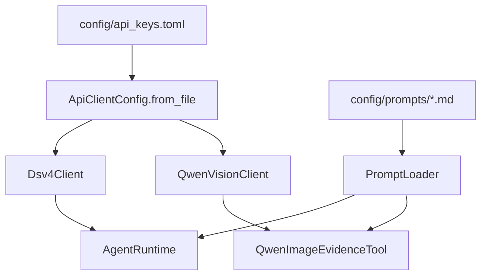
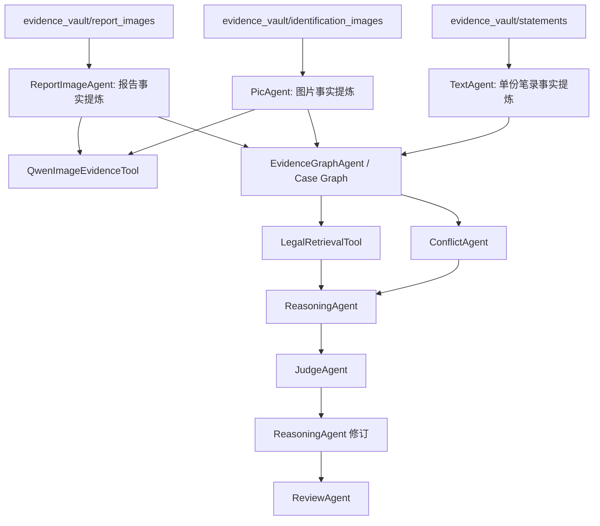

# 项目技术架构

## 1. 当前定位

本项目是 Python + LangChain Core 搭建的多 Agent 案件证据分析 demo。它面向真实 LLM 接入，支持 DeepSeek 文本模型、Qwen 视觉模型、证据文件夹、静态法律库、Case Graph、Conflict、Judge challenge 和 Review。

当前法律依据检索是 `LegalRetrievalTool` 读取静态 JSONL 法律库，不是向量 RAG，也不是独立 Rag Agent。后续如果升级向量检索，应优先把 retriever 接到这个工具接口后面。

## 2. 核心目录

```text
case_agent_demo/
  agents.py           # Planning/Text/Pic/Report/Conflict/EvidenceGraph/Reasoning/Judge/Review
  workflow.py         # CaseWorkflow 编排
  models.py           # Material、Fact、CaseGraph、LegalMatch 等数据结构
  evidence_intake.py  # 证据文件夹扫描与材料读取
  tools.py            # LegalRetrievalTool / RagLegalAgent 兼容包装
  config.py           # 模型 profile
  llm_clients.py      # OpenAI-compatible API client
  prompt_config.py    # PromptLoader
  vision_tools.py     # Qwen 图片证据工具
  cli.py              # 命令行入口

config/
  api_keys.example.toml
  api_keys.toml       # 本地真实 key，已忽略
  prompts/

legal_library/
  laws.jsonl          # 静态法律库
```

## 3. 模型分工

| 模块 | 推荐模型 / 工具 |
| --- | --- |
| Planning | deepseek-v4-pro |
| Text | deepseek-v4-flash，失败时走规则 fallback |
| Pic / Vision | qwen2.5-vl-72b-instruct 或账号有权限的 Qwen VL 模型 |
| ReportImage | Qwen VL + deepseek-v4-pro，文档文本可直接读取 |
| EvidenceGraph | 结构化合并 |
| Conflict | deepseek-v4-pro 或规则 fallback |
| Legal Retrieval | 静态 JSONL 检索工具 |
| Reasoning | deepseek-v4-pro |
| Judge | deepseek-v4-pro |
| Review | deepseek-v4-pro |

## 4. 配置流



## 5. 证据流



## 6. Agent Runtime 与上下文隔离

`AgentRuntime` 统一处理 prompt 加载、OpenAI-compatible 调用、JSON 解析和 fallback。文本类 Agent 可以选择注入 runtime；未注入 runtime、API 不可用或返回内容无法解析时，系统回退到规则逻辑，保证 demo 可离线运行。

`PlanningAgent` 在执行分析前生成 `MaterialPlan`。该计划记录 statement task、evidence image group task、report image group task，作为后续调度依据。

上下文隔离规则：

- `TextAgent` 每次只处理一个 statement material；
- `PicAgent` 在 Qwen 可用时按图片文件夹调用 `describe_group`；
- `ReportImageAgent` 在 Qwen 可用时按报告图片文件夹调用 `describe_group`；
- `ReasoningAgent` 的 runtime 输入只来自 Case Graph、Conflict 和 LegalMatch，不接收原始材料全集。

## 7. TextAgent 事实提炼

`TextAgent` 的目标是把单份笔录提炼为 `Fact`，而不是把整段问答写入数据库。`Fact` 包含：

```text
fact_id
source_material_id
source_type
person
behavior
time
location
object
confidence
```

当前规则 fallback 会优先识别：

- 暴力/伤害行为，例如拉拽、抱摔、掐脖子及伤情后果；
- 财物损坏行为，例如摔坏手机、砸坏门锁、屏幕损坏；
- 财物转移行为，例如拿走、窃取；
- 否认类陈述，例如没有打架、没有动手、没有拿、没有损坏、没有受伤。

否认类事实会保留为独立 `Fact`，供 `ConflictAgent` 与报告、图片、物证事实交叉检测。

## 8. 静态法律库检索

`LegalRetrievalTool` 从 `legal_library/laws.jsonl` 读取法条，输出 `LegalMatch`。当前不是向量 RAG。

匹配策略：

- 案件类型匹配的法条可以按较低阈值命中；
- 跨案件类型法条必须有更强关键词或构成要素命中；
- 盗窃条款需要“盗窃、偷、窃取、拿走、非法占有、秘密窃取”等强语义；
- “手机、财物、物品、现场、人员”等泛化词不会单独触发跨类型法条；
- “摔坏、损坏、毁坏、砸坏、屏幕损坏”等上下文可关联故意毁坏财物类依据。

这可以避免“手机被摔坏”仅因包含“手机/财物”而误匹配刑法第二百六十四条盗窃罪。

## 9. 报告材料接入

`evidence_vault/report_images/` 是报告类材料入口，不再只表示图片目录：

- `.jpg` / `.jpeg` / `.png`：进入 `ReportImageAgent`，通过 Qwen 视觉模型生成图片描述和文字识别结果；
- `.docx`：由证据导入层直接提取 Word 文本，生成报告类 `Material`；
- `.pdf`：优先提取 PDF 文本层；扫描版或不可提取文本的 PDF 使用 `evidence_vault/extracted/<同名>.txt` 作为人工文本覆盖。

系统不在本地运行 OCR。图片理解交给 Qwen API，文档文本只读取可解析文本层或人工提供的同名文本。

## 10. 关键边界

- Planning 只能建议案件类型，执行前必须有人确认案件定性；
- Reasoning 只能基于 Case Graph、Conflict、LegalMatch 输出；
- Judge 只负责 challenge，不作最终裁判；
- Review 拦截最终性法律判断和超出证据/法条边界的表述；
- API key 只放在 `config/api_keys.toml`；
- Prompt 放在 `config/prompts/`，不硬编码在 Agent 中。
