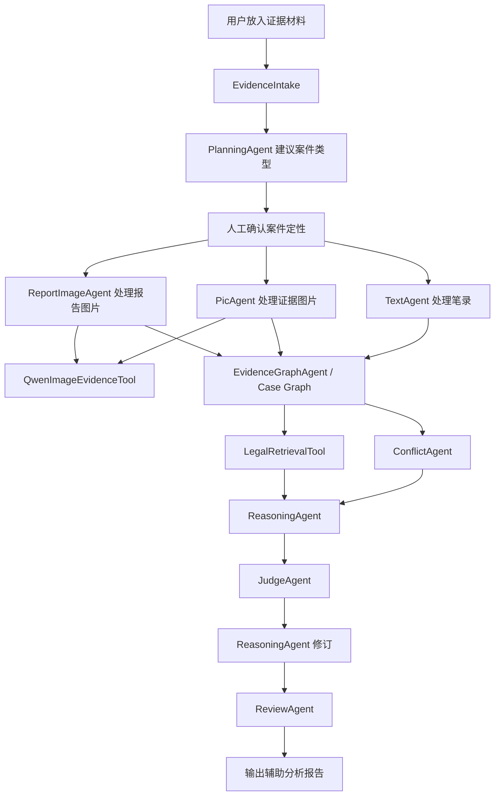
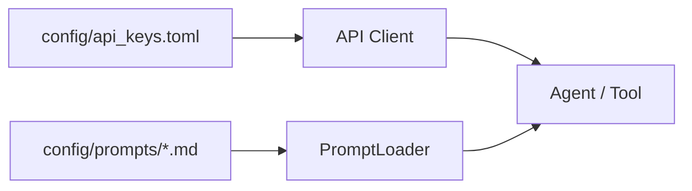

# 流程说明

## 1. 总体流程

## 2. 配置流程

## 3. 人工门

PlanningAgent 只提出案件类型建议。用户必须传入或确认 `--case-type` 后，后续 Agent 才执行。

## 4. 图片证据

真实证据目录默认调用 Qwen Vision。人工修正文本可写入 `evidence_vault/extracted/同名.txt`，系统会优先使用人工文本。

## 5. 输出边界

报告只作为辅助分析，不输出最终定罪、处罚、责任承担等结论。
