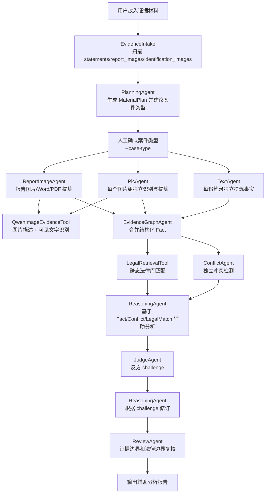
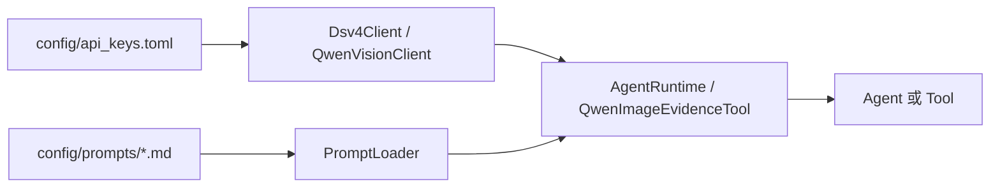

# 流程说明

## 1. 总体流程

## 2. 执行顺序

1. `EvidenceIntake` 扫描证据目录。
2. `PlanningAgent` 生成材料盘点 `MaterialPlan`。
3. 用户通过 `--case-type` 人工确认案件类型。
4. `TextAgent` 按每份笔录独立提取结构化事实。
5. `PicAgent` 按证据图片文件夹独立调用 Qwen 视觉并提炼事实。
6. `ReportImageAgent` 处理报告图片、Word、PDF，并提炼事实。
7. `EvidenceGraphAgent` 合并结构化 facts。
8. `ConflictAgent` 独立检测冲突。
9. `LegalRetrievalTool` 从 `legal_library/laws.jsonl` 返回静态法律依据。
10. `ReasoningAgent`、`JudgeAgent`、`ReviewAgent` 完成报告、质询和边界复核。

## 3. 配置流程

## 4. 人工门

`PlanningAgent` 只提出案件类型建议和材料处理计划。用户必须传入或确认 `--case-type` 后，后续 Agent 才执行。

## 5. 事实入图规则

进入 Case Graph 的是结构化 `Fact`，不是原始材料全文。

`TextAgent` 会把笔录中的关键内容提炼为“谁、何时、何地、做了什么、对象/后果”。例如“李文杰摔坏手机”“李文杰称没有打架”。这些事实随后用于冲突检测、法条检索和推理报告。

`PicAgent` 和 `ReportImageAgent` 也遵循同样原则：先从 Qwen 视觉结果或文档文本中提炼事实，再进入 Case Graph。

## 6. 法律依据检索

`LegalRetrievalTool` 是共享工具，不是独立 Agent。它读取 `legal_library/laws.jsonl`，并根据案件类型、行为事实、关键词和构成要素返回 `LegalMatch`。

当前匹配会过滤过于泛化的跨类型命中。例如“摔坏手机”不会仅因出现“手机/财物”匹配盗窃条款；盗窃条款需要“盗窃、偷、窃取、拿走、非法占有”等更强行为语义。

## 7. 输出边界

报告只作为辅助分析，不输出最终定罪、处罚、责任承担等结论。`JudgeAgent` 负责提出反方 challenge，`ReviewAgent` 负责检查报告是否超出证据边界或法律依据边界。
