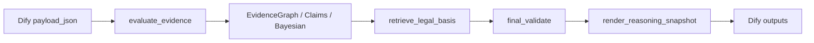

# v0.58 Dify 迁移记录

## 结果

Va1ha11a v0.58 的确定性推理核心已经作为本地 Dify Tool Plugin 安装到 Dify 1.15.0，并通过导入的 DSL 0.6.0 工作流完成 10 个复杂合成案件的实际服务 API 验收。

## 架构



插件暴露且只暴露四个工具：

1. `evaluate_evidence`
2. `retrieve_legal_basis`
3. `final_validate`
4. `render_reasoning_snapshot`

插件复制经过验证的 v0.58 运行时代码、配置、法律 SQLite 索引和本地中文向量模型；Dify 包装层不另写一套证据或贝叶斯算法。

## 实际安装

- Dify：`1.15.0`
- Plugin Daemon：`0.6.3-local`
- 插件 ID：`va1ha11a/case_evidence_v058`
- 插件版本：`0.58.0`
- 插件内容校验：`93400aa07323a6ecb7ed273f14d77fc4f70095d9b46318ee15fe2755d178284c`
- 插件包 SHA-256：`8d6b8debbd94f51f90bbced8178a246e2bb90348d4329fc24d0a779a563a32ab`
- 本机应用 ID：`8b13bd15-f2fa-4e2e-b6fb-290c372b7f46`
- 本次工作流 ID：`08912694-40ef-4775-8cd1-d782969d3a19`

本机 ID 仅用于审计，重新导入后会变化。

## 验收

10 个案件均通过 Dify `/v1/workflows/run` 返回 HTTP 200，并逐案验证：

- 必需 EvidenceClaim 与状态；
- 贝叶斯模型选择或安全弃权；
- 必需法律条文召回；
- 必需 ValidationIssue；
- fact、assertion、claim 三层可视化节点；
- 独立 HTML 推理快照。

最终回归：

```text
主工程：265 passed
可移除可视化插件：5 passed
Dify 迁移工程：14 passed
Dify 语义一致性：10/10 passed
```

## 独立交付

交付目录：

```text
F:\汇报\Va1ha11a_dify_v0.58
```

目录包含插件包和源代码、DSL、法律原文、10 例输入/实际输出、测试包、部署/使用/技术/验收文档和 SHA-256 校验表；不包含 Dify `.env`、密钥、Cookie 或真实案件材料。

## 运行边界

当前已验收 DSL 的入口是 v0.58 结构化案件 JSON。真实材料的 DOCX/PDF/图片抽取和语义理解仍使用原工程 Prompt 与部署单位在 Dify 配置的模型 Provider；模型凭据不得打包到插件或 DSL。
