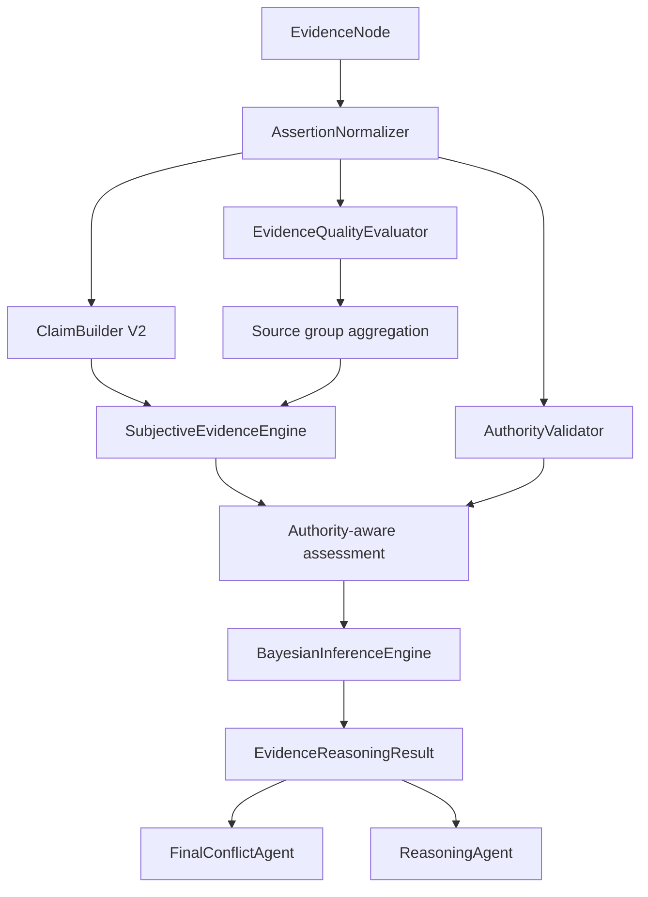

# Authority-Aware Bayesian Evidence Engine Design

## Goal

Replace the current single-score confidence heuristic with an explainable evidence reasoning layer that preserves the current v0.51 framework. The implementation must distinguish extraction quality from claim support, prevent duplicate-source inflation, represent supporting/opposing/ambiguous evidence, give verified professional conclusions scope-limited authority, and infer only cross-claim dependencies through a small versioned Bayesian model.

## Compatibility

`Fact`, `EvidenceNode`, `EvidenceClaim`, `ConfidenceProfile`, and `ConfidenceEngine.score_claims()` remain available. Existing agents continue producing `Fact` objects. A new normalizer converts graph nodes into structured assertions, and the old confidence profile becomes a compatibility view over the new claim opinion.

## Data Flow

## Assertion And Claim Semantics

An assertion separates declarant, actor, predicate, target person, object, event, stance, modality, source group, and origin evidence. The normalizer prefers structured node metadata and uses conservative text rules only as fallback. `lack_of_memory` and `uncertain` assertions are ambiguous, not supporting. Claims are keyed by actor, predicate, target/object, and event; injury-grade claims therefore remain separate from violence and causation claims.

## Evidence Fusion

Evidence quality is a weighted geometric mean of extraction quality, relevance, specificity, directness, authenticity, procedural integrity, internal consistency, and verifiability. Identity categories do not receive fixed truth weights. Assertions sharing an origin/source group are combined with a maximum-per-stance rule before cross-group accumulation.

The subjective evidence layer computes positive evidence `R`, negative evidence `S`, belief, disbelief, uncertainty, projected support, and conflict index. These values are an evidence support assessment, not a calibrated probability of truth.

## Authority Rules

Authority is never inferred merely because a material is official. A technical anchor requires explicit or safely inferred validation flags for competence, authenticity, procedure, subject identity, standard, and scope. Forensic injury conclusions may anchor `injury_exists` and `injury_grade`; they may not anchor actor identity, violence, intent, causation, or criminal liability. A conflicting reappraisal or validity defect changes the result to `authority_contested`.

## Bayesian Model

A standard-library inference engine loads a versioned JSON model and supports `prior`, `logistic`, and `noisy_or` nodes. The first model is a compact intentional-injury template. Existing claim opinions enter as soft evidence; only derived nodes such as causation receive Bayesian output. The model must never feed injury-grade evidence backward into actor identity or violent-action claims.

## Workflow And Reporting

`CaseWorkflow` calls one `EvidenceReasoningEngine` after graph construction. Its result supplies compatible scored claims plus assertions, claim assessments, Bayesian trace, and model versions. Final conflict review uses assessment status to create contested, insufficient, opposing-dominant, authority-contested, and causation-gap issues. Report generation receives assessment summaries so disputed or insufficient claims are not presented as settled facts.

## Error Handling And Audit

Missing or invalid Bayesian configuration produces an explicit model error; it does not silently invent parameters. Every result records model id, version, parameter hash, and calibration status. When no configured model applies to a case type, subjective evidence and authority assessment still run and Bayesian output is empty.

## Test Boundaries

Tests cover assertion normalization, claim grouping, duplicate-source control, denial and ambiguity, authority scope and defeaters, Bayesian causation behavior, compatibility facade behavior, workflow exposure, and final-review issue generation. Existing 88 tests remain regression coverage.
