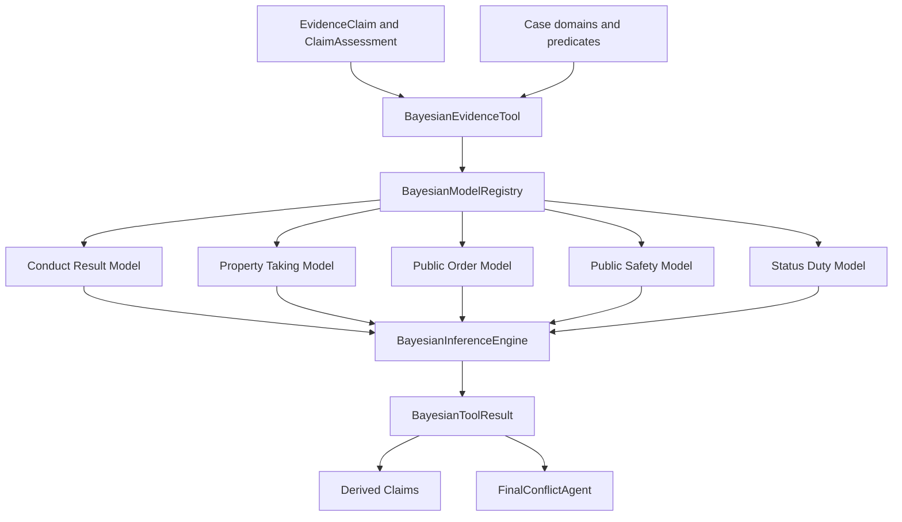

# General Bayesian Evidence Tool Design

## Goal

Replace the intentional-injury-specific routing with a case-neutral Bayesian evidence tool. All case families have equal registry priority, a case may select multiple reusable models, and legal rules remain separate from probabilistic factual inference.

## Constraints

- Preserve `BayesianInferenceEngine`, `EvidenceReasoningEngine.evaluate()`, `CaseWorkflow.run()`, and existing result fields.
- Do not derive guilt, punishment, or final legal applicability as a probability.
- Do not assign fixed credibility solely from declarant role.
- Keep authority scope, legal thresholds, and statutory exceptions outside learned Bayesian parameters.
- Treat every numeric model as versioned and uncalibrated until real-data validation marks it otherwise.
- Do not stage or modify user-owned `law_DB/` and `测试用例/`.

## Architecture



## Equal-Priority Model Registry

`config/bayesian_models/registry.json` is the only routing source. Every entry has the same default priority and declares domains, trigger predicates, model path, input mappings, and derived nodes. Selection is based on domain or predicate overlap, never an `if case_type == intentional injury` branch.

The initial reusable model families are:

1. `conduct_result_v1`: conduct, result, mechanism, time, alternative cause, causation.
2. `property_taking_v1`: prior possession, taking, possession transfer, recovery/trace, alternative explanation.
3. `public_order_v1`: conduct, public context, persistence/group conduct, operational impact, order disruption.
4. `public_safety_v1`: hazardous conduct, dangerous object/condition, exposure, control failure, public danger.
5. `status_duty_v1`: qualified actor, duty, prohibited conduct, missing authorization, duty violation.

One case may select multiple model families. Personal injury uses `conduct_result_v1`; it is no longer a special module.

## Legal Element Boundary

The tool consumes factual Claim predicates. Statutory age, amount, frequency, legal status, defenses, exemptions, and the administrative/criminal boundary are deterministic legal elements and are not Bayesian outputs. The initial legal-element taxonomy records these distinctions and cites the Criminal Law and Public Security Administration Punishments Law supplied in `law_DB/` without ingesting or committing those PDF files.

## Runtime Contract

```python
BayesianEvidenceTool.evaluate(
    case_domains: list[str],
    claims: list[EvidenceClaim],
    claim_assessments: list[ClaimAssessment],
) -> BayesianToolResult
```

The result records selected models, per-model inference traces, derived Claim assessments, parameter hashes, calibration statuses, skipped models, and input Claim IDs. `EvidenceReasoningEngine` remains the compatibility orchestration entry point.

## Statistical Data Workbook

Generate `docs/statistics/bayesian_parameter_collection_template.xlsx` with these sheets:

- `填写说明`
- `原子事实核验`
- `来源观测统计`
- `抽取准确率`
- `来源依赖`
- `案件族CPD`
- `权威锚定复核`
- `模型发布记录`
- `枚举值`

The workbook contains no personal data. It defines claim-level labels, TP/FP/FN/TN, Beta posterior fields, extraction quality, provenance dependencies, CPD observations, authority validity, model versions, and approval metadata. Formulas are examples only and must not convert unknown labels into false labels.

## Documentation

`docs/statistics/BAYESIAN_PARAMETER_COLLECTION_GUIDE.md` explains field definitions, formulas, collection workflow, independent verification, privacy controls, offline parameter publication, and which values must remain legal rules or expert priors.

## Testing

- Registry selection is case-neutral and multi-model.
- No intentional-injury string branch remains in runtime routing or final validation.
- Existing intentional-injury behavior works through `conduct_result_v1`.
- Property taking and public-order examples select peer templates.
- Unknown/no-match cases retain subjective evidence results with empty Bayesian output.
- Workbook exists, opens, has all required sheets, formulas, headers, freeze panes, filters, and data validation.
- Existing project tests remain green.
