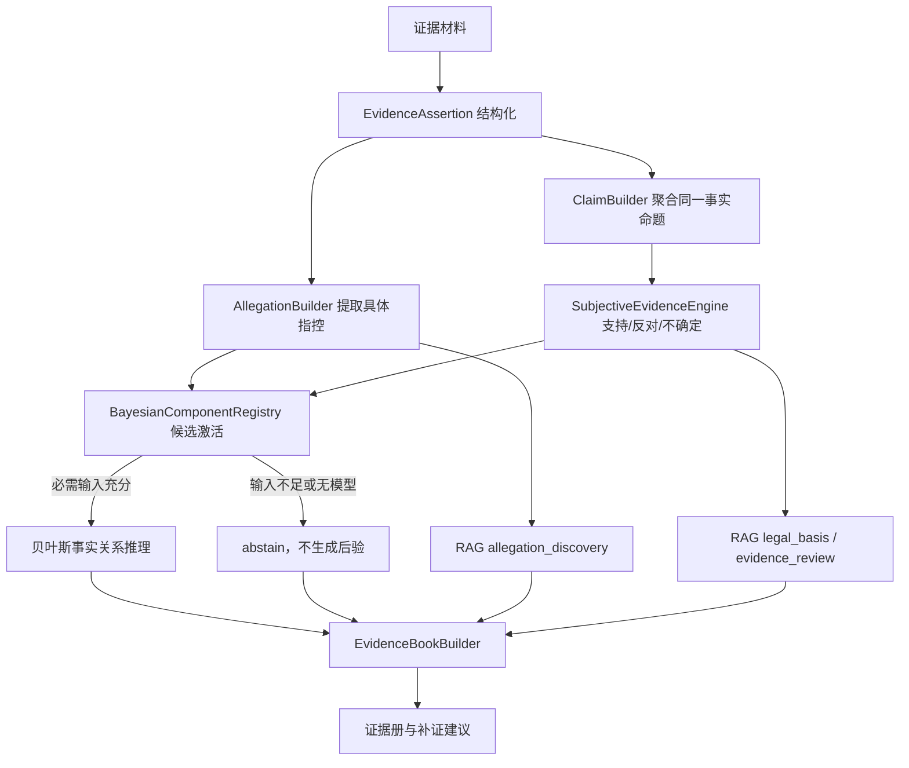

# v0.56 案件中立、指控驱动的证据推理设计

## 1. 目标

系统不得以人工填写案件类型作为运行前提，也不得把五类回放样例当成能力边界。
无论材料最终可能涉及何种治安违法、刑事犯罪或尚无法分类的行为，系统都应先完成：

1. 识别涉案人员及其材料内角色；
2. 提取报警人、被害人等提出的具体事实指控；
3. 将指控拆成可被证据支持、反对或保持不确定的事实 Claim；
4. 区分控诉陈述、辩解陈述和客观观察材料；
5. 检索可能相关的实体法、程序法和证据规范；
6. 仅在存在已批准的事实关系模型且输入充分时运行贝叶斯组件；
7. 输出可追溯的证据册，不直接代替执法、检察或审判人员作最终法律认定。

## 2. 法理边界

系统必须区分三个层次：

- **材料层**：某份材料记载、观察或声称了什么；
- **事实层**：某个 Claim 获得多少支持、反对，或者仍无法判断；
- **法律层**：候选规范的构成要素目前覆盖到什么程度、缺少什么。

“证据不足”不等于“已经证明没有该行为”。事实状态至少包括：

- `supported`：现有材料形成支持；
- `contested`：支持和反对材料均存在；
- `insufficient`：尚无足够材料形成稳定判断；
- `opposing_dominant`：反向材料占优；
- `refuted`：存在能够正面排除该事实的材料；
- `unassessed`：尚未进入有效评估。

输出使用“现有证据支持/不支持/不足以判断某项事实”等表达，不输出“某人已经违法、构成某罪”之类最终结论。

## 3. 总体结构

## 4. 案件类型的地位

`confirmed_case_type` 改为可选的人工作业标签，只用于显示、人工覆盖或缩小检索范围，不能成为工作流门禁。

系统自行输出：

- `inferred_case_domains`：由材料和 Claim 推断的事实/法律领域；
- `legal_candidates`：RAG 召回的候选法律规范；
- `candidate_case_labels`：仅供人工复核的候选案件标签。

没有任何候选标签时，系统仍必须输出证据册。

## 5. 指控驱动

为 Assertion 增加 `assertion_role`：

- `allegation`：报警人、被害人或其他材料提出的待核实指控；
- `defense_response`：被指控人对同一事实的承认、否认、部分否认或替代解释；
- `evidence_observation`：监控、照片、鉴定、记录等材料直接呈现的观察；
- `context`：身份、关系、时间背景等不直接证明行为的材料。

控诉只激活候选 Claim 和候选贝叶斯组件，不自动获得“事实成立”地位。它必须和其他 Assertion 一样进入支持、反对和不确定评估。

## 6. 可复用贝叶斯组件

不建立“每个罪名一张网络”，也不建立包含全部法律事实的巨大网络。模型注册表只保存可跨案件复用的事实关系组件，例如：

- `conduct_result`：行为、结果、机制和时间关系；
- `possession_change`：原占有、取得控制、去向及替代解释；
- `deception_disposition`：虚假陈述、认识错误、财产处分和损失；
- `coercion_compliance`：胁迫、受迫行为及结果；
- `authorization_scope`：行为、授权记录和职责范围；
- `event_occurrence`：人员、事件、客观记录之间的归属关系。

组件激活必须满足：

1. 存在 `allegation` 角色的肯定式 Assertion；
2. 谓词属于组件注册表允许的触发谓词；
3. Assertion 的 actor、target/object、event 可形成明确分组；
4. 必需输入至少存在一个非完全不确定的 ClaimAssessment；
5. 参数文件通过固定版本和哈希校验。

案件域只能用于候选召回，不能单独激活模型。缺少必需输入时返回 `abstained_runs`，不得用 `0.5` 或模型 prior 伪装成案件证据。

## 7. 法律 RAG 的三个目的

- `allegation_discovery`：允许使用尚未证实的指控发现候选实体法，但结果必须标注为候选；
- `legal_basis`：只使用已经得到一定证据支持的 Claim 检索可能适用的实体法；
- `evidence_review` / `procedure_compliance`：检索刑事诉讼法、证据规范和办案程序，审查取证、查证和证明缺口。

新入库的《中华人民共和国刑事诉讼法》应分类为 `criminal_procedure_law`，并在证据审查目的下优先排序。

## 8. 证据册

新增 `EvidenceBook`，至少包含：

- `participants`：人员、材料内角色及角色依据；
- `allegations`：控诉人、被指控人、具体指控、时间、地点、对象和来源；
- `fact_findings`：每个 Claim 的支持、反对、模糊材料和当前状态；
- `objective_circumstances`：监控、图片、鉴定、交易记录、现场记录等；
- `conflicts`：相互矛盾的 Assertion/Claim；
- `legal_candidates`：候选法律、条款、召回目的和构成要素缺口；
- `bayesian_runs`：实际运行、跳过和 abstain 的模型及参数版本；
- `missing_evidence`：针对争议和不足 Claim 的补证方向；
- `conclusion_boundary`：说明系统结论只代表当前证据状态。

## 9. 未特化案件的安全兜底

遇到诈骗或未来没有注册事实关系组件的案件时：

1. 正常生成 Assertion、Allegation、Claim 和 ClaimAssessment；
2. 正常检索候选法律条款；
3. 正常输出参与人、时间地点、指认、客观材料、冲突和缺口；
4. 贝叶斯层返回“无已批准组件”或“必需输入不足”；
5. 不生成虚构的后验概率，也不阻塞工作流。

## 10. 兼容策略

- 保留现有 `confirmed_case_type` 字段和五类回放，作为兼容输入与回归测试；
- 保留旧 `ConfidenceEngine` facade；
- 不删除已有 v0.51 文档内容；文档更新仅在末尾新增 v0.56 章节；
- 旧调用传入案件类型时仍可运行，但不再是必填项。

## 11. 验收

1. 不传 `case_type` 可以完成工作流；
2. 未特化事实仍能生成证据册；
3. 控诉可激活候选组件，但不自动证明事实；
4. 纯否认和全模糊材料不会形成正向贝叶斯输入；
5. 必需输入不足时模型 abstain；
6. 同一案件中的多个指控可分别评估；
7. RAG 能区分 allegation discovery、legal basis 和 evidence review；
8. 刑事诉讼法被正确分类并用于证据审查；
9. 五类旧回放继续通过；
10. 新增至少一个未特化案件回放，并验证不会输出最终违法犯罪结论。
