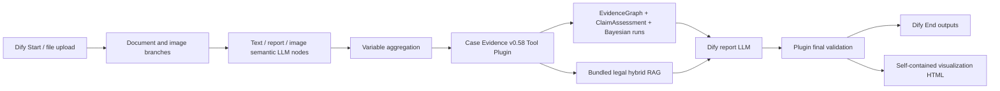

# Dify Full Migration Design

## 1. Objective

Migrate the complete v0.58 case-evidence workflow into the local Dify 1.15.0 platform at `F:\dify`, preserve deterministic evidence reasoning and legal retrieval, and produce a standalone delivery copy under `F:\汇报`.

The migration is platform-native at the orchestration boundary: users upload materials and run the process in Dify. Deterministic computation is packaged as a Dify Tool Plugin rather than left as an unrelated external service.

## 2. Chosen Architecture



The design uses:

- Dify Workflow DSL version `0.6.0`;
- one Python 3.12 Tool Plugin;
- the existing v0.58 prompts in Dify LLM nodes;
- the existing deterministic Python engines inside the plugin;
- the existing prebuilt SQLite legal index and three source-law PDFs;
- no separate always-running FastAPI service.

This preserves the current algorithms while allowing Dify to own file input, LLM orchestration, workflow traces, user-facing execution, and output delivery.

## 3. Migration Directory

Primary migration workspace:

```text
F:\dify\case-evidence-v058\
  app\
    case-evidence-v058.yml
  plugin\
    manifest.yaml
    main.py
    privacy.md
    provider\
    tools\
    case_agent_demo\
    config\
    legal_knowledge\index\legal_kb.sqlite3
  knowledge\
    刑法.pdf
    治安管理处罚法.pdf
    刑诉法.pdf
  tests\
  scripts\
    package-plugin.ps1
    install-local.ps1
    smoke-test.ps1
  MIGRATION.md
  CAPABILITY_MAPPING.md
  VERIFICATION.md
```

Standalone delivery copy:

```text
F:\汇报\Va1ha11a_dify_v0.58\
```

The delivery copy includes the importable DSL, plugin source, packaged plugin, law files, configuration templates, checksums, test corpus, installation scripts, and verification report. It excludes API keys, tokens, Dify `.env` secrets, caches, model downloads, and case outputs containing real data.

## 4. Dify Workflow Responsibilities

The workflow accepts:

- statement and report documents;
- evidence and report images;
- optional case-type hint;
- optional authority-verification JSON;
- optional model-version override restricted to registered versions.

Workflow stages:

1. Validate and separate uploaded files by document or image type.
2. Extract DOCX/PDF/TXT text using Dify document extraction.
3. Run statement, image, and report semantic prompts in isolated branches.
4. Aggregate structured facts without flattening source IDs.
5. Call `evaluate_evidence` in the plugin.
6. Call `retrieve_legal_basis` using the evaluated Claims and review purpose.
7. Generate a Claim-centered draft report in a Dify LLM node.
8. Call `final_validate` with the report, assessments, Bayesian result, and legal results.
9. Revise the report through a second LLM node using grounded validation issues.
10. Return report text, EvidenceBook JSON, validation JSON, audit JSON, and visualization HTML.

## 5. Tool Plugin Responsibilities

The plugin exposes four tools:

### `evaluate_evidence`

Consumes material metadata, structured facts, and authority verifications. Produces EvidenceGraph, Assertions, Claims, ClaimAssessments, Bayesian runs and abstentions, EvidenceBook, model versions, parameter hashes, and reasoning trace.

### `retrieve_legal_basis`

Consumes ClaimAssessments, case time, purpose, and optional domain filters. Uses the bundled SQLite FTS5 plus precomputed dense vectors, relevance gates, domain affinity, document type, and legal context. Produces cited chunks and trace data.

### `final_validate`

Consumes the draft report and all structured reasoning outputs. Produces grounded ValidationIssues and supplementary-investigation suggestions without making final legal decisions.

### `render_reasoning_snapshot`

Consumes the structured result and returns a self-contained HTML file showing EvidenceGraph, EvidenceClaim, ClaimAssessment, Bayesian inputs, derived nodes, abstentions, and node details. It is read-only and does not alter parameters or case data.

## 6. Code Migration Rule

The plugin does not fork a second hand-written implementation. The current package is copied into the plugin build context with narrowly defined adapters for Dify tool inputs and outputs. Dify-specific code remains in provider and tool wrappers; evidence algorithms remain importable and unit-testable as ordinary Python modules.

The plugin package includes only runtime modules and configuration required by the four tools. CLI-only code, development workflow logs, local API keys, tests, and unrelated documentation are excluded.

## 7. Legal Knowledge Migration

The prebuilt SQLite index remains the authoritative retrieval implementation for parity because it contains the project's custom legal chunking, FTS5 index, dense embeddings, legal-purpose gates, and domain affinity. The three PDFs are also included in `knowledge/` so an operator can create a Dify Knowledge dataset for inspection or future replacement.

Dify Knowledge is not treated as parity evidence until its chunking, model, retrieval settings, and Recall@K results match the current legal RAG. This avoids silently replacing a tested retriever with a visually similar but behaviorally different one.

## 8. Configuration and Security

- No secret is embedded in the DSL, plugin, scripts, or delivery copy.
- DeepSeek and Qwen are configured through Dify model providers or workflow environment variables.
- Plugin permissions are limited to Tool capability and the storage required for temporary rendered output.
- Uploaded files and outputs are not written to the plugin source directory.
- The bundled legal index is read-only at runtime.
- Synthetic test cases are used for installation verification.
- Plugin package signing is used when available; local trusted-development installation may temporarily disable signature verification only in the operator's Dify environment, never in the deliverable `.env`.

## 9. Local Runtime Plan

The current Docker daemon is stopped and C/F free space is insufficient for an unplanned full image pull. Before starting Dify:

1. Confirm Docker Desktop's data-root location.
2. Place Docker/WSL data on E, which has sufficient free space, without deleting existing data.
3. Start the Dify 1.15.0 stack from `F:\dify\docker`.
4. Initialize a local workspace without recording credentials in project files.
5. Install the packaged plugin.
6. Import DSL `0.6.0`.
7. Configure model providers.
8. Run one smoke case and then all ten synthetic cases.

If Docker relocation cannot be completed safely, packaging and static validation continue, but full migration is not declared complete until the actual Dify workflow runs.

## 10. Verification Gates

1. Plugin manifest and all tool schemas validate against Dify 1.15.0 requirements.
2. Plugin unit tests produce equivalent structured output to the local v0.58 engine.
3. Packaged plugin installs in the local Dify instance.
4. DSL `0.6.0` imports without unresolved dependencies.
5. Every workflow edge and variable selector resolves.
6. A synthetic case runs through Dify end to end.
7. All ten cases preserve required Claims, statuses, Bayesian runs or abstentions, legal candidates, and ValidationIssues.
8. The generated visualization contains material, fact, assertion, Claim, derived Claim, validation, and Bayesian layers.
9. The delivery copy reproduces hashes of the DSL, plugin package, SQLite index, law PDFs, and ten-case corpus.
10. No secret scan finding remains in the delivery directory.

## 11. Definition of Complete

The migration is complete only when the Dify instance has an installed plugin and imported workflow, an end-to-end synthetic execution succeeds, the ten-case parity report is generated, and `F:\汇报\Va1ha11a_dify_v0.58` contains independently installable, checksum-verified artifacts with no secrets.

