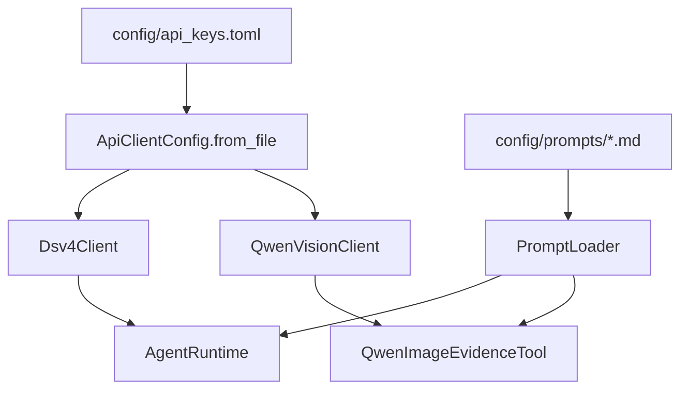

# 技术手册

## 1. 技术定位

本项目是基于 Python 3.11 和 LangChain Core 的多 Agent 案件证据分析 demo。当前版本采用“工具层 + Agent 层 + 兼容型 EvidenceGraph”的架构：

- 工具层负责确定性、可复用、可测试的能力，例如材料读取、图存储、关系规则、法律库检索；
- Agent 层负责需要语言理解、图像理解、推理、质询和复核的能力；
- EvidenceGraph 作为结构化事实和证据关系的中间层，向后兼容旧 `CaseGraph.facts`。

当前版本不是完整生产系统，也不是完整向量 RAG 系统。它的目标是把材料处理、事实提取、图谱组织、冲突提示和报告生成这条链路跑通，并保持足够清晰的扩展边界。

## 2. 核心目录

```text
case_agent_demo/
  agents.py           # Planning/Text/Pic/Report/EvidenceGraph/Conflict/Reasoning/Judge/Review
  workflow.py         # CaseWorkflow 主编排
  models.py           # Material、Fact、EvidenceNode、EvidenceEdge、EvidenceGraph 等数据结构
  graph_store.py      # GraphStoreTool，节点和边的内存 upsert
  relation_tools.py   # RelationRuleTool，基础关系规则建边
  evidence_intake.py  # 证据文件夹扫描与材料读取
  tools.py            # LegalRetrievalTool / RagLegalAgent 兼容包装
  material_plan.py    # 材料规划结构
  config.py           # 模型 profile
  llm_clients.py      # OpenAI-compatible API client
  prompt_config.py    # PromptLoader
  vision_tools.py     # Qwen 图片证据工具
  cli.py              # 命令行入口

config/
  api_keys.example.toml
  api_keys.toml       # 本地真实 key，已忽略
  prompts/

legal_library/
  laws.jsonl          # 静态法律库

tests/
  test_evidence_graph_nodes_edges.py
  test_relation_rule_tool.py
  ...
```

## 3. 数据模型

### 3.1 Material

`Material` 是输入材料的统一表示：

```text
material_id
material_type
content
source_path
```

`material_type` 当前包括：

- `statement`
- `evidence_image`
- `report_image`

### 3.2 Fact

`Fact` 是从材料中提炼出的结构化事实，继续作为兼容旧流程的核心事实对象：

```text
fact_id
source_material_id
source_type
person
behavior
time
location
object
confidence
human_confirmed
```

### 3.3 EvidenceNode

`EvidenceNode` 是图节点：

```text
node_id
node_type
source_material_id
source_type
summary
person
behavior
time
location
object
confidence
raw_ref
human_confirmed
metadata
```

当前已使用的 `node_type`：

- `material`
- `fact`

预留类型：

- `report_opinion`
- `person`
- `object`
- `event`
- `legal_element`

### 3.4 EvidenceEdge

`EvidenceEdge` 是图关系边：

```text
edge_id
source_node_id
target_node_id
edge_type
reason
confidence
evidence_basis
metadata
```

当前已使用的 `edge_type`：

- `source_of`
- `same_person`
- `same_object`
- `same_event`
- `contradicts`
- `supports`
- `needs_human_check`

### 3.5 EvidenceGraph / CaseGraph 兼容关系

代码中 `EvidenceGraph = CaseGraph`，`CaseGraph` 同时包含：

```text
facts
nodes
edges
```

兼容策略：

- 传入 `facts` 但未传入 `nodes` 时，自动把 `Fact` 转成 `EvidenceNode`；
- 传入 `nodes` 但未传入 `facts` 时，自动把 `node_type == "fact"` 的节点转回 `Fact`；
- 旧代码仍可读取 `.facts`；
- 新代码可读取 `.nodes` 和 `.edges`。

## 4. 图存储与建边

### 4.1 GraphStoreTool

`GraphStoreTool` 是当前阶段的内存图存储工具，负责：

- `upsert_node(node)`
- `upsert_edge(edge)`
- `list_nodes()`
- `list_edges()`
- `to_graph()`

它不是数据库，也不做持久化。当前用途是把单次 workflow 中生成的节点和边组织成 EvidenceGraph。

### 4.2 EvidenceGraphAgent.build()

`EvidenceGraphAgent.build(facts)` 的当前逻辑：

1. 为每条事实创建一个 `material` 节点；
2. 通过 `fact_to_node()` 把 `Fact` 转为 `fact` 节点；
3. 创建 `source_of` 边，表示材料生成事实；
4. 调用 `RelationRuleTool.infer_edges_for_new_node()`，把新事实节点与已有事实节点进行规则匹配；
5. 返回包含 `facts`、`nodes`、`edges` 的 EvidenceGraph。

### 4.3 RelationRuleTool

`RelationRuleTool` 当前负责稳定、低成本、可解释的规则关系：

| 关系 | 生成规则 |
| --- | --- |
| `same_person` | 两个事实节点 `person` 非空且相等 |
| `same_object` | 两个事实节点 `object` 存在包含关系或相等 |
| `same_event` | `person/object/time/location` 至少两个维度重合 |
| `contradicts` | 一方是否认事实，另一方为正向事实，且人员或对象重合 |
| `supports` | 图片或报告事实与既有事实在人员或对象上重合，且不构成冲突 |
| `needs_human_check` | 新节点置信度低于 `0.75` |

复杂语义关系暂未交给 LLM。后续可增加 `RelationAgent`，但应保持 JSON 输出和可审计依据。

## 5. 置信度来源

当前置信度不是统计学概率，而是规则和模型输出的支持强度提示。

### 5.1 Fact 置信度

- `Fact.confidence` 默认值为 `0.8`；
- 文本规则 fallback 的普通事实固定为 `0.86`；
- 否认类事实固定为 `0.84`；
- LLM JSON 输出带 `confidence` 时读取模型返回值，否则默认 `0.8`；
- 图片事实继承 Qwen 输出中的 `confidence`；
- 报告事实使用报告处理逻辑传入的置信度。

### 5.2 Node 置信度

`fact_to_node()` 直接复制 `Fact.confidence` 到 `EvidenceNode.confidence`。

材料节点当前置信度为 `1.0`，表示材料节点本身由输入目录确定生成，不代表材料真实性。

### 5.3 Edge 置信度

- `source_of`：继承对应事实的 `Fact.confidence`；
- `same_person` / `same_object` / `same_event` / `supports`：默认 `0.8`；
- `contradicts`：固定 `0.9`；
- `needs_human_check`：固定 `1.0`，表示规则确定触发复核提示。

后续如需用于排序、图算法或报告分层，建议新增综合评分逻辑，不直接把当前 `confidence` 理解为司法证明概率。

## 6. 模型与工具分工

| 模块 | 当前实现 |
| --- | --- |
| PlanningAgent | 案件类型建议、材料计划 |
| TextAgent | 单份笔录事实抽取，支持 runtime 和规则 fallback |
| PicAgent | 图片材料事实抽取，可调用 Qwen 视觉 |
| ReportImageAgent | 报告类材料事实抽取 |
| EvidenceGraphAgent | 构建兼容型 EvidenceGraph |
| GraphStoreTool | 内存节点/边 upsert |
| RelationRuleTool | 基础规则建边 |
| ConflictAgent | 基于 `.facts` 的冲突检测 |
| LegalRetrievalTool | 静态 JSONL 法律库检索 |
| ReasoningAgent | 辅助分析报告 |
| JudgeAgent | 反方质询 |
| ReviewAgent | 输出边界复核 |

## 7. 工作流编排

`CaseWorkflow.run()` 的主流程：

1. 要求 `confirmed_case_type`，否则抛出 `HumanConfirmationRequired`；
2. `PlanningAgent.plan_materials()` 生成材料计划；
3. `TextAgent` 处理笔录；
4. `PicAgent` 处理图片证据，Qwen 可用时按图片组处理；
5. `ReportImageAgent` 处理报告材料，Qwen 可用时按报告图片组处理；
6. `EvidenceGraphAgent.build()` 生成 EvidenceGraph；
7. `ConflictAgent.detect()` 检测冲突；
8. `ReasoningAgent.retrieve_legal_matches()` 调用法律检索工具；
9. `ReasoningAgent.reason()` 生成初稿；
10. `JudgeAgent.challenge()` 生成质询；
11. `ReasoningAgent.revise()` 修订报告；
12. `ReviewAgent.review()` 做边界复核；
13. 返回 `WorkflowResult`。

`WorkflowResult.evidence_graph` 当前与 `case_graph` 指向同一个兼容型图对象。

## 8. 上下文隔离

系统通过以下方式降低材料相互污染：

- `TextAgent` 每次只处理一份 statement；
- 图片按文件夹分组，组与组之间独立处理；
- 报告图片按文件夹分组，组与组之间独立处理；
- `ReasoningAgent` 只接收 EvidenceGraph、LegalMatch、Conflict，不接收原始材料全集；
- `ReviewAgent` 只检查最终报告和结构化来源信息。

## 9. 静态法律库

`LegalRetrievalTool` 从 `legal_library/laws.jsonl` 读取法条，输出 `LegalMatch`。

匹配策略：

- 案件类型匹配的法条可以按较低阈值命中；
- 跨类型匹配必须有更强关键词或构成要素命中；
- 盗窃条款需要“盗窃、偷、窃取、拿走、非法占有、秘密窃取”等强语义；
- “手机、财物、物品、现场、人员”等泛化词不会单独触发跨类型法条；
- “摔坏、损坏、毁坏、砸坏、屏幕损坏”等上下文可关联故意毁坏财物类依据。

当前法律检索仍是静态 JSONL，不支持文档入库、向量检索、软删除和版本管理。后续可在保持 `retrieve(payload)` 兼容接口的前提下升级为 `LegalKnowledgeBaseTool`。

## 10. 配置流



真实 key 只允许放在 `config/api_keys.toml`，该文件已被 `.gitignore` 忽略。

## 11. 材料目录

```text
evidence_vault/
  statements/             # 笔录：.txt / .docx / .pdf
  report_images/          # 报告：.jpg / .jpeg / .png / .docx / .pdf
  identification_images/  # 图片证据：.jpg / .jpeg / .png
  extracted/              # 人工修正文本
  manifest.json
```

系统不在本地运行 OCR。图片理解交由 Qwen API；PDF 优先读取文本层；扫描版 PDF 或识别结果需要修正时，可在 `extracted/` 放同名 `.txt`。

## 12. 测试

运行全部测试：

```powershell
python -m unittest discover -s tests -v
```

新增图相关测试包括：

- `tests/test_evidence_graph_nodes_edges.py`
- `tests/test_relation_rule_tool.py`

这些测试覆盖 `fact_to_node()`、`GraphStoreTool`、基础关系边生成和低置信人工复核边。

## 13. 当前技术边界

- `GraphStoreTool` 是内存工具，不是数据库；
- `RelationRuleTool` 是规则工具，不处理复杂语义推理；
- `ConflictAgent` 仍主要基于 `.facts` 工作；
- `LegalRetrievalTool` 是静态库检索，不是完整 RAG；
- 当前 confidence 是辅助支持强度，不是校准概率；
- `FinalConflictAgent`、`LegalKnowledgeBaseTool`、复杂 `RelationAgent` 尚未落地。

## 14. 推荐扩展路径

1. 先保持现有兼容图结构稳定；
2. 增加图查询工具，用于按节点、边、来源、冲突关系查询；
3. 把 ConflictAgent 逐步迁移到 `nodes/edges`；
4. 增加 RelationAgent 处理复杂语义关系；
5. 增加 LegalKnowledgeBaseTool，支持法律文档生命周期管理；
6. 增加 FinalConflictAgent，合并证据冲突、证据充分性、程序风险、报告越界检查；
7. 再考虑持久化图数据库或向量库。
