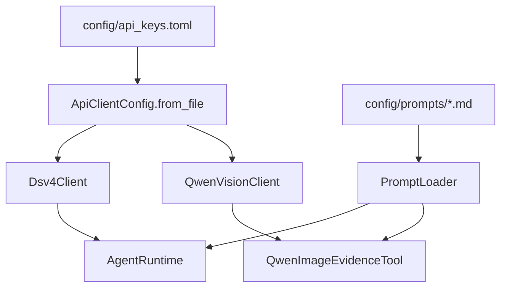
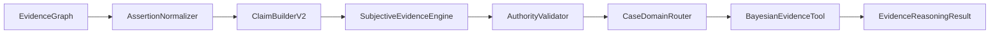
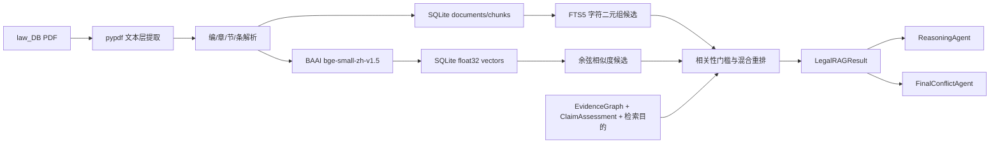
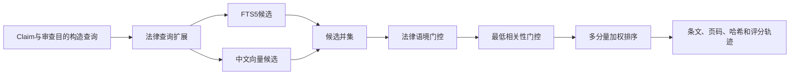
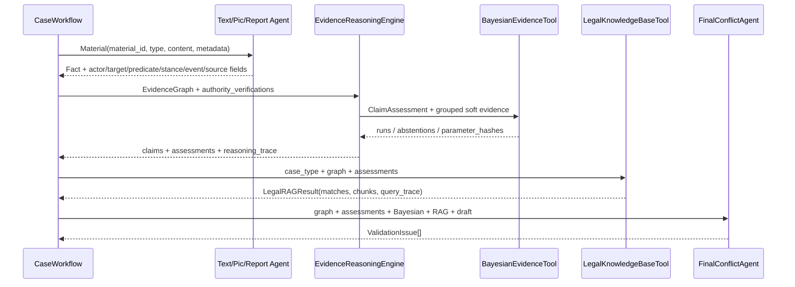

# 技术手册（当前 v0.58，含 v0.51、v0.56 历史基线）

> 阅读说明：第 1 至 14 节及附录 A 保留 v0.51 历史架构，附录 B 说明 v0.56 贝叶斯重构；维护当前代码时还应阅读文末附录 C，v0.58 的十案契约、通用修复和发布门禁以附录 C 为准。

## 阅读导航

| 读者任务 | 推荐章节 |
| --- | --- |
| 快速理解 v0.56 技术变化 | B.0、B.2、B.13、B.29-B.36 |
| 排查 Claim 没有形成 | B.3、B.14-B.16、B.29 |
| 排查贝叶斯没有运行 | B.5-B.8、B.20-B.23、B.32 |
| 修改或校准参数 | B.7、B.11、B.27、B.30-B.33 |
| 扩充法律 RAG | B.13、B.16、B.23、B.34 |
| 新增事实关系组件 | B.20-B.22、B.28、B.32、B.36 |

## 第一部分：v0.51 历史架构和兼容基线

## 1. v0.51 当时的技术定位

本项目是基于 Python 3.11 和 LangChain Core 的多 Agent 案件证据分析 demo。当前版本采用“工具层 + Agent 层 + 兼容型 EvidenceGraph”的架构：

- 工具层负责确定性、可复用、可测试的能力，例如材料读取、图存储、关系规则、法律库检索；
- Agent 层负责需要语言理解、图像理解、推理、质询和复核的能力；
- EvidenceGraph 作为结构化事实和证据关系的中间层，向后兼容旧 `CaseGraph.facts`。

v0.51 不是完整生产系统，也不是完整向量 RAG 系统。它的目标是把材料处理、事实提取、图谱组织、claim 聚合、置信度计算、法律知识库检索、最终审查和报告生成这条链路跑通，并保持足够清晰的扩展边界。

## 2. 核心目录

```text
case_agent_demo/
  agents.py           # Planning/Text/Pic/Report/EvidenceGraph/Conflict/Reasoning/Judge/Review
  workflow.py         # CaseWorkflow 主编排
  models.py           # Material、Fact、EvidenceNode、EvidenceEdge、EvidenceGraph 等数据结构
  graph_store.py      # GraphStoreTool，节点和边的内存 upsert
  relation_tools.py   # RelationRuleTool，基础关系规则建边
  confidence.py       # ClaimBuilder / ConfidenceEngine
  legal_kb.py         # LegalKnowledgeBaseTool
  domain_affinity.py  # 法律领域相关度
  final_conflict_agent.py
  evidence_intake.py  # 证据文件夹扫描与材料读取
  tools.py            # LegalRetrievalTool / RagLegalAgent 兼容包装
  material_plan.py    # 材料规划结构
  config.py           # 模型 profile
  llm_clients.py      # OpenAI-compatible API client
  prompt_config.py    # PromptLoader
  vision_tools.py     # Qwen 图片证据工具
  cli.py              # 命令行入口

config/
  api_keys.example.toml
  api_keys.toml       # 本地真实 key，已忽略
  prompts/

legal_library/
  laws.jsonl          # v0.51 历史静态法律库

tests/
  test_evidence_graph_nodes_edges.py
  test_relation_rule_tool.py
  ...
```

## 3. 数据模型

### 3.1 Material

`Material` 是输入材料的统一表示：

```text
material_id
material_type
content
source_path
```

`material_type` 当前包括：

- `statement`
- `evidence_image`
- `report_image`

### 3.2 Fact

`Fact` 是从材料中提炼出的结构化事实，继续作为兼容旧流程的核心事实对象：

```text
fact_id
source_material_id
source_type
person
behavior
time
location
object
confidence
human_confirmed
```

### 3.3 EvidenceNode

`EvidenceNode` 是图节点：

```text
node_id
node_type
source_material_id
source_type
summary
person
behavior
time
location
object
confidence
raw_ref
human_confirmed
metadata
```

当前已使用的 `node_type`：

- `material`
- `fact`

预留类型：

- `report_opinion`
- `person`
- `object`
- `event`
- `legal_element`

### 3.4 EvidenceEdge

`EvidenceEdge` 是图关系边：

```text
edge_id
source_node_id
target_node_id
edge_type
reason
confidence
evidence_basis
metadata
```

当前已使用的 `edge_type`：

- `source_of`
- `same_person`
- `same_object`
- `same_event`
- `contradicts`
- `supports`
- `needs_human_check`

### 3.5 EvidenceGraph / CaseGraph 兼容关系

代码中 `EvidenceGraph = CaseGraph`，`CaseGraph` 同时包含：

```text
facts
nodes
edges
```

兼容策略：

- 传入 `facts` 但未传入 `nodes` 时，自动把 `Fact` 转成 `EvidenceNode`；
- 传入 `nodes` 但未传入 `facts` 时，自动把 `node_type == "fact"` 的节点转回 `Fact`；
- 旧代码仍可读取 `.facts`；
- 新代码可读取 `.nodes` 和 `.edges`。

## 4. 图存储与建边

### 4.1 GraphStoreTool

`GraphStoreTool` 是当前阶段的内存图存储工具，负责：

- `upsert_node(node)`
- `upsert_edge(edge)`
- `list_nodes()`
- `list_edges()`
- `to_graph()`

它不是数据库，也不做持久化。当前用途是把单次 workflow 中生成的节点和边组织成 EvidenceGraph。

### 4.2 EvidenceGraphAgent.build()

`EvidenceGraphAgent.build(facts)` 的当前逻辑：

1. 为每条事实创建一个 `material` 节点；
2. 通过 `fact_to_node()` 把 `Fact` 转为 `fact` 节点；
3. 创建 `source_of` 边，表示材料生成事实；
4. 调用 `RelationRuleTool.infer_edges_for_new_node()`，把新事实节点与已有事实节点进行规则匹配；
5. 返回包含 `facts`、`nodes`、`edges` 的 EvidenceGraph。

### 4.3 RelationRuleTool

`RelationRuleTool` 当前负责稳定、低成本、可解释的规则关系：

| 关系 | 生成规则 |
| --- | --- |
| `same_person` | 两个事实节点 `person` 非空且相等 |
| `same_object` | 两个事实节点 `object` 存在包含关系或相等 |
| `same_event` | `person/object/time/location` 至少两个维度重合 |
| `contradicts` | 两个已解析节点 predicate 相同、stance 分别为 `affirm/deny`，且主体或对象重合 |
| `supports` | 两个已解析节点 predicate 相同、stance 均为 `affirm`，且图片或报告节点与主体/对象重合 |
| `needs_human_check` | 新节点置信度低于 `0.75` |

复杂语义关系暂未交给 LLM。后续可增加 `RelationAgent`，但应保持 JSON 输出和可审计依据。

## 5. 置信度来源

当前置信度不是统计学概率。v0.56 已把节点抽取质量与 Claim 证据支持评估分开；以下 5.1 至 5.3 保留 v0.51 兼容字段的含义，5.4 描述当前主链路。

### 5.1 Fact 置信度（v0.51 兼容字段）

- `Fact.confidence` 默认值为 `0.8`；
- v0.51 文本规则 fallback 的普通事实曾固定为 `0.86`；
- v0.51 否认类事实曾固定为 `0.84`；
- LLM JSON 输出带 `confidence` 时读取模型返回值，否则默认 `0.8`；
- 图片事实继承 Qwen 输出中的 `confidence`；
- 报告事实使用报告处理逻辑传入的置信度。

### 5.2 Node 置信度

`fact_to_node()` 直接复制 `Fact.confidence` 到 `EvidenceNode.confidence`。

材料节点当前置信度为 `1.0`，表示材料节点本身由输入目录确定生成，不代表材料真实性。

### 5.3 Edge 置信度

- `source_of`：继承对应事实的 `Fact.confidence`；
- `same_person` / `same_object` / `same_event` / `supports`：默认 `0.8`；
- `contradicts`：固定 `0.9`；
- `needs_human_check`：固定 `1.0`，表示规则确定触发复核提示。

后续如需用于排序、图算法或报告分层，建议新增综合评分逻辑，不直接把当前 `confidence` 理解为司法证明概率。

### 5.4 v0.56 当前语义与证据评估链路

- `Fact/EvidenceNode.confidence` 只表示 LLM、OCR 或视觉结果的抽取质量；
- predicate、stance、actor、target/object 和 event 必须来自结构化语义输出或人工录入；
- 原文不再经过关键词词表推断行为类型、否定立场、人员或案件领域；
- 语义模型不可用、调用失败或 JSON 不满足契约时，生成 `unresolved_observation / ambiguous`，保留原文并触发人工复核；
- `SubjectiveEvidenceEngine` 在 Claim 层输出 support、opposition、uncertainty 和 conflict；
- `AuthorityValidator` 与贝叶斯 Tool 在各自明确范围内生成权威锚定和跨 Claim 派生结果。

## 6. 模型与工具分工

| 模块 | 当前实现 |
| --- | --- |
| PlanningAgent | 案件类型建议、材料计划 |
| TextAgent | 单份笔录语义抽取；失败时安全弃权，不执行关键词 fallback |
| PicAgent | Qwen 识别图片/OCR，DeepSeek 将观察转为结构化事实 |
| ReportImageAgent | 读取报告观察或提取文本，再由 DeepSeek 形成结构化事实 |
| EvidenceGraphAgent | 构建兼容型 EvidenceGraph |
| GraphStoreTool | 内存节点/边 upsert |
| RelationRuleTool | 基础规则建边 |
| ConflictAgent | 基于 `.facts` 的冲突检测 |
| LegalRetrievalTool | 旧接口兼容，优先调用 LegalKnowledgeBaseTool |
| LegalKnowledgeBaseTool | 本地法律知识库入库、切片、搜索、更新、软删除 |
| DomainAffinityIndexer | 法律领域相关度排序 |
| FinalConflictAgent | 最终审查问题和补充侦查建议 |
| ReasoningAgent | 辅助分析报告 |
| JudgeAgent | 反方质询 |
| ReviewAgent | 输出边界复核 |

## 7. 工作流编排

`CaseWorkflow.run()` 的主流程：

1. 要求 `confirmed_case_type`，否则抛出 `HumanConfirmationRequired`；
2. `PlanningAgent.plan_materials()` 生成材料计划；
3. `TextAgent` 处理笔录；
4. `PicAgent` 处理图片证据，Qwen 可用时按图片组处理；
5. `ReportImageAgent` 处理报告材料，Qwen 可用时按报告图片组处理；
6. `EvidenceGraphAgent.build()` 生成 EvidenceGraph；
7. `ConflictAgent.detect()` 检测冲突；
8. `ReasoningAgent.retrieve_legal_matches()` 调用法律检索工具；
9. `ReasoningAgent.reason()` 生成初稿；
10. `JudgeAgent.challenge()` 生成质询；
11. `ReasoningAgent.revise()` 修订报告；
12. `ReviewAgent.review()` 做边界复核；
13. 返回 `WorkflowResult`。

`WorkflowResult.evidence_graph` 当前与 `case_graph` 指向同一个兼容型图对象。

## 8. 上下文隔离

系统通过以下方式降低材料相互污染：

- `TextAgent` 每次只处理一份 statement；
- 图片按文件夹分组，组与组之间独立处理；
- 报告图片按文件夹分组，组与组之间独立处理；
- `ReasoningAgent` 只接收 EvidenceGraph、LegalMatch、Conflict，不接收原始材料全集；
- `ReviewAgent` 只检查最终报告和结构化来源信息。

## 9. v0.51 静态法律库（历史）

`LegalRetrievalTool` 从 `legal_library/laws.jsonl` 读取法条，输出 `LegalMatch`。

匹配策略：

- 案件类型匹配的法条可以按较低阈值命中；
- 跨类型匹配必须有更强关键词或构成要素命中；
- 盗窃条款需要“盗窃、偷、窃取、拿走、非法占有、秘密窃取”等强语义；
- “手机、财物、物品、现场、人员”等泛化词不会单独触发跨类型法条；
- “摔坏、损坏、毁坏、砸坏、屏幕损坏”等上下文可关联故意毁坏财物类依据。

在 v0.51 当时，法律检索支持本地 txt/md/jsonl 入库、chunk、软删除、更新和关键词检索，尚未引入向量库；v0.56 已由附录 B 所述的 SQLite、FTS5 和中文向量混合 RAG 取代该现状。

## 10. 配置流



真实 key 只允许放在 `config/api_keys.toml`，该文件已被 `.gitignore` 忽略。

## 11. 材料目录

```text
evidence_vault/
  statements/             # 笔录：.txt / .docx / .pdf
  report_images/          # 报告：.jpg / .jpeg / .png / .docx / .pdf
  identification_images/  # 图片证据：.jpg / .jpeg / .png
  extracted/              # 人工修正文本
  manifest.json
```

系统不在本地运行 OCR。图片理解交由 Qwen API；PDF 优先读取文本层；扫描版 PDF 或识别结果需要修正时，可在 `extracted/` 放同名 `.txt`。

## 12. 测试

运行全部测试：

```powershell
python -m pytest -q -p no:cacheprovider
```

v0.51 当时新增的图相关测试包括：

- `tests/test_evidence_graph_nodes_edges.py`
- `tests/test_relation_rule_tool.py`

这些测试覆盖 `fact_to_node()`、`GraphStoreTool`、基础关系边生成和低置信人工复核边。

## 13. v0.51 当时的技术边界

- `GraphStoreTool` 是内存工具，不是数据库；
- `RelationRuleTool` 是规则工具，不处理复杂语义推理；
- `ConflictAgent` 当时仍主要基于 `.facts` 工作；
- `LegalKnowledgeBaseTool` 当时采用本地文件和关键词检索，尚未形成当前的 SQLite、FTS5 和中文向量混合 RAG；
- 当时的 confidence 是启发式辅助支持强度，不是校准概率；
- 复杂 `RelationAgent` 尚未落地。

以上是 v0.51 的历史限制。v0.56 当前边界以 B.36 为准。

## 14. v0.51 技术路线与 v0.56 落实状态

| v0.51 当时的技术路线 | v0.56 当前状态 |
| --- | --- |
| 保持兼容图结构稳定 | 已保留 `Fact`/`CaseGraph` 兼容入口，并增加 Assertion、Claim 和 EvidenceBook |
| 增加图查询和关系能力 | 已提供增量图、Claim 聚合、来源/事件隔离和只读可视化；持久化图数据库尚未引入 |
| 把冲突审查迁移到结构化结果 | FinalConflict 已读取 ClaimAssessment、贝叶斯派生值、RAG 和报告文本 |
| 增加复杂语义关系处理 | 事实抽取改为 prompt 驱动结构化语义；跨 Claim 关系由注册表和贝叶斯 Tool 处理 |
| 增加向量检索和 rerank | 已完成 SQLite FTS5、FastEmbed 中文向量、领域和目的加权混合检索 |
| 深化程序风险和补证建议 | 已形成多类 ValidationIssue，但覆盖程度仍受法律语料和结构化输入限制 |
| 再考虑持久化图或向量库 | 法律向量已持久化到 SQLite；案件证据图仍以单次 workflow 内存对象为主 |
## 附录：本次更新补充说明（v0.51）

本次更新在原有流程末尾补充说明 v0.51 的技术变化，便于后续开发、维护和验收时快速定位新增能力。

### A.1 技术路线

v0.51 继续采用 Python 本地工程结构，不引入外部向量数据库或新的重型服务。该版本新增能力主要通过标准库、dataclasses、JSONL 本地索引和当时的单元测试体系完成。

主要技术点包括：

- 使用 `EvidenceNode`、`EvidenceEdge` 承载图谱节点和关系；
- 使用 `EvidenceClaim` 聚合多个证据节点形成待审查事实主张；
- 使用 `ConfidenceProfile` 保存 claim 级置信度、标签和解释；
- 使用 `GraphStoreTool` 做节点、边的增量写入、查询、软删除和导出；
- 使用 `LegalKnowledgeBaseTool` 做本地法律知识文件入库、切片、检索、更新和软删除；
- 使用 `DomainAffinityIndexer` 和 `CaseDomainRouter` 做法律领域亲和度计算；
- 使用 `FinalConflictAgent` 做最终冲突、证据不足、法律依据缺失和报告越界审查。

### A.2 置信度生成方式

v0.51 当时的置信度不是司法证明概率，而是系统内部的辅助支持强度。它综合考虑支持证据数量、反向证据数量、证据来源可靠性、来源多样性和冲突情况。

输出分为三部分：

- `score`：0 到 1 的数值；
- `label`：面向用户的解释性标签；
- `reasons`：为什么给出该分值和标签。

### A.3 法律知识库实现

法律知识库采用本地文件方式，支持 `.txt`、`.md` 入库后生成 `documents.jsonl` 和 `chunks.jsonl`。检索时先根据案件类型和证据图谱推断领域，再进行关键词和领域加权检索。

旧接口 `LegalRetrievalTool.retrieve(payload)` 保留。知识库有内容时优先使用 `LegalKnowledgeBaseTool`，没有内容时回退到 `legal_library/laws.jsonl`。

### A.4 最终审查机制

`FinalConflictAgent` 在报告生成链路后段运行，重点检查：

- 证据之间是否存在直接冲突；
- claim 是否明显存疑或需要补强；
- 法律依据是否缺失；
- 报告是否写出了材料没有支撑的结论；
- 图片证据置信度是否偏低，需要人工核验。

输出的 `ValidationIssue` 会兼容转换为原有 `Challenge`，因此不会破坏旧的 Judge/Review 流程。

## 附录 B：v0.56 贝叶斯证据推理重构

### B.0 技术更新地图与阅读顺序

v0.56 不是在旧 `ConfidenceEngine` 后面简单追加一个贝叶斯公式，而是重构了事实数据契约、证据融合、跨 Claim 推理、法律检索和审计输出。技术链路可概括为：

```mermaid
flowchart LR
  A["Agent 语义抽取"] --> B["EvidenceNode"]
  B --> C["AssertionNormalizer"]
  C --> D["EvidenceAssertion"]
  D --> E["ClaimBuilderV2"]
  E --> F["EvidenceClaim"]
  F --> G["SubjectiveEvidenceEngine"]
  G --> H["ClaimAssessment"]
  H --> I["BayesianEvidenceTool"]
  I --> J["BayesianModelRun / Abstention"]
  J --> K["LegalKnowledgeBaseTool"]
  K --> L["EvidenceBook / FinalConflict / Report"]
```



| 技术更新 | 解决的问题 | 主要实现位置 |
| --- | --- | --- |
| 开放结构化语义抽取 | 避免 Python 关键词词表穷举案件事实和否定表达 | `config/prompts/`、`agents.py`、`agent_runtime.py` |
| Assertion/Claim 双层契约 | 区分“材料说了什么”和“系统正在评估什么事实” | `models.py`、`evidence_reasoning.py` |
| 主观证据融合 | 分开表示支持、反对、不确定和冲突 | `evidence_reasoning.py` |
| 来源依赖约简 | 防止同源截图、派生报告和复制材料重复加权 | `SubjectiveEvidenceEngine._strongest_strengths()` |
| 权威范围锚定 | 让经核验专业意见只作用于其专业 Claim | `AuthorityValidator`、`authority_rules.json` |
| 注册表驱动贝叶斯 Tool | 按事实谓词动态选择同级关系组件 | `bayesian_tool.py`、`registry.json` |
| 小型确定性推理器 | 支持可审计的 prior、logistic、noisy_or 节点 | `bayesian_engine.py`、`bayesian_models/*.json` |
| 安全弃权 | 缺少锚点、输入或组件时不使用先验填空 | `BayesianAbstention` |
| 法律混合 RAG | 结合 FTS、中文向量、法律概念、领域和目的召回条文 | `legal_kb.py`、`legal_embeddings.py` |
| EvidenceBook 与可视化 | 将事实、输入、派生值、弃权和法律候选统一展示 | `evidence_book.py`、`plugins/reasoning_visualizer/` |

建议先阅读 B.2、B.3、B.5-B.8 掌握数据流，再阅读 B.29-B.36 理解底层计算和参数治理。

### B.1 新增模块

```text
case_agent_demo/
  bayesian_engine.py           # prior/logistic/noisy_or 确定性推理器
  bayesian_tool.py             # 注册表选模、分组、输入约简和审计
  evidence_book.py             # 案件中立证据册构建
  evidence_reasoning.py        # Assertion、Claim、主观证据、权威验证
  evidence_reasoning_engine.py # 统一证据推理入口
  legal_parser.py              # PDF 法律条文与页码解析
  legal_embeddings.py          # 中文向量 provider 与降级策略
  legal_kb.py                  # SQLite/FTS5/向量混合 RAG

config/
  bayesian_models/
    registry.json
    conduct_result_v1.json
    property_taking_v1.json
    public_order_v1.json
    public_safety_v1.json
    status_duty_v1.json
    deception_disposition_v1.json
  legal_elements/case_family_elements.json
  authority_rules.json
```

### B.2 数据流和传参



统一入口：

```python
result = EvidenceReasoningEngine().evaluate(
    case_type=confirmed_case_type,
    evidence_graph=evidence_graph,
    authority_verifications=authority_verifications,
)
```

返回 `assertions`、`claims`、`claim_assessments`、`bayesian_result`、`reasoning_trace` 和 `model_versions`。workflow 将 Claim、评估结果、贝叶斯结果和法律检索结果显式传给 ReasoningAgent 与 FinalConflictAgent。

### B.3 Assertion、Claim 与主观证据

`AssertionNormalizer` 生成 declarant、actor、predicate、target/object、event_id、stance、modality、source_group 和 origin_evidence。如果 metadata 已包含 `predicate`，优先使用结构化值；否则 `infer_claim_types()` 可以从同一材料生成多个原子谓词。

Claim 按 `actor + predicate + target/object + event_id` 聚合，分别保存 supporting、opposing 和 ambiguous 节点。

`SubjectiveEvidenceEngine` 输出 support、opposition、uncertainty 和 conflict。证据质量综合 extraction_quality、relevance、specificity、directness、authenticity、procedural_integrity、internal_consistency 和 verifiability。

系统先按 `origin_evidence` 去重，再按 `source_group` 汇总。同一来源组、同一立场只保留最强证据。`opinion is None` 或完全未知的 opinion 不进入贝叶斯输入，不会被转换成 `0.0`。

### B.4 权威锚定

`AuthorityValidator` 根据 `config/authority_rules.json` 检查机构/文书类型、资格、真实性、程序、对象对应、方法、标准、范围、人工核验和 defeater。

只有规则匹配且必要验证通过，才在配置允许的谓词范围内形成权威锚定。普通陈述不能直接削弱有效专业意见；重新鉴定、资格或程序缺陷、对象错误、标准错误、正式排除或替代意见可以形成同层级反证。

### B.5 BayesianModelRegistry

注册表加载时验证模型文件、model_id、input_map、anchor_inputs、derived_nodes、重复 ID 和 priority。priority 必须是整数 `0`。

选模只使用 Claim 谓词与 `trigger_predicates` 的交集，人工案件类型和领域标签不参与组件选择。所有命中组件都执行；故意伤害不会触发专用模型，而是通过 `conduct_result` 处理。

| model_id | anchor_inputs | derived_nodes |
| --- | --- | --- |
| `conduct_result` | `conduct` | `causation` |
| `property_taking` | `taking_action` | `taking_supported` |
| `public_order` | `conduct` | `order_disruption` |
| `public_safety` | `hazardous_conduct` | `public_danger` |
| `status_duty` | `conduct_recorded` | `status_duty_facts_supported` |
| `deception_disposition` | `deceptive_representation` | `disposition_link` |

`status_duty` 只使用资格文书、职责记录、行为记录和授权记录缺失等可核验事实，不推断法律身份、义务成立、授权有效或违反义务。

### B.6 分组算法

每个模型以 anchor Claim 建立 run：

```text
group_key = event_id + anchor actor + target/object
```

不同事件、不同行为人和不同目标不会拼入同一 run；缺少 event_id 时不连接不同 Claim；同一事件多个行为人分别运行。同一输入节点对应多个 Claim 时只使用最大支持值，并记录并列最大来源。

### B.7 推理器和模型格式

`BayesianInferenceEngine` 支持 `prior`、`logistic` 和 `noisy_or`。模型加载时校验重复节点、未知父节点、循环和非法字段。

```json
{
  "model_id": "example",
  "version": "1",
  "calibration_status": "expert_prior_unvalidated",
  "nodes": [
    {"id": "input_fact", "type": "prior", "prior": 0.2},
    {
      "id": "derived_fact",
      "type": "logistic",
      "parents": ["input_fact"],
      "intercept": -1.0,
      "weights": {"input_fact": 2.0}
    }
  ]
}
```

### B.8 审计结构

每个 `BayesianModelRun` 保存模型 ID、版本、校准状态、参数哈希、group_key、anchor_claim_id、input_claim_ids、soft_evidence、来源、全部节点值和派生值。

多模型和多 run 使用命名空间存储节点及输入，并生成组合参数哈希，防止同名节点覆盖和单模型哈希冒充组合哈希。

### B.9 法律规则边界

`config/legal_elements/case_family_elements.json` 将要素分成可学习事实与确定性法律规则。年龄、数额、次数、法律身份、法定义务、授权效力、抗辩、治安刑事边界、法律适用和处罚不进入贝叶斯模型。

### B.10 FinalConflictAgent 接入

v0.56 新增或强化 `derived_fact_insufficient`、`causation_insufficient`、`authority_contested` 和 `contested_but_not_refuted`。旧格式 `bayesian_result.node_values` 的兼容逻辑只读取注册表声明的派生节点，不把低值输入节点误报为派生事实不足。

### B.11 参数采集和校准

统计模板位于 `docs/statistics/bayesian_parameter_collection_template.xlsx`，生成命令：

```powershell
python scripts/generate_bayesian_statistics_workbook.py
```

模板记录原子事实标签、TP/FP/FN/TN、来源观测率、抽取准确率、来源依赖、案件族 CPD、权威材料复核和模型发布审批。空白或未知不进入真/假分母，先验 Alpha/Beta 为空或不大于 0 时不生成后验。

当前参数状态为 `expert_prior_unvalidated`。运行时只推理，不在线学习；真实数据经去标识化、独立核验、离线拟合、回放验证、隐私检查和审批后，才能发布新版本。

### B.12 v0.56 测试

```powershell
python -m pytest -p no:cacheprovider tests -q
```

v0.56 当时建立了 230 项测试设计，覆盖注册表、六种关系组件、未知关系安全弃权、语义模型失败安全弃权、事件隔离、权威范围、EvidenceBook、PDF 条文解析和混合 RAG。v0.58 已将旧 DOCX fixture 引用迁移到用户保留目录，并加入十案、发布文档和验收报告测试；2026-07-14 本地主工程 264 项全部通过。

### B.13 v0.56 法律混合 RAG

本节在保留附录 A 的 v0.51 历史说明基础上，替代其中“仅支持 txt/md/jsonl、JSONL 索引、尚未引入向量库”的当前状态描述。

法律源文件位于 `law_DB/`，当前已入库：

- 《中华人民共和国刑法》：505 个条文块；
- 《中华人民共和国治安管理处罚法》：144 个条文块；
- 《中华人民共和国刑事诉讼法》：308 个条文块；
- 合计 957 个条文块。

数据流如下：



实现文件：

```text
case_agent_demo/legal_parser.py      # PDF 文本层、条文和页码解析
case_agent_demo/legal_embeddings.py  # FastEmbed 中文向量与显式降级实现
case_agent_demo/legal_kb.py          # SQLite、FTS5、向量融合、CRUD
case_agent_demo/legal_kb_cli.py      # ingest/search/stats 命令
```

索引数据库为 `legal_knowledge/index/legal_kb.sqlite3`。可读清单位于 `legal_knowledge/metadata/corpus_manifest.json`，记录文档哈希、版本、来源、条文数量和 embedding 模型。模型缓存位于 `legal_knowledge/models/`，可随时删除并重新下载。

检索先由 FTS5 和向量通道分别生成候选，再根据法律行为概念、Domain Affinity、检索目的和文档类型重排。领域分和文档类型分不能单独让无关条文进入结果；必须通过词项、法律概念或语义相似度门槛。查询会对盗窃、伤害、毁坏财物、公共秩序、诈骗和抢夺等常见表述补充法律规范用语，但不会据此自动判断违法犯罪成立。

`LegalRetrievalTool.retrieve(payload)` 保留为兼容接口，新增 `retrieve_result(payload)` 返回完整 `LegalRAGResult`。Reasoning 与 FinalConflict 均通过同一个服务检索，避免一处回退静态库、另一处误报“法律依据缺失”。

当前语料覆盖刑法、治安管理处罚法和刑事诉讼法。刑诉法可支持证明标准、证据种类和非法证据排除等检索；`query_trace.missing_corpus_scopes` 仍会提示尚未纳入的司法解释、专门证据规定、法医鉴定标准和地方规范，系统不得把三部法律描述为“全部法律知识”。

管理命令：

```powershell
pip install -e ".[rag]"
python -m case_agent_demo.legal_kb_cli --root legal_knowledge ingest --source law_DB --embedding-provider fastembed
python -m case_agent_demo.legal_kb_cli --root legal_knowledge stats
python -m case_agent_demo.legal_kb_cli --root legal_knowledge search "殴打他人造成轻伤，治安处罚与刑事责任边界"
```

### B.14 v0.56 结构化证据契约

TextAgent、PicAgent 和 ReportImageAgent 通过语义模型输出结构化 metadata；现有 prompt 原文保留，并追加统一证据契约。推荐的 Assertion 字段为：

```text
declarant
actor
target_person
object
predicate
event_id
stance
source_group
origin_evidence
evidence_span
```

一份 Fact 可通过 `metadata.assertions` 提供多个语义断言。`AssertionNormalizer` 逐项展开后生成独立 `EvidenceAssertion`，避免为同一材料复制节点，同时允许报告中的结果、损伤等级、机制一致性和时间一致性分别进入对应 Claim。

LLM 输出缺少 predicate、stance 等必需字段时，解析器不再从原文关键词猜测。该材料会生成 `predicate=unresolved_observation`、`stance=ambiguous` 的安全弃权节点，并在 metadata 中记录失败原因和原始文本。下游 Claim、关系、案件领域与贝叶斯组件只能使用已解析的结构化字段；无法解析的内容必须人工补录或重新运行语义模型。

### B.15 Claim 对齐和隔离规则

Claim 基础键使用：

```text
actor + predicate + target_person/object
```

`event_id` 作为事件作用域。实现遵循以下约束：

1. 两个明确不同 event_id 的 Claim 不合并、不进入同一贝叶斯 run；
2. 双方都没有 event_id 时，不用其他 Claim 猜测它们属于同一事件；
3. 一方缺少 event_id 时，只有存在唯一兼容事件才允许对齐；
4. 人身类谓词以 target_person 对齐；
5. 财产类谓词及其支持谓词以 object 对齐；
6. 同一事件的多个财物保持为不同 Claim；
7. `status_duty` 不能仅由通用 `conduct_recorded` 触发。

这些规则同时作用于 `ClaimBuilderV2` 和 `BayesianEvidenceTool`，防止 Claim 层正确、运行分组层又发生跨事件拼接。

### B.16 Claim 驱动的法律查询

workflow 通过以下接口显式传递评估结果：

```python
legal_rag_result = legal_service.retrieve_for_case(
    case_type=confirmed_case_type,
    evidence_graph=case_graph,
    claim_assessments=reasoning_result.claim_assessments,
)
```

法律查询只吸收以下正向状态：

```text
supported
authority_anchored
达到门槛的 bayesian_derived
```

`insufficient_evidence`、`opposing_evidence_dominant`、否定立场和未评估 Claim 不激活违法犯罪行为族。查询内容使用案件类型、受支持谓词和必要事实短语，不再拼接全部事实、状态标签和英文解释。

对刑法和治安管理处罚法的实体条款，候选召回增加行为关系门控。当前支持人身伤害、财物取得、毁坏财物、公共场所秩序、社会秩序、公共安全、欺骗处分以及若干相邻事实关系。刑诉法主要按 `evidence_review`、`procedure_compliance` 等目的检索。相邻行为必须有独立上下文事实，严重结果条款必须有相应结果词；用户自行加入的规范性文档仍按通用混合检索处理。

### B.17 FinalConflict 的贝叶斯输入覆盖

伤情结果、机制一致性、时间一致性和其他原因等 Claim 可能只是某次贝叶斯 run 的辅助输入。若它们已经被成功运行实际消费，并且与锚点 Claim 的事件、行为人和目标范围重合，FinalConflictAgent 不再把这些辅助 Claim 单独报告为“全案证据不足”。

覆盖判断基于 `bayesian_result.runs` 中的真实输入槽和 Claim ID，不依赖谓词名称的全局白名单。未被任何 run 使用、跨事件、跨主体或未形成有效派生结果的辅助 Claim 仍会生成补证问题。

### B.18 事实关系回放器

实现文件：

```text
case_agent_demo/case_replay.py
```

直接运行命令：

```powershell
python -m case_agent_demo.case_replay --root 测试用例
```

回放器扫描 `测试用例/*/case.json`，加载各类 statement/report 材料并执行真实 `CaseWorkflow`。取消事实关键词兜底后，命令行默认的 `CaseWorkflow.demo()` 不注入语义 fixture；如果没有可用语义运行时，材料会成为 `unresolved_observation`，该命令此时验证的是安全弃权，而不是六个正向场景全部通过。

六个正向回归场景由 pytest 注入确定性的 `SemanticFixtureRuntime`，再断言主要 Claim、来源数、组件 ID、run 数量、派生值下限、应包含法条和应排除法条：

```powershell
python -m pytest -q -p no:cacheprovider tests/test_case_replay_corpus.py
```

这些场景是回归样本，不是支持范围白名单。需要把独立回放器用于正向离线验收时，应先为它显式提供受控语义 fixture 或可用的语义模型，不能恢复关键词猜测。

原始 `test_he.docx`、`test_li.docx` 和 `video_report.docx` 曾由独立回归测试验证中文 DOCX 中的行为人、目标人员、多来源支持、专业结论权威锚定、`conduct_result` 运行及法律条款精确召回。当前工作区中这三个旧 fixture 已被用户删除，因此相应测试会报告文件不存在；本次文档更新没有恢复它们。

### B.19 v0.51 与 v0.56 现状对应

前文 v0.51 内容作为历史基线保留。当前实现以本附录为准：

| v0.51 基线 | v0.56 当前状态 |
| --- | --- |
| 本地 JSONL/关键词法律检索 | SQLite + FTS5 + BGE 向量混合 RAG |
| 单一 Fact/节点置信度为主 | Assertion → Claim → 主观证据 → 权威锚定 → 贝叶斯派生 |
| 案件语义主要依赖简单字段 | actor/target/object/predicate/event/stance 结构化契约 |
| 手工示例验证 | 六个关系回放样本 + 原始 DOCX 回归 + 未知关系弃权测试 |
| 规则审查所有低支持 Claim | 按真实贝叶斯输入覆盖区分辅助不足和全案不足 |

`pyproject.toml` 当前版本为 `0.56.0`，基础依赖显式包含 NumPy，RAG 可选依赖包含 FastEmbed 和 pypdf。pytest 默认只扫描 `tests/`，避免把插件或外部目录中的测试误纳入主工程测试集。

### B.20 案件中立选模契约

`BayesianModelRegistry.select()` 忽略人工 `case_type` 和领域标签，只按 `EvidenceClaim.behavior_type` 与 `trigger_predicates` 的交集选择全部匹配组件。所有组件优先级为 `0`，允许同一事件运行多个组件。

当前注册关系组件为：

```text
conduct_result
property_taking
public_order
public_safety
status_duty
deception_disposition
```

这些 ID 表示事实关系模板，不表示罪名或封闭案件类型。注册表外谓词不会选择“最相似案件”，而是生成 `BayesianAbstention(reason="no_matching_relation_component")`。证据 Claim、主观证据评估、RAG 和证据册继续执行。

### B.21 正向锚点与安全弃权

贝叶斯组件只能由存在正向支持的锚点 Claim 启动。报警人肯定控诉是常见锚点；证人肯定陈述、行为人自认和客观记录也可以成为锚点。`defense_response`、否定立场和完全不确定意见不能单独启动正向推理。

安全弃权分为：

| reason | 含义 |
| --- | --- |
| `no_matching_relation_component` | 事实存在，但注册表没有适用的跨 Claim 关系组件 |
| `missing_allegation_anchor` | 已匹配组件，但没有获得正向支持的锚点事实；字段名为兼容保留 |
| `missing_required_inputs` | 有锚点，但缺少组件声明的必需输入 |

弃权时不读取模型先验补齐案件事实，不生成派生 Claim。`FinalConflictAgent` 对未知组件使用低严重度提示，要求保留主观证据评估；对缺少必需输入的组件提出补证建议。

### B.22 事件作用域统一

真实事件号、日期地点组合和 `MATERIAL-*` 材料作用域必须区分。`MATERIAL-*` 不是实体事件：当同一主体、谓词和目标只有一个明确事件时可归入该事件；存在多个明确事件时不得自动选择。该规则在 ClaimBuilder、BayesianEvidenceTool 和 FinalConflict 覆盖判断三层一致执行，避免报告已进入 Claim 后又被后续评估排除。

旧材料若把人身行为对象放在 `object` 而不是 `target_person`，`physical_contact`、`violence` 和 `violent_action` 会按人身目标兼容归一化；伤情等级、结果描述等关系谓词不会把“轻伤二级”等结果文本误当成人员目标。

### B.23 三部法律 RAG

最新 `legal_knowledge/index/legal_kb.sqlite3` 与 `law_DB/` 文件哈希一致：

| 文档 | doc_type | chunks |
| --- | --- | ---: |
| 中华人民共和国刑法 | `criminal_law` | 505 |
| 中华人民共和国治安管理处罚法 | `public_security_law` | 144 |
| 中华人民共和国刑事诉讼法 | `criminal_procedure_law` | 308 |

总计 3 个文档、957 个条文块。`reindex()` 保持文档 ID，同时允许解析器刷新规范标题、文档类型、条文和向量，避免标题规范化后产生同源重复文档。刑诉法第五十五条、第五十六条可以按 `evidence_review` 目的召回；无关查询受 relevance gate 拦截。

### B.24 证据册输出与验收范围

`EvidenceBook` 包含 `participants`、`allegations`、`fact_findings`、`objective_circumstances`、`identifications`、`conflicts`、`legal_candidates`、`bayesian_runs`、`bayesian_abstentions` 和 `missing_evidence`。`EvidenceFinding.conclusion` 用自然语言说明当前证据支持、争议、客观反对或不足，不能替代最终违法犯罪认定。

`测试用例/` 中的传统案件回放与开放事实回放只是回归语料，不是支持范围白名单。当前完整测试命令为：

```powershell
python -m pytest -q -p no:cacheprovider
```

该历史遗留已在 v0.58 解决：旧 DOCX 测试读取 `测试用例/伤害/`，可视化插件样例改用显式结构化语义输入，不再依赖已删除的关键词 fallback。2026-07-14 本地主工程 264 项全部通过，可视化插件 5 项全部通过。

### B.25 `CaseWorkflow.run()` 的完整调用顺序

默认入口：

```python
result = CaseWorkflow.demo().run(
    materials=materials,
    confirmed_case_type=None,
    authority_verifications=None,
    require_human_confirmation=False,
)
```

关键调用顺序如下：

1. `PlanningAgent.plan_materials()` 只生成材料任务计划；不要求先确定案件类型。
2. `TextAgent`、`PicAgent`、`ReportImageAgent` 把材料转成一个或多个 `Fact`。
3. `EvidenceGraphAgent.add_fact()` 将每个 Fact 增量写入 `GraphStoreTool`，并建立节点间关系。
4. `EvidenceReasoningEngine.evaluate()` 生成 Assertion、Claim、证据意见、权威评估和贝叶斯结果。
5. `LegalRetrievalTool.retrieve_result(... purpose="allegation_discovery")` 根据控诉和 Assertion 发现法律候选。
6. `ReasoningAgent.retrieve_legal_matches()` 根据已经评估的 Claim 获取报告依据。
7. `EvidenceBookBuilder.build()` 汇总证据册。
8. `ReasoningAgent` 生成初稿，`JudgeAgent` 提出反方质询。
9. `LegalRetrievalTool.retrieve_result(... purpose="final_compliance_review")` 获取程序和证据审查依据。
10. `FinalConflictAgent.review()` 生成结构化审查问题，`ReasoningAgent.revise()` 收窄报告。
11. `ReviewAgent` 检查最终性法律表述和引用边界。

`confirmed_case_type` 只影响兼容性展示和检索提示，不参与贝叶斯选模。严格旧模式只有在显式传入 `require_human_confirmation=True` 时才恢复人工确认门。

### B.26 核心传参契约

```text
Material
  -> Fact
  -> EvidenceNode / EvidenceEdge
  -> EvidenceAssertion
  -> EvidenceClaim
  -> ClaimAssessment
  -> BayesianToolResult
  -> LegalRAGResult
  -> EvidenceBook / ValidationIssue / Report
```

`EvidenceAssertion` 至少应能表达：

```text
declarant、declarant_role、actor、target_person、object、predicate、
event_id、time、location、stance、modality、assertion_role、
evidence_category、source_group、origin_evidence、derivative_of
```

`ClaimAssessment` 保存普通证据意见、权威状态、支持指数、冲突与不确定性；贝叶斯派生 Claim 另外保存 `bayesian_posterior` 和模型版本。这里的 posterior 是基于版本化专家参数的派生支持值，不是司法事实概率。

### B.27 贝叶斯参数来源和治理

参数分为三类：

| 参数 | 当前来源 | 是否适合真实数据校准 |
| --- | --- | --- |
| 主观证据质量维度权重 | `case_agent_demo/evidence_reasoning.py` 中的工程先验 | 可用人工复核数据离线校准；后续宜迁入版本化配置 |
| 权威材料均值、强度和范围 | `config/authority_rules.json` 与人工核验 | 主要由制度规则和专业审查确定 |
| 关系组件 prior/logistic/noisy_or 参数 | `config/bayesian_models/*.json` | 可用去标识化、独立复核样本离线校准 |
| 选模触发谓词和必需输入 | `registry.json` 的结构规则 | 由领域专家和工程审查维护，不在线学习 |

运行时不会根据当前案件改写参数。发布新参数应经过数据去标识化、标签定义、来源依赖处理、训练/验证集隔离、敏感性分析、回放验证、审批和版本变更，并保留旧模型参数哈希。

### B.28 扩展未知事实关系

新增关系组件时，不应创建“某罪名专用 Agent”。推荐步骤是：

1. 把待判断问题拆成主体、行为、对象、结果、条件和替代解释等事实 Claim；
2. 明确哪些输入必须有正向锚点，哪些输入缺失时必须弃权；
3. 只把跨 Claim 的事实关系放入贝叶斯组件；
4. 把年龄、数额、法律身份、法定例外和法律后果留在确定性规范层；
5. 在 `registry.json` 登记谓词映射，并增加未知输入、跨事件、反向材料和不足输入测试；
6. 更新参数版本与统计采集说明，不能复用无依据的其他组件参数。

如果还没有可靠结构或参数，应保留 `no_matching_relation_component`，而不是强行选择最相近组件。

### B.29 从语义材料到可计算 Claim 的底层过程

#### B.29.1 语义抽取输出

TextAgent、PicAgent 和 ReportImageAgent 负责把材料转成结构化观察。v0.56 要求语义模型尽量显式返回：

```text
declarant           陈述人或记录形成者
actor               当前事实中的行为主体
target_person       行为指向的人员
object              行为涉及的物或其他对象
predicate           开放事实谓词
event_id            事件作用域
stance              affirm / deny / ambiguous
modality            确定、可能、推测等表达强度
source_group        来源组
origin_evidence     最底层原始来源
evidence_span       对应原材料片段
```

这里取消的是**案件事实语义层的关键词兜底**。如果 LLM 不可用、输出不完整或不能确定事实类型，程序保留材料并生成 `unresolved_observation / ambiguous`，不通过“受伤”“没有”“未”等枚举词猜测事实。法律 RAG 中的 FTS 和法律概念词仍然存在，因为它们只负责召回候选条文，不负责认定案件事实。

#### B.29.2 AssertionNormalizer

`EvidenceNode` 表示图中的一条材料事实节点；`EvidenceAssertion` 表示该节点针对某个具体谓词作出的原子主张。一份报告可拆成多个 Assertion：

```text
报告节点
  ├── injury_exists = affirm
  ├── injury_grade = affirm
  ├── mechanism_consistency = affirm
  └── temporal_consistency = ambiguous
```

若节点 metadata 已包含结构化 `assertions[]`，Normalizer 逐条展开；若只有单一 `predicate`，生成一条 Assertion；两者都没有时使用 `unresolved_observation`，不会调用 Python 词表补出谓词。

#### B.29.3 ClaimBuilderV2

Claim 的核心聚合键是：

```text
actor + predicate + target/object + event_id
```

它解决两个问题：

1. 不同材料对同一个事实使用不同表述时，可以进入同一 Claim 的支持、反对或歧义集合；
2. 同一人员在不同事件、面对不同目标或不同对象的行为不会被错误合并。

缺失 `event_id` 时只在存在唯一兼容事件的条件下补入；否则保留独立作用域。该策略优先减少错误拼接，即使因此产生安全弃权。

### B.30 主观证据融合原理

#### B.30.1 证据质量使用加权几何平均

单条 Assertion 的质量不是陈述人身份分，而是八个证据属性的组合：

```text
extraction_quality      抽取是否准确
relevance               与当前 Claim 是否直接相关
specificity             主体、行为、对象等是否具体
directness              亲历、直接记录或转述程度
authenticity            来源、原件和完整性是否可核验
procedural_integrity    形成、提取、辨认或鉴定程序是否完整
internal_consistency    材料内部是否一致
verifiability           能否通过独立材料核查
```

当前实现为：

```text
quality = Π(value_i ^ weight_i)
```

即加权几何平均。相比普通算术平均，它会让真实性、程序等明显短板真实降低总质量，避免“图片很清晰”掩盖“来源完全无法确认”。当前权重是工程先验，不是统计训练结论。

#### B.30.2 先去重，再累积

同一 `origin_evidence` 内同一立场只保留最强 Assertion；随后同一 `source_group` 再只保留最强值。处理顺序为：


因此，同一视频的十张截图、根据该视频形成的研判报告和再次转发的截图，不会自动成为十二份独立支持。

#### B.30.3 支持、反对、不确定和冲突

设独立正向证据量为 `R`，独立反向证据量为 `S`，基础不确定证据量当前为 `W=2`：

```text
total       = R + S + W
support     = R / total
opposition  = S / total
uncertainty = W / total
conflict    = 2 × min(R, S) / (R + S)    # R+S=0 时为0
```

这四个值把两种完全不同的低支持状态区分开：

- 没有足够材料：`uncertainty` 高、`conflict` 低；
- 正反材料都较强：`uncertainty` 较低、`conflict` 高。

兼容层使用的 `support_index` 通常为：

```text
support_index = support + 0.5 × uncertainty
```

它是工程上的证据支持指数，不是事实真实概率。完全未知的 opinion 不进入贝叶斯输入，也不会被转换成 `0`。

### B.31 权威锚定原理

`AuthorityValidator` 只有在以下验证字段均明确通过时才应用配置规则：

```text
competence_verified
authenticity_verified
procedure_verified
subject_identity_verified
method_verified
standard_verified
scope_verified
human_verified
```

规则还必须同时匹配机构类型、文书类型和允许锚定的谓词。对于均值 `m`、强度 `k` 的有效权威 Assertion，当前实现转换为证据量：

```text
正向权威证据量 = m × k
反向权威证据量 = (1 - m) × k
```

若 Assertion 本身为反向立场，则两者交换。这样可以表达“权威结论在专业范围内具有很强作用，同时仍可被同层级反证推翻”。当前法医损伤等级示例规则使用 `mean=0.99`、`strength=50`，属于经配置批准的工程锚定，不是由本项目历史样本训练出的概率。

权威锚定只作用于配置声明的事实谓词。即使 `injury_grade` 被锚定，也不能沿图反向升级 `violent_action`、具体行为人、主观目的或法律责任。

### B.32 BayesianEvidenceTool 与推理器原理

#### B.32.1 为什么实现为 Tool

贝叶斯计算需要固定输入、固定参数、可重复结果和完整审计，不需要 Agent 自由对话。因此 v0.56 将它实现为确定性 Tool：

```text
输入：case_domains + EvidenceClaim[] + ClaimAssessment[]
输出：BayesianModelRun[] + BayesianAbstention[]
```

Tool 不读取原始材料全文。原始材料先经过语义抽取、Claim 聚合和主观证据评估，Tool 只接收结构化软证据。

#### B.32.2 注册表选择与分组

`registry.json` 为每个组件声明：

```text
trigger_predicates    哪些事实谓词可能触发组件
input_map             Claim 谓词如何映射到模型节点
anchor_inputs         哪些输入必须存在正向锚点
required_inputs       缺少哪些输入时必须弃权
derived_nodes         只允许哪些节点作为派生结果输出
priority              当前统一为0，表示同级
```

匹配后的 Claim 再按以下作用域形成独立 run：

```text
group_key = event_id | actor | target/object
```

同一模型可以为同一案件中的不同事件、不同主体或不同目标生成多个运行记录，避免交叉污染。

#### B.32.3 三种节点计算

当前 `BayesianInferenceEngine` 是小型、前向、确定性的有向无环图计算器。它校验模型后按拓扑顺序计算，不是需要大型第三方库的通用精确枚举引擎。

**prior 节点**：没有本案软证据覆盖时使用版本化先验：

```text
value = prior
```

**logistic 节点**：

```text
z = intercept + Σ(weight_i × parent_i)
value = 1 / (1 + exp(-z))
```

正权重增加派生支持，负权重降低派生支持。例如 `alternative_cause` 在 `conduct_result` 中使用负权重，表示合理其他原因会削弱当前行为与结果的联系。

**noisy_or 节点**：

```text
miss = (1 - leak) × Π(1 - weight_i × parent_i)
value = 1 - miss
```

适合多个父因素分别可以促成同一结果的关系。当前模型文件以 prior 和 logistic 为主，引擎已保留 noisy_or 支持。

#### B.32.4 软证据覆盖和安全弃权

若 Claim 已有有效 `support_index`，该值覆盖对应模型输入节点的 prior。若同一模型节点有多个兼容 Claim，当前选择最高有效支持值，并记录所有并列来源 Claim。完全未知的 Claim 被省略。

运行前检查：

1. 没有任何匹配组件：`no_matching_relation_component`；
2. 匹配组件但没有正向锚点：`missing_allegation_anchor`；
3. 有锚点但缺少 `required_inputs`：`missing_required_inputs`。

第三种情况不会使用 prior 自动补齐缺失输入，因为“缺少本案证据”不等于“采用总体基础率即可继续认定”。

### B.33 参数结构、真实数据和人工发布

当前六个模型包含：

| 参数类型 | 数量 | 真实数据用途 |
| --- | ---: | --- |
| 根节点 `prior` | 27 | 独立核验真/假计数可形成 Beta 后验候选值 |
| 派生节点 `intercept` | 6 | 与同一节点的全部权重一起离线拟合 |
| 派生节点 `weights` | 27 | 使用逐案父节点值和子节点真值做正则化逻辑回归 |

根节点候选先验可使用：

```text
posterior_alpha = prior_alpha + true_count
posterior_beta  = prior_beta + false_count
candidate_prior = posterior_alpha / (posterior_alpha + posterior_beta)
```

`intercept/weights` 不能用“某角色笔录正确率”直接替换。必须收集同一子节点的逐案父节点值、子节点独立真值和训练/验证/测试划分，再整体拟合。

角色笔录统计可以形成“特定角色×谓词×立场×批次”的长期观测表现后验，但它不是新案件中该角色陈述为真的单案后验，也不是个人信誉分。

发布流程为：


运行单案时只读取冻结参数，绝不在线改写模型文件。详细采集口径见：

- `docs/statistics/bayesian_parameter_collection_template.xlsx`；
- `docs/statistics/BAYESIAN_PARAMETER_COLLECTION_GUIDE.md`。

### B.34 法律混合 RAG 的检索原理

法律知识库把 PDF 解析成带法律名称、条号、页码、文档版本和哈希的 chunk，保存到 SQLite；FTS5 提供词项检索，FastEmbed 的 `BAAI/bge-small-zh-v1.5` 提供中文向量相似度。

一次检索流程为：



当前最终分数为：

```text
0.30 × lexical
+ 0.32 × dense
+ 0.20 × legal_concept
+ 0.08 × domain
+ 0.07 × exact
+ 0.03 × document_type
```

候选必须先通过相关性门控：法律概念分达到 0.5，或至少两个词项命中且词法分达到 0.12，或语义向量分达到 0.55。领域分和文档类型分只用于重排，不能让完全无关条文进入候选。

`purpose` 区分实体法律依据、证据审查、程序合规和最终复核。系统还对相邻但构成要求不同的法律语境设置门控，避免仅凭泛化语义召回无关条款。

### B.35 模型校验、审计与故障边界

加载贝叶斯 JSON 时，`BayesianInferenceEngine` 校验：

- `model_id/version/calibration_status` 必须存在；
- 节点 ID 唯一，父节点存在，图必须无环；
- 节点字段只允许对应类型声明的键；
- logistic 权重必须与父节点集合完全一致；
- prior、noisy_or 权重和软证据必须在 `[0,1]`；
- intercept 和 logistic 权重必须是有限数值。

参数哈希只包含规范化后的模型参数结构，使用排序后的 JSON 计算 SHA-256。每个 `BayesianModelRun` 记录模型、版本、校准状态、哈希、group_key、锚点 Claim、输入 Claim、软证据、来源映射、全部节点值和派生值。

语义模型失败时不启用事实关键词猜测；向量模型不可用时法律检索可降级到可用的本地检索路径；贝叶斯模型结构错误则直接抛出校验错误，不能静默使用损坏参数。

### B.36 v0.56 技术边界与扩展原则

1. 当前贝叶斯参数是 `expert_prior_unvalidated`，数值不应解释为经过真实历史数据校准的事实概率。
2. 当前引擎是小型有向无环图前向计算器，不包含结构学习、在线参数学习或大型通用贝叶斯库。
3. `ClaimBuilderV2`、注册表和法律查询仍依赖受控结构化谓词；开放语义由 Agent 生成，结构映射由配置和代码审查维护。
4. RAG 当前语料为三部法律、957 个条文块；法律时效、司法解释、鉴定标准和地方规范仍需继续扩充并人工审查。
5. 可视化插件只读、仅监听 localhost；浏览器中的参数模拟不会写回案件或模型。
6. 新增关系组件应先证明其事实结构稳定、必需输入明确、参数可解释、缺失时能够弃权，再进入注册表。
7. 任何法律责任、处罚、证明标准和法定门槛都留在规范层，不进入贝叶斯历史频率学习。

## 附录 C：v0.58 十案验证、通用修复与发布契约

### C.1 版本目标

v0.58 没有把十条抽中法条写成十个专用模块。语料生成器属于开发期测试工具，生产运行时仍使用同一套 Agent、EvidenceGraph、ClaimBuilder、SubjectiveEvidenceEngine、BayesianEvidenceTool、LegalKnowledgeBaseTool 和 FinalConflictAgent。

```text
生成期：随机条文 -> 合成材料 -> 黄金 Assertion -> 预期契约
运行期：真实材料 -> Agent Assertion -> 通用证据推理 -> 法律检索 -> 审查与报告
验收期：黄金回放 + 真实模型偏差记录 + 全量回归
```

### C.2 可复现抽样和语料契约

- 随机种子：`58`；
- 刑法：第三百五十三条、第一百八十五条、第一百八十九条、第四百二十九条、第一百八十六条；
- 治安管理处罚法：第五十一条、第五十二条、第三十一条、第五十条、第八十三条；
- 刑法第三百八十三条因属于纯处罚衔接条文被记录为拒绝项，并按抽样轨迹替换为第一百八十六条；
- 每案包含 `case.json`、`sampling.json`、DOCX 笔录、DOCX/PNG 报告、`semantic_assertions.json` 和 `expected_outcome.json`；
- DOCX ZIP 时间戳经过规范化，生成结果可做字节级复现；
- 所有材料带合成标识并经过身份证号、手机号和参考机构名称扫描。

### C.3 双轨验收

**黄金语义回放**通过 `SemanticFixtureRuntime` 直接向现有 Agent parser 提供结构化事实，只隔离大模型随机性，不绕开下游生产代码。它验证 Claim 聚合、支持/反对/不确定、贝叶斯选择或弃权、法律检索、审查问题和报告边界，是发布硬门禁。

**真实 Agent 对比**使用当前配置的 DeepSeek/Qwen 读取合成材料，保存原始模型 JSON、解析错误和语义差异。该运行不把黄金数据喂给模型，不启用关键词 fallback。真实模型措辞波动作为模型治理信号记录，不用来弱化确定性工程契约。

### C.4 v0.58 通用修复

1. `BayesianModelRegistry.select()` 除谓词映射外，还要求出现模型声明的锚点谓词；`alternative_explanation` 等辅助事实不能单独激活组件。
2. Agent 输出可携带 `legal_query_terms`。RAG 使用这些候选术语召回法律，但该字段不参与 Claim 真伪融合。
3. Agent 输出可携带 `element_role`。`actor_attribution`、`legal_context` 和 `legal_element` 只触发通用缺口审查，不按罪名或条号分支。
4. `SubjectiveEvidenceEngine` 的普通证据规模恢复为配置化的 `2.0`，来源组内仍先去重，不能把十张同源截图当成十个独立来源。
5. 法律检索对当前有效语料全集进行最终重排。FTS 和向量候选仍记录在 trace 中，但不再让前 50 候选截断决定召回上限。
6. DOCX 回放统一通过 `_extract_docx_text()`，旧测试引用保留在 `测试用例/伤害/` 的文件，不恢复根目录重复件。

### C.5 关键传参路径



### C.6 贝叶斯运行与安全弃权

每个运行必须记录 `model_id`、`version`、`calibration_status`、`parameter_hash`、`group_key`、`anchor_claim_id`、输入 Claim、软证据来源、节点值和派生值。以下状态均为合法输出：

- `selected_model_ids` 非空：关系组件获得锚点和必要输入并完成计算；
- `no_matching_relation_component`：没有可匹配的锚点关系；
- `missing_required_inputs`：存在锚点，但缺少组件声明的本案输入；
- `missing_allegation_anchor`：只有否认、猜测或不确定材料，缺少正向锚点。

安全弃权不使用 prior 节点替代缺失的本案事实。贝叶斯结果只能生成派生 Claim，不能反向覆盖行为人、基础行为或权威材料的原始评估。

### C.7 法律 RAG 召回修复原理

中文 FTS 会产生大量二字切分项。若只重排前 50 个 FTS/向量候选，低频但准确的治安边界条文可能在候选阶段被挤出。当前索引仅 957 个条文块，向量分数本来已经对全部有效条款计算，因此 v0.58 直接对经过文档类型和有效性过滤的条款全集执行相关性门槛与重排。该实现更短、更可验证；语料扩大到需要专用向量数据库时，再以 Recall@K 实测决定候选策略。

### C.8 可视化插件实时性

`plugins/reasoning_visualizer` 不保存独立推理参数。它从实际 `WorkflowResult` 读取 EvidenceGraph、Assertion、ClaimAssessment、ValidationIssue 和 `bayesian_result.runs`，再从当前模型注册表读取节点公式。因此界面展示的是本次工程运行和当前参数版本；删除插件目录不影响主项目。

### C.9 发布证据

- `tests/test_v058_case_acceptance.py`：十案确定性主链路；
- `scripts/run_v058_live_agent_acceptance.py`：真实模型差异记录；
- `scripts/build_v058_acceptance_report.py`：材料哈希和结构化结果汇总；
- `artifacts/v058-acceptance/summary.json`：后续 Dify 十案 parity 基线；
- `plugins/reasoning_visualizer/tests`：插件独立性和实时快照验证。

发布前必须重新运行主测试、插件测试、抽样清单校验、报告 `--verify` 和生产代码特化扫描。贝叶斯参数仍为 `expert_prior_unvalidated`，不是事实概率；真实统计数据只能离线校准并发布新版本，不能在单案运行中在线改参。
