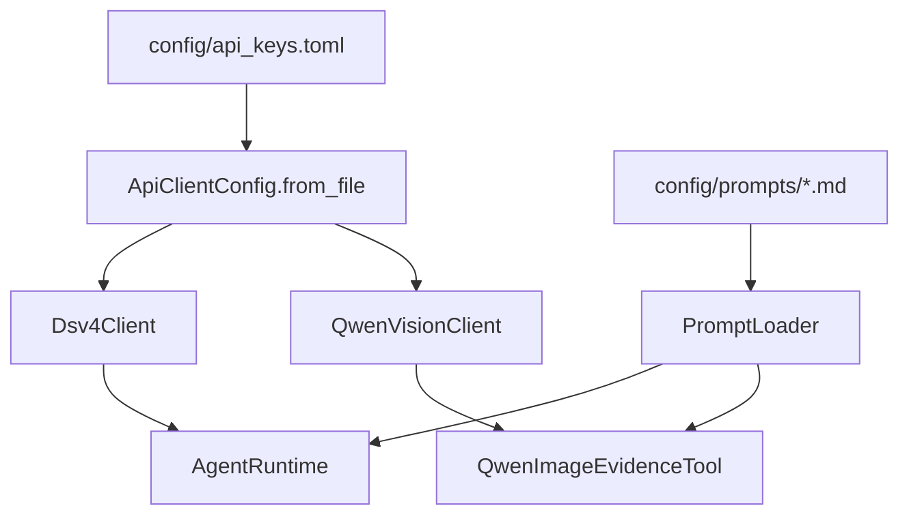
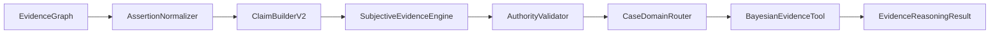

# 技术手册（v0.51）

## 1. 技术定位

本项目是基于 Python 3.11 和 LangChain Core 的多 Agent 案件证据分析 demo。当前版本采用“工具层 + Agent 层 + 兼容型 EvidenceGraph”的架构：

- 工具层负责确定性、可复用、可测试的能力，例如材料读取、图存储、关系规则、法律库检索；
- Agent 层负责需要语言理解、图像理解、推理、质询和复核的能力；
- EvidenceGraph 作为结构化事实和证据关系的中间层，向后兼容旧 `CaseGraph.facts`。

v0.51 不是完整生产系统，也不是完整向量 RAG 系统。它的目标是把材料处理、事实提取、图谱组织、claim 聚合、置信度计算、法律知识库检索、最终审查和报告生成这条链路跑通，并保持足够清晰的扩展边界。

## 2. 核心目录

```text
case_agent_demo/
  agents.py           # Planning/Text/Pic/Report/EvidenceGraph/Conflict/Reasoning/Judge/Review
  workflow.py         # CaseWorkflow 主编排
  models.py           # Material、Fact、EvidenceNode、EvidenceEdge、EvidenceGraph 等数据结构
  graph_store.py      # GraphStoreTool，节点和边的内存 upsert
  relation_tools.py   # RelationRuleTool，基础关系规则建边
  confidence.py       # ClaimBuilder / ConfidenceEngine
  legal_kb.py         # LegalKnowledgeBaseTool
  domain_affinity.py  # 法律领域相关度
  final_conflict_agent.py
  evidence_intake.py  # 证据文件夹扫描与材料读取
  tools.py            # LegalRetrievalTool / RagLegalAgent 兼容包装
  material_plan.py    # 材料规划结构
  config.py           # 模型 profile
  llm_clients.py      # OpenAI-compatible API client
  prompt_config.py    # PromptLoader
  vision_tools.py     # Qwen 图片证据工具
  cli.py              # 命令行入口

config/
  api_keys.example.toml
  api_keys.toml       # 本地真实 key，已忽略
  prompts/

legal_library/
  laws.jsonl          # 静态法律库

tests/
  test_evidence_graph_nodes_edges.py
  test_relation_rule_tool.py
  ...
```

## 3. 数据模型

### 3.1 Material

`Material` 是输入材料的统一表示：

```text
material_id
material_type
content
source_path
```

`material_type` 当前包括：

- `statement`
- `evidence_image`
- `report_image`

### 3.2 Fact

`Fact` 是从材料中提炼出的结构化事实，继续作为兼容旧流程的核心事实对象：

```text
fact_id
source_material_id
source_type
person
behavior
time
location
object
confidence
human_confirmed
```

### 3.3 EvidenceNode

`EvidenceNode` 是图节点：

```text
node_id
node_type
source_material_id
source_type
summary
person
behavior
time
location
object
confidence
raw_ref
human_confirmed
metadata
```

当前已使用的 `node_type`：

- `material`
- `fact`

预留类型：

- `report_opinion`
- `person`
- `object`
- `event`
- `legal_element`

### 3.4 EvidenceEdge

`EvidenceEdge` 是图关系边：

```text
edge_id
source_node_id
target_node_id
edge_type
reason
confidence
evidence_basis
metadata
```

当前已使用的 `edge_type`：

- `source_of`
- `same_person`
- `same_object`
- `same_event`
- `contradicts`
- `supports`
- `needs_human_check`

### 3.5 EvidenceGraph / CaseGraph 兼容关系

代码中 `EvidenceGraph = CaseGraph`，`CaseGraph` 同时包含：

```text
facts
nodes
edges
```

兼容策略：

- 传入 `facts` 但未传入 `nodes` 时，自动把 `Fact` 转成 `EvidenceNode`；
- 传入 `nodes` 但未传入 `facts` 时，自动把 `node_type == "fact"` 的节点转回 `Fact`；
- 旧代码仍可读取 `.facts`；
- 新代码可读取 `.nodes` 和 `.edges`。

## 4. 图存储与建边

### 4.1 GraphStoreTool

`GraphStoreTool` 是当前阶段的内存图存储工具，负责：

- `upsert_node(node)`
- `upsert_edge(edge)`
- `list_nodes()`
- `list_edges()`
- `to_graph()`

它不是数据库，也不做持久化。当前用途是把单次 workflow 中生成的节点和边组织成 EvidenceGraph。

### 4.2 EvidenceGraphAgent.build()

`EvidenceGraphAgent.build(facts)` 的当前逻辑：

1. 为每条事实创建一个 `material` 节点；
2. 通过 `fact_to_node()` 把 `Fact` 转为 `fact` 节点；
3. 创建 `source_of` 边，表示材料生成事实；
4. 调用 `RelationRuleTool.infer_edges_for_new_node()`，把新事实节点与已有事实节点进行规则匹配；
5. 返回包含 `facts`、`nodes`、`edges` 的 EvidenceGraph。

### 4.3 RelationRuleTool

`RelationRuleTool` 当前负责稳定、低成本、可解释的规则关系：

| 关系 | 生成规则 |
| --- | --- |
| `same_person` | 两个事实节点 `person` 非空且相等 |
| `same_object` | 两个事实节点 `object` 存在包含关系或相等 |
| `same_event` | `person/object/time/location` 至少两个维度重合 |
| `contradicts` | 一方是否认事实，另一方为正向事实，且人员或对象重合 |
| `supports` | 图片或报告事实与既有事实在人员或对象上重合，且不构成冲突 |
| `needs_human_check` | 新节点置信度低于 `0.75` |

复杂语义关系暂未交给 LLM。后续可增加 `RelationAgent`，但应保持 JSON 输出和可审计依据。

## 5. 置信度来源

当前置信度不是统计学概率，而是规则和模型输出的支持强度提示。

### 5.1 Fact 置信度

- `Fact.confidence` 默认值为 `0.8`；
- 文本规则 fallback 的普通事实固定为 `0.86`；
- 否认类事实固定为 `0.84`；
- LLM JSON 输出带 `confidence` 时读取模型返回值，否则默认 `0.8`；
- 图片事实继承 Qwen 输出中的 `confidence`；
- 报告事实使用报告处理逻辑传入的置信度。

### 5.2 Node 置信度

`fact_to_node()` 直接复制 `Fact.confidence` 到 `EvidenceNode.confidence`。

材料节点当前置信度为 `1.0`，表示材料节点本身由输入目录确定生成，不代表材料真实性。

### 5.3 Edge 置信度

- `source_of`：继承对应事实的 `Fact.confidence`；
- `same_person` / `same_object` / `same_event` / `supports`：默认 `0.8`；
- `contradicts`：固定 `0.9`；
- `needs_human_check`：固定 `1.0`，表示规则确定触发复核提示。

后续如需用于排序、图算法或报告分层，建议新增综合评分逻辑，不直接把当前 `confidence` 理解为司法证明概率。

## 6. 模型与工具分工

| 模块 | 当前实现 |
| --- | --- |
| PlanningAgent | 案件类型建议、材料计划 |
| TextAgent | 单份笔录事实抽取，支持 runtime 和规则 fallback |
| PicAgent | 图片材料事实抽取，可调用 Qwen 视觉 |
| ReportImageAgent | 报告类材料事实抽取 |
| EvidenceGraphAgent | 构建兼容型 EvidenceGraph |
| GraphStoreTool | 内存节点/边 upsert |
| RelationRuleTool | 基础规则建边 |
| ConflictAgent | 基于 `.facts` 的冲突检测 |
| LegalRetrievalTool | 旧接口兼容，优先调用 LegalKnowledgeBaseTool |
| LegalKnowledgeBaseTool | 本地法律知识库入库、切片、搜索、更新、软删除 |
| DomainAffinityIndexer | 法律领域相关度排序 |
| FinalConflictAgent | 最终审查问题和补充侦查建议 |
| ReasoningAgent | 辅助分析报告 |
| JudgeAgent | 反方质询 |
| ReviewAgent | 输出边界复核 |

## 7. 工作流编排

`CaseWorkflow.run()` 的主流程：

1. 要求 `confirmed_case_type`，否则抛出 `HumanConfirmationRequired`；
2. `PlanningAgent.plan_materials()` 生成材料计划；
3. `TextAgent` 处理笔录；
4. `PicAgent` 处理图片证据，Qwen 可用时按图片组处理；
5. `ReportImageAgent` 处理报告材料，Qwen 可用时按报告图片组处理；
6. `EvidenceGraphAgent.build()` 生成 EvidenceGraph；
7. `ConflictAgent.detect()` 检测冲突；
8. `ReasoningAgent.retrieve_legal_matches()` 调用法律检索工具；
9. `ReasoningAgent.reason()` 生成初稿；
10. `JudgeAgent.challenge()` 生成质询；
11. `ReasoningAgent.revise()` 修订报告；
12. `ReviewAgent.review()` 做边界复核；
13. 返回 `WorkflowResult`。

`WorkflowResult.evidence_graph` 当前与 `case_graph` 指向同一个兼容型图对象。

## 8. 上下文隔离

系统通过以下方式降低材料相互污染：

- `TextAgent` 每次只处理一份 statement；
- 图片按文件夹分组，组与组之间独立处理；
- 报告图片按文件夹分组，组与组之间独立处理；
- `ReasoningAgent` 只接收 EvidenceGraph、LegalMatch、Conflict，不接收原始材料全集；
- `ReviewAgent` 只检查最终报告和结构化来源信息。

## 9. 静态法律库

`LegalRetrievalTool` 从 `legal_library/laws.jsonl` 读取法条，输出 `LegalMatch`。

匹配策略：

- 案件类型匹配的法条可以按较低阈值命中；
- 跨类型匹配必须有更强关键词或构成要素命中；
- 盗窃条款需要“盗窃、偷、窃取、拿走、非法占有、秘密窃取”等强语义；
- “手机、财物、物品、现场、人员”等泛化词不会单独触发跨类型法条；
- “摔坏、损坏、毁坏、砸坏、屏幕损坏”等上下文可关联故意毁坏财物类依据。

当前法律检索已支持本地 txt/md/jsonl 入库、chunk、软删除、更新和关键词检索；尚未引入向量库，后续可在保持 `retrieve(payload)` 兼容接口的前提下增加 embedding 与 rerank。

## 10. 配置流



真实 key 只允许放在 `config/api_keys.toml`，该文件已被 `.gitignore` 忽略。

## 11. 材料目录

```text
evidence_vault/
  statements/             # 笔录：.txt / .docx / .pdf
  report_images/          # 报告：.jpg / .jpeg / .png / .docx / .pdf
  identification_images/  # 图片证据：.jpg / .jpeg / .png
  extracted/              # 人工修正文本
  manifest.json
```

系统不在本地运行 OCR。图片理解交由 Qwen API；PDF 优先读取文本层；扫描版 PDF 或识别结果需要修正时，可在 `extracted/` 放同名 `.txt`。

## 12. 测试

运行全部测试：

```powershell
python -m unittest discover -s tests -v
```

新增图相关测试包括：

- `tests/test_evidence_graph_nodes_edges.py`
- `tests/test_relation_rule_tool.py`

这些测试覆盖 `fact_to_node()`、`GraphStoreTool`、基础关系边生成和低置信人工复核边。

## 13. 当前技术边界

- `GraphStoreTool` 是内存工具，不是数据库；
- `RelationRuleTool` 是规则工具，不处理复杂语义推理；
- `ConflictAgent` 仍主要基于 `.facts` 工作；
- `LegalKnowledgeBaseTool` 是本地 JSONL/关键词检索，不是完整向量 RAG；
- 当前 confidence 是辅助支持强度，不是校准概率；
- 复杂 `RelationAgent` 尚未落地。

## 14. 推荐扩展路径

1. 先保持现有兼容图结构稳定；
2. 增加图查询工具，用于按节点、边、来源、冲突关系查询；
3. 把 ConflictAgent 逐步迁移到 `nodes/edges`；
4. 增加 RelationAgent 处理复杂语义关系；
5. 为 LegalKnowledgeBaseTool 增加向量检索和 rerank；
6. 深化 FinalConflictAgent 的程序风险、证据充分性和补充侦查建议；
7. 再考虑持久化图数据库或向量库。
## 附录：本次更新补充说明（v0.51）

本次更新在原有流程末尾补充说明 v0.51 的技术变化，便于后续开发、维护和验收时快速定位新增能力。

### A.1 技术路线

v0.51 继续采用 Python 本地工程结构，不引入外部向量数据库或新的重型服务。新增能力主要通过标准库、dataclasses、JSONL 本地索引和现有 unittest 测试体系完成。

主要技术点包括：

- 使用 `EvidenceNode`、`EvidenceEdge` 承载图谱节点和关系；
- 使用 `EvidenceClaim` 聚合多个证据节点形成待审查事实主张；
- 使用 `ConfidenceProfile` 保存 claim 级置信度、标签和解释；
- 使用 `GraphStoreTool` 做节点、边的增量写入、查询、软删除和导出；
- 使用 `LegalKnowledgeBaseTool` 做本地法律知识文件入库、切片、检索、更新和软删除；
- 使用 `DomainAffinityIndexer` 和 `CaseDomainRouter` 做法律领域亲和度计算；
- 使用 `FinalConflictAgent` 做最终冲突、证据不足、法律依据缺失和报告越界审查。

### A.2 置信度生成方式

当前置信度不是司法证明概率，而是系统内部的辅助支持强度。它综合考虑支持证据数量、反向证据数量、证据来源可靠性、来源多样性和冲突情况。

输出分为三部分：

- `score`：0 到 1 的数值；
- `label`：面向用户的解释性标签；
- `reasons`：为什么给出该分值和标签。

### A.3 法律知识库实现

法律知识库采用本地文件方式，支持 `.txt`、`.md` 和旧版 `laws.jsonl`。入库后生成 `documents.jsonl` 和 `chunks.jsonl`。检索时先根据案件类型和证据图谱推断领域，再进行关键词和领域加权检索。

旧接口 `LegalRetrievalTool.retrieve(payload)` 保留。知识库有内容时优先使用 `LegalKnowledgeBaseTool`，没有内容时回退到 `legal_library/laws.jsonl`。

### A.4 最终审查机制

`FinalConflictAgent` 在报告生成链路后段运行，重点检查：

- 证据之间是否存在直接冲突；
- claim 是否明显存疑或需要补强；
- 法律依据是否缺失；
- 报告是否写出了材料没有支撑的结论；
- 图片证据置信度是否偏低，需要人工核验。

输出的 `ValidationIssue` 会兼容转换为原有 `Challenge`，因此不会破坏旧的 Judge/Review 流程。

### A.5 仍需注意的边界

v0.51 不是完整生产系统，也不是完整向量 RAG 系统。复杂语义关系推理、向量检索、业务化界面、权限审计和长期知识库治理仍属于后续扩展范围。

## 附录 B：v0.56 贝叶斯证据推理重构

### B.1 新增模块

```text
case_agent_demo/
  bayesian_engine.py           # prior/logistic/noisy_or 确定性推理器
  bayesian_tool.py             # 注册表选模、分组、输入约简和审计
  evidence_reasoning.py        # Assertion、Claim、主观证据、权威验证
  evidence_reasoning_engine.py # 统一证据推理入口

config/
  bayesian_models/
    registry.json
    conduct_result_v1.json
    property_taking_v1.json
    public_order_v1.json
    public_safety_v1.json
    status_duty_v1.json
  legal_elements/case_family_elements.json
  authority_rules.json
```

### B.2 数据流和传参



统一入口：

```python
result = EvidenceReasoningEngine().evaluate(
    case_type=confirmed_case_type,
    evidence_graph=evidence_graph,
    authority_verifications=authority_verifications,
)
```

返回 `assertions`、`claims`、`claim_assessments`、`bayesian_result`、`reasoning_trace` 和 `model_versions`。workflow 将 Claim、评估结果、贝叶斯结果和法律检索结果显式传给 ReasoningAgent 与 FinalConflictAgent。

### B.3 Assertion、Claim 与主观证据

`AssertionNormalizer` 生成 declarant、actor、predicate、target/object、event_id、stance、modality、source_group 和 origin_evidence。如果 metadata 已包含 `predicate`，优先使用结构化值；否则 `infer_claim_types()` 可以从同一材料生成多个原子谓词。

Claim 按 `actor + predicate + target/object + event_id` 聚合，分别保存 supporting、opposing 和 ambiguous 节点。

`SubjectiveEvidenceEngine` 输出 support、opposition、uncertainty 和 conflict。证据质量综合 extraction_quality、relevance、specificity、directness、authenticity、procedural_integrity、internal_consistency 和 verifiability。

系统先按 `origin_evidence` 去重，再按 `source_group` 汇总。同一来源组、同一立场只保留最强证据。`opinion is None` 或完全未知的 opinion 不进入贝叶斯输入，不会被转换成 `0.0`。

### B.4 权威锚定

`AuthorityValidator` 根据 `config/authority_rules.json` 检查机构/文书类型、资格、真实性、程序、对象对应、方法、标准、范围、人工核验和 defeater。

只有规则匹配且必要验证通过，才在配置允许的谓词范围内形成权威锚定。普通陈述不能直接削弱有效专业意见；重新鉴定、资格或程序缺陷、对象错误、标准错误、正式排除或替代意见可以形成同层级反证。

### B.5 BayesianModelRegistry

注册表加载时验证模型文件、model_id、input_map、anchor_inputs、derived_nodes、重复 ID 和 priority。priority 必须是整数 `0`。

选模使用领域或谓词匹配，所有命中模型都执行。故意伤害不会触发专用模型，而是通过 `conduct_result` 处理。

| model_id | anchor_inputs | derived_nodes |
| --- | --- | --- |
| `conduct_result` | `conduct` | `causation` |
| `property_taking` | `taking_action` | `taking_supported` |
| `public_order` | `conduct` | `order_disruption` |
| `public_safety` | `hazardous_conduct` | `public_danger` |
| `status_duty` | `conduct_recorded` | `status_duty_facts_supported` |

`status_duty` 只使用资格文书、职责记录、行为记录和授权记录缺失等可核验事实，不推断法律身份、义务成立、授权有效或违反义务。

### B.6 分组算法

每个模型以 anchor Claim 建立 run：

```text
group_key = event_id + anchor actor + target/object
```

不同事件、不同行为人和不同目标不会拼入同一 run；缺少 event_id 时不连接不同 Claim；同一事件多个行为人分别运行。同一输入节点对应多个 Claim 时只使用最大支持值，并记录并列最大来源。

### B.7 推理器和模型格式

`BayesianInferenceEngine` 支持 `prior`、`logistic` 和 `noisy_or`。模型加载时校验重复节点、未知父节点、循环和非法字段。

```json
{
  "model_id": "example",
  "version": "1",
  "calibration_status": "expert_prior_unvalidated",
  "nodes": [
    {"id": "input_fact", "type": "prior", "prior": 0.2},
    {
      "id": "derived_fact",
      "type": "logistic",
      "parents": ["input_fact"],
      "intercept": -1.0,
      "weights": {"input_fact": 2.0}
    }
  ]
}
```

### B.8 审计结构

每个 `BayesianModelRun` 保存模型 ID、版本、校准状态、参数哈希、group_key、anchor_claim_id、input_claim_ids、soft_evidence、来源、全部节点值和派生值。

多模型和多 run 使用命名空间存储节点及输入，并生成组合参数哈希，防止同名节点覆盖和单模型哈希冒充组合哈希。

### B.9 法律规则边界

`config/legal_elements/case_family_elements.json` 将要素分成可学习事实与确定性法律规则。年龄、数额、次数、法律身份、法定义务、授权效力、抗辩、治安刑事边界、法律适用和处罚不进入贝叶斯模型。

### B.10 FinalConflictAgent 接入

v0.56 新增或强化 `derived_fact_insufficient`、`causation_insufficient`、`authority_contested` 和 `contested_but_not_refuted`。旧格式 `bayesian_result.node_values` 的兼容逻辑只读取注册表声明的派生节点，不把低值输入节点误报为派生事实不足。

### B.11 参数采集和校准

统计模板位于 `docs/statistics/bayesian_parameter_collection_template.xlsx`，生成命令：

```powershell
python scripts/generate_bayesian_statistics_workbook.py
```

模板记录原子事实标签、TP/FP/FN/TN、来源观测率、抽取准确率、来源依赖、案件族 CPD、权威材料复核和模型发布审批。空白或未知不进入真/假分母，先验 Alpha/Beta 为空或不大于 0 时不生成后验。

当前参数状态为 `expert_prior_unvalidated`。运行时只推理，不在线学习；真实数据经去标识化、独立核验、离线拟合、回放验证、隐私检查和审批后，才能发布新版本。

### B.12 v0.56 测试

```powershell
python -m pytest -p no:cacheprovider tests -q
```

v0.56 项目测试共 177 项，覆盖注册表、五案件族模型、多模型执行、未知输入、跨事件/主体/目标隔离、同句多谓词、权威范围、最终审查和统计工作簿。
