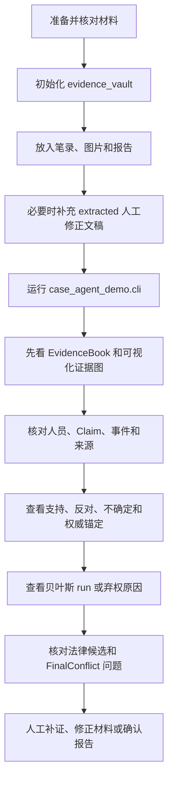

# 用户手册（当前 v0.58，含 v0.51、v0.56 历史基线）

> 阅读说明：第 1 至 16 节保留基础操作结构，“v0.51 补充说明”和“v0.56 贝叶斯证据推理使用说明”用于追溯演进；当前测试、验收和故障处理以文末“v0.58 十案验证操作说明”为准。

## 阅读导航

| 你要完成的事情 | 建议阅读 |
| --- | --- |
| 第一次运行系统 | 第 1 至 7 节 |
| 准备笔录、图片和报告 | 第 3 至 5 节、第 9 至 10 节 |
| 维护三部法律和混合 RAG | 第 11 节、v0.56 附录第十一、十九、二十四节 |
| 看懂 EvidenceGraph、Claim 和置信度 | 第 8、13 节，v0.56 附录第一至七节 |
| 查看图和贝叶斯网络 | v0.56 附录第二十六节 |
| 采集并校准贝叶斯参数 | v0.56 附录第二十七节和统计量说明文档 |
| 排查运行问题 | 第 15 节和 v0.56 附录第二十八节 |

## 1. 快速开始

进入项目目录：

```powershell
cd F:\汇报\Va1ha11a_demo
```

安装为可编辑包：

```powershell
pip install -e .
```

使用内置材料运行流程：

```powershell
python -m case_agent_demo.cli --sample
```

运行完整测试：

```powershell
python -m pytest -q -p no:cacheprovider
```

`--sample` 不读取真实证据目录，但当前 CLI 仍会通过 `CaseWorkflow.from_runtime_config()` 初始化语义模型运行时，并可能调用已配置的 DeepSeek。它表示“使用内置材料”，不等于“完全离线”。如果只想验证确定性代码和安全弃权，请运行测试；如果想查看不写回数据的可视化内置示例，可运行 `python -m plugins.reasoning_visualizer --sample --port 0`，该命令同样可能使用当前语义配置生成 workflow 结果。

## 2. 配置 API

复制配置模板：

```powershell
Copy-Item config/api_keys.example.toml config/api_keys.toml
```

填写 `config/api_keys.toml`：

```toml
[deepseek]
api_key = "你的 deepseek key"
base_url = "https://api.deepseek.com"
timeout_seconds = 120

[qwen]
api_key = "你的 qwen key"
base_url = "https://dashscope.aliyuncs.com/compatible-mode/v1"
model_name = "qwen2.5-vl-72b-instruct"
timeout_seconds = 120
```

真实 key 文件已被 `.gitignore` 忽略。不要把 key 写入 Markdown、测试文件或代码。

如果 Qwen 返回 `HTTP 403 Forbidden` 或 `access_denied`，通常是账号权限、模型名称或 endpoint 不匹配。请在控制台确认视觉模型权限，或把 `[qwen].model_name` 改成账号已有权限的视觉模型。

## 3. 初始化证据文件夹

```powershell
python -m case_agent_demo.cli --init-evidence-vault evidence_vault
```

生成目录：

```text
evidence_vault/
  statements/             # 笔录：.txt / .docx / .pdf
  report_images/          # 报告：.jpg / .jpeg / .png / .docx / .pdf
  identification_images/  # 图片证据：.jpg / .jpeg / .png
  extracted/              # 人工修正文本
  manifest.json           # 自动生成的材料清单
```

## 4. 放置材料

笔录放入：

```text
evidence_vault/statements/
```

报告材料放入：

```text
evidence_vault/report_images/
```

包括法医检测报告、监控研判报告、图片版报告、Word 报告和 PDF 报告。

图片证据放入：

```text
evidence_vault/identification_images/
```

包括现场照片、辨认图片、物证照片、截图等。

同一件事、同一次辨认或同一份报告的多张图片，建议放在同一个子文件夹中：

```text
evidence_vault/
  identification_images/
    group_001/
      1.jpg
      2.jpg
  report_images/
    report_001/
      page1.jpg
      page2.jpg
```

系统会把同一个子文件夹作为一个图片组处理，不同文件夹之间不会共享视觉上下文。

## 5. 人工修正文本

系统不在本地运行 OCR。图片理解依赖 Qwen 视觉 API；PDF 优先读取文本层。

如果扫描版 PDF、图片识别结果或 Word/PDF 解析结果需要人工修正，可以在 `extracted/` 放同名 `.txt`。

示例：

```text
evidence_vault/identification_images/P1.jpg
evidence_vault/extracted/P1.txt
```

运行时会优先使用 `extracted/P1.txt`。

## 6. 运行真实分析

```powershell
python -m case_agent_demo.cli --evidence-dir evidence_vault
```

`--case-type` 当前只作为兼容性提示，不是运行前置条件。只有显式调用旧 API 且设置 `require_human_confirmation=True` 时，系统才恢复人工确认门。

如需排查文本流程，临时关闭 Qwen 视觉：

```powershell
python -m case_agent_demo.cli --evidence-dir evidence_vault --disable-qwen-vision
```

## 7. 系统会做什么

运行后，系统会按以下顺序处理：

1. 扫描证据目录，读取材料；
2. 生成材料处理计划；
3. Text、Pic、Report Agent 提取事实并增量写入 EvidenceGraph；
4. `AssertionNormalizer` 把材料内容拆成原子 Assertion；
5. `ClaimBuilderV2` 按主体、谓词、目标/对象和事件形成 Claim；
6. 主观证据引擎计算支持、反对、不确定和冲突；
7. 权威验证器在专业范围内处理经人工核验的鉴定或意见；
8. 贝叶斯 Tool 按事实谓词选择关系组件，或者安全弃权；
9. LegalRetrievalTool 发现法律候选并检索报告、审查依据；
10. EvidenceBookBuilder 生成结构化证据册；
11. Reasoning Agent 生成辅助报告；
12. Judge Agent 和 FinalConflictAgent 提出质询、补证及程序问题；
13. Reasoning Agent 修订报告；
14. Review Agent 做最终边界复核。

## 8. EvidenceGraph 如何理解

当前系统生成的不只是事实列表，还会生成轻量证据图。

图中包含：

- 材料节点：某份笔录、某组图片、某份报告；
- 事实节点：从材料中提炼出的结构化事实；
- 关系边：材料和事实之间、事实和事实之间的关系。

常见关系包括：

| 关系 | 含义 |
| --- | --- |
| `source_of` | 某份材料生成某条事实 |
| `same_person` | 两条事实涉及同一人员 |
| `same_object` | 两条事实涉及同一对象或后果 |
| `same_event` | 两条事实可能指向同一事件 |
| `contradicts` | 两条事实存在冲突 |
| `supports` | 图片或报告事实与其他事实相互印证 |
| `needs_human_check` | 低置信节点需要人工复核 |

为了兼容旧流程，系统仍保留 `.facts`。因此旧的冲突检测和报告生成仍能正常工作，同时新图结构已经可以为后续扩展使用。

## 9. Text Agent 如何处理笔录

`TextAgent` 每次只处理一份笔录，不会把多份笔录混在同一次上下文中。

写入图中的不是整篇笔录原文，而是结构化事实。以下仅用抽象字段说明，不代表程序依赖任何固定人名、地点或行为词：

```text
declarant=陈述人A
actor=行为主体B
target_person=目标人员C
predicate=开放事实谓词
event_id=事件编号
stance=affirm / direct_deny / ambiguous
source_material_id=材料编号
```

否认、记不清和替代解释也会作为独立 Assertion 保留，例如：

```text
direct_deny：明确否认同一命题
lack_of_memory：表示无法回忆，不作为直接反证
alternative_explanation：提出另一种可核验解释
```

系统通过语义模型识别这些立场，不使用“没有”“未”“受伤”等固定关键词枚举案件事实。语义模型不能可靠判断时，材料会进入 `unresolved_observation / ambiguous`，等待人工复核。

## 10. 图片和报告如何处理

图片证据：

- Qwen 可用时，系统会生成图片描述和可见文字识别结果；
- 同一文件夹内图片作为一组处理；
- 低置信图片事实会触发 `needs_human_check`。

报告材料：

- 图片报告会调用 Qwen 视觉；
- Word 报告直接读取文本；
- PDF 报告优先读取文本层；
- 扫描版或解析效果差的报告，可在 `extracted/` 提供人工文本。

## 11. 法律库维护

当前法律源文件和索引位置：

```text
law_DB/                                      # PDF 法律和规范源文件
legal_knowledge/index/legal_kb.sqlite3       # SQLite、FTS5 和向量索引
legal_knowledge/metadata/corpus_manifest.json # 可读语料清单
```

当前入库语料为刑法、治安管理处罚法和刑事诉讼法，共 957 个条文块。新增或更新文件后运行：

```powershell
python -m case_agent_demo.legal_kb_cli --root legal_knowledge ingest --source law_DB --embedding-provider fastembed
python -m case_agent_demo.legal_kb_cli --root legal_knowledge stats
```

维护建议：

- 保留法律名称、版本、来源文件和生效状态；
- 更新同一文件后重建索引并检查是否产生重复文档；
- 抽查条号、页码和标题是否正确；
- 通过 `corpus_manifest.json` 核对文件哈希和条文块数量；
- 不要把未检索到条文解释成法律没有规定，先确认语料覆盖范围。

`legal_library/laws.jsonl` 仅作为旧接口兼容回退，不是当前主知识库。

## 12. 如何阅读报告

报告中建议重点看：

1. 行为事实
   系统从材料中提炼了哪些事实，是否符合原文。

2. 时间地点
   时间、地点是否完整，是否有明显冲突。

3. 对象与后果
   是否准确识别伤情、损失、涉案物品和报告结论。

4. 冲突与纰漏
   哪些材料之间存在矛盾，哪些事实需要人工核实。

5. 可能关联法律依据
   法条是否与事实行为匹配。该部分只作辅助参考。

6. 反方质询与修订
   查看 Judge Agent 是否指出证据不足、法律依据缺失或结论越界。

7. Review 状态
   如 Review 为 `FAIL`，应先处理报告越界、缺少事实来源或缺少法律依据等问题。

## 13. 置信度怎么看

当前系统区分三类不同概念：节点抽取质量、Claim 证据状态和贝叶斯派生关系支持值。它们都是辅助研判信息，不是司法证明概率。

常见来源：

- `extraction_quality`：LLM、OCR 或图片理解是否准确读取材料；
- `support`：独立正向来源对同一 Claim 的累计证据量；
- `opposition`：直接否认或反向客观材料形成的反向证据量；
- `uncertainty`：关键事实缺失、材料含糊或无法核验的程度；
- `conflict`：正向与反向证据同时存在的程度；
- `authority_anchored`：经人工核验的专业材料在限定范围内形成强锚定；
- `bayesian_derived`：跨 Claim 关系组件产生的版本化派生支持值。

系统先按 `origin_evidence` 和 `source_group` 去重，同源截图和派生报告不会无限叠加。如果出现高不确定、高冲突、反向占优或安全弃权，应优先核对原始材料和缺失证据，而不是只看一个汇总数值。

## 14. Prompt 调整

Prompt 文件位置：

```text
config/prompts/
```

常用文件：

```text
text_agent.md
pic_agent_qwen.md
report_image_agent.md
conflict_agent.md
reasoning_agent.md
judge_agent.md
review_agent.md
```

修改 prompt 后重新运行即可。建议每次只改一个 Agent 的 prompt，并用固定测试材料对比输出变化。

## 15. 常见问题

### 缺少 API key

v0.56 命令行会尝试从 `config/api_keys.toml` 连接 DeepSeek 语义模型。DeepSeek key 缺失、接口失败或返回格式不合格时，系统不会使用关键词猜测事实，而会把对应材料标记为 `unresolved_observation / ambiguous` 并要求人工复核。启用 Qwen 图片识别时，Qwen 配置错误仍可能直接阻止图片识别。

可能看到的配置错误：

```text
provider.api_key is required in config/api_keys.toml
```

处理方法：

- 确认 `config/api_keys.toml` 存在；
- 确认 `[deepseek]` 或 `[qwen]` 下已填写 `api_key`；
- 确认 key 没有被误写进其他文件。
- 检查 EvidenceGraph 是否出现 `unresolved_observation`；出现时不要把它当作已识别事实，应修复配置后重跑或人工录入结构化 Assertion。

### 图片没有自动识别

检查：

- 是否使用了 `--disable-qwen-vision`；
- `[qwen]` 配置是否完整；
- 模型名称是否有权限；
- 是否存在 `extracted/同名.txt`，如果存在会优先使用人工文本。

### 法条匹配不准确

检查：

- `law_DB/` 中对应法律文件是否已重新入库；
- `python -m case_agent_demo.legal_kb_cli --root legal_knowledge stats` 是否显示 3 个文档、957 个条文块和预期向量后端；
- EvidenceClaim 是否准确表达主体、谓词、目标/对象和事件范围；
- 本次检索的 `purpose`、法律领域和案件时间信息是否完整；
- 结果是否被 relevance gate 拦截，或当前三部法律本身尚未覆盖所需司法解释、鉴定标准和地方规范。

`legal_library/laws.jsonl` 只用于旧接口兼容回退，不应再作为当前 RAG 精度调整入口。

### 报告出现最终性法律判断

Review Agent 会拦截此类表达，例如：

```text
已经构成犯罪
应当处罚
必然构成
依法应当追究
```

系统输出应改为“辅助分析”“可能关联”“需人工复核”等边界表达。

## 16. 当前边界

- 不替代人工定性；
- 不判断材料真实性；
- 不自动联网更新法律法规；
- 不在本地 OCR；
- 不把置信度当作证明概率；
- 不输出最终处理决定；
- 当前混合 RAG 只覆盖已入库的三部法律，尚未覆盖全部司法解释、鉴定标准和地方规范；
- 当前贝叶斯组件只处理已注册的事实关系，缺少锚点、输入或匹配组件时会安全弃权；
- 案件证据图仍以单次 workflow 内存对象为主，长期案件数据库、在线多人协作和参数自动发布不属于当前版本。
## 附录：本次更新补充说明（v0.51）

本节说明 v0.51 新增功能在实际使用时应如何理解和操作。

### 一、法律知识库怎么放材料

如需让系统检索本地法律依据，可以把文件放到：

```text
legal_knowledge/incoming/
```

支持文件类型：

- `.txt`
- `.md`
- `.jsonl`

程序会在运行时建立本地索引，索引文件位于：

```text
legal_knowledge/index/
```

普通用户不需要手工修改索引文件。需要更新知识库时，放入新文件后重新运行入库流程即可。

### 二、怎么看置信度

系统会对部分事实主张生成置信度标签。常见标签含义如下：

| 标签 | 使用含义 |
| --- | --- |
| 多源较强印证 | 多份材料支持，可作为重点事实候选 |
| 有一定印证 | 有支持材料，但仍建议人工复核 |
| 争议事实，尚不足以否定 | 有反向说法，但不一定能推翻支持材料 |
| 明显存疑，需补强 | 材料不足或冲突明显，应补充核实 |
| 低可信或被冲突削弱 | 不建议直接采信，应重点审查 |

注意：置信度不是法律结论，也不是系统替用户判断事实是否成立。

### 三、怎么看最终审查问题

v0.51 会把审查问题集中提示出来，常见包括：

- 证据冲突；
- 证据不足；
- 法律依据缺失；
- 报告越界；
- 图片证据置信度偏低。

看到这些提示时，用户应回到原始笔录、图片、报告和法律依据中核对。

### 四、推荐操作顺序

1. 放入案件材料；
2. 如需扩展法律依据，放入 `legal_knowledge/incoming/`；
3. 运行程序；
4. （v0.51 历史步骤）人工确认案件类型；v0.56 默认跳过该步骤；
5. 查看事实、证据图谱、冲突、法律依据和置信度；
6. 对系统提示的“需补强”“越界”“依据缺失”等问题逐项复核；
7. 人工决定是否采纳报告内容。

### 五、不要把系统输出当作最终结论

系统只做辅助研判。真实案件中的事实采信、法律定性、程序审查和处理决定，仍然必须由具备权限的人员完成。

## 附录：v0.56 贝叶斯证据推理使用说明

### 新版操作总览：先做什么、后看什么

普通业务用户不需要手工选择贝叶斯模型，也不需要先判断案件属于哪一类。推荐按以下顺序操作：



系统输出较多时，遵循三个原则：

1. **先看证据册，后看报告**：先确认系统是否理解了正确的人、事、物和事件，再阅读自然语言结论。
2. **先看输入，后看派生值**：贝叶斯数值只有在 anchor、输入 Claim 和分组正确时才有参考意义。
3. **先看弃权原因，不把无结果当无事实**：没有贝叶斯 run 可能只是缺少组件或必需输入，EvidenceGraph、Claim 和法律候选仍然有效。

### 一、新版会增加哪些结果

v0.56 在原有 EvidenceGraph、置信度和最终审查结果之外，新增：

- 原子 `EvidenceAssertion`；
- 支持、反对、不确定和冲突分量；
- 经人工核验的权威材料范围锚定；
- 注册表动态选择的贝叶斯事实模型；
- `bayesian_derived` 派生 Claim；
- 模型版本、参数哈希、输入 Claim 和分组信息；
- 派生事实不足和因果不足补证提示。

### 二、六种事实关系组件如何使用

| 关系组件 | 面向的事实问题 |
| --- | --- |
| `conduct_result` | 行为与结果是否存在机制、时间和其他原因上的事实联系 |
| `property_taking` | 财物原占有、取得、转移和流向是否形成支持 |
| `public_order` | 公共场所行为是否造成实际秩序影响 |
| `public_safety` | 危险行为或状态是否形成公共危险事实支持 |
| `status_duty` | 资格、职责、授权和行为记录是否齐备并相互支持 |
| `deception_disposition` | 虚假陈述、错误认识和财产处分之间是否形成事实联系 |

所有组件优先级相同。它们不是案件类型，也不负责判断罪名。故意伤害不使用专用模型，而是和其他行为—结果场景一样进入 `conduct_result`；诈骗等表述也不是直接触发“诈骗结论”，而是先拆解为陈述、认识、处分和损失等事实 Claim。

### 三、为什么有时没有贝叶斯结果

以下情况系统会保守地不进行跨 Claim 推断：

- 注册表中没有匹配当前事实谓词的关系组件；
- 已匹配组件，但没有获得正向支持的 anchor 事实；
- 有 anchor，但缺少组件声明的必需输入；
- Claim 未评估或完全未知；
- 不同 Claim 没有相同 event_id；
- 行为人、目标或对象不一致；
- 系统无法确认材料是否属于同一事件。

例如只有法医轻伤二级鉴定，没有行为 Claim 时，伤情仍可得到权威评估，但系统不会自动推断某人造成该损伤。

### 四、如何阅读贝叶斯结果

| 字段 | 含义 |
| --- | --- |
| `selected_model_ids` | 本案命中的模型 |
| `skipped_model_ids` | 未运行的模型 |
| `calibration_status` | 参数是否经过真实数据校准 |
| `parameter_hash` | 本次使用参数的审计哈希 |
| `group_key` | 本次 run 的事件、行为人和目标分组 |
| `anchor_claim_id` | 本次推断的锚点事实 |
| `input_claim_ids` | 实际参与推断的 Claim |
| `soft_evidence_sources` | 输入数值来自哪些 Claim |
| `derived_values` | 派生事实支持值 |

当前 `calibration_status` 为 `expert_prior_unvalidated`，因此派生值只能用于排序、复核和补证提示，不能解释为事实概率。

### 五、权威材料怎么处理

专业报告需要人工核验机构/人员资格、文书真实性、程序、对象对应、方法、标准和结论范围。验证通过后，只锚定专业范围内事实。

轻伤二级鉴定不能自动证明谁实施了行为、损伤由哪一次行为造成、行为人主观目的、违法犯罪成立或处罚结论。

### 六、怎么看支持、反对和未知

`support` 表示正向证据质量，`opposition` 表示反向证据质量，`uncertainty` 表示信息不足，`conflict` 表示正反证据同时存在的程度。

“不知道”“记不清”或未完成核验不等于否认，也不会被填写成 `0`。同一来源的多张截图和派生报告不会被当成多份独立证据累计。

### 七、新增补证提示

- `derived_fact_insufficient`：派生事实支持不足；
- `causation_insufficient`：行为和结果之间的因果支持不足；
- `authority_contested`：权威意见存在同层级反证或有效性问题；
- `contested_but_not_refuted`：有实质争议，但现有反向材料尚不足以完全否定。

用户应根据 required_action 回到监控、证人、病历、原始报告、财物流向或程序记录中补充核对。

### 八、真实统计数据怎么收集

使用：

```text
docs/statistics/bayesian_parameter_collection_template.xlsx
docs/statistics/BAYESIAN_PARAMETER_COLLECTION_GUIDE.md
```

需要记录原子事实真/假/未知、TP/FP/FN/TN、角色×谓词×立场、抽取准确率、来源依赖、案件族 CPD 和模型审批信息。

不得填写姓名、证件号、联系方式、地址或材料全文。未知不得填成假。报警人、嫌疑人、被害人和证人等角色的历史比例不能直接转换成固定个人可信度。

### 九、哪些内容不能训练

年龄、数额、次数、法律身份、法定义务、授权效力、抗辩、治安刑事边界、法律适用和处罚必须使用现行法律规则和人工审查，不得通过历史案件比例自动学习。

### 十、v0.56 推荐复核顺序

1. 核对原始材料和 EvidenceGraph；
2. 核对 Claim 的 actor、target/object 和 event_id；
3. 查看 support、opposition、uncertainty 和来源组；
4. 检查权威材料是否完成范围核验；
5. 查看每个贝叶斯 run 的 anchor 和输入 Claim；
6. 查看派生事实及其参数版本；
7. 检查法律依据和 FinalConflictAgent 提示；
8. 由具备权限的人员决定是否采纳和如何补证。

### 十一、v0.56 法律混合 RAG 使用方法

本节是 v0.56 新增说明，不删除前文 v0.51 的法律库历史内容。当前系统已不再局限于 JSONL/关键词检索。

`law_DB/` 中的三部 PDF 已经入库：

- 《中华人民共和国刑法》；
- 《中华人民共和国治安管理处罚法》。
- 《中华人民共和国刑事诉讼法》。

首次在新环境使用时执行：

```powershell
pip install -e ".[rag]"
python -m case_agent_demo.legal_kb_cli --root legal_knowledge ingest --source law_DB --embedding-provider fastembed
```

查看索引状态：

```powershell
python -m case_agent_demo.legal_kb_cli --root legal_knowledge stats
```

直接检索：

```powershell
python -m case_agent_demo.legal_kb_cli --root legal_knowledge search "盗窃他人财物，如何区分治安处罚和刑事责任"
```

每个结果包含法律名称、条号、PDF 页码、综合分和条文内容。更详细的检索分项、文档哈希和模型名称保存在 `query_trace`；语料清单位于：

```text
legal_knowledge/metadata/corpus_manifest.json
```

系统会同时使用精确法律词语和中文语义向量检索，再按案件领域与检索目的排序。只命中“法律”“责任”“处罚”等泛化词不会自动获得高排名，无关查询会返回空结果。

请特别注意：当前 RAG 包含三部法律。它可以帮助比较治安处罚与刑事实体法条，也可以检索刑诉法中的证明标准、证据种类和非法证据排除等内容，但尚未完整包含全部司法解释、专门证据规则、法医鉴定标准和地方裁量基准。没有检索到相关依据时，应先检查语料覆盖，不得直接推断“法律没有规定”。

### 十二、v0.56 材料如何形成 Claim

v0.56 不再只依赖一句文本中的单一 `person` 字段。笔录和报告会尽量提取陈述人、行为人、目标人员、对象、事实谓词、事件编号和肯定/否定立场。一份材料可以形成多个原子 Assertion，例如一份法医报告可以分别表达“损伤存在”“损伤等级”“机制吻合”和“时间接近”。

事实抽取由 prompt 驱动的语义模型完成。项目没有删除原有 prompt，只在原有任务说明后追加了开放 predicate、stance、`evidence_span` 和安全弃权约束。Qwen 输出的图片描述和 OCR 文本只是观察结果，仍需 DeepSeek 语义理解后才会成为事实节点。

程序不再通过“受伤、轻伤、没有、未、否认”等词表推断事实类型或立场。模型不可用或无法可靠填写结构化字段时，材料会保留为 `unresolved_observation / ambiguous`，并由 FinalConflictAgent 提示人工复核；它不会进入正向或反向证据，也不会启动贝叶斯推理。法律 RAG 的关键词/FTS 检索不受此变化影响，因为它只用于召回法条，不用于判断案件事实。

Assertion 按“行为人 + 谓词 + 目标/对象 + 事件”聚合为 Claim。系统采用以下保守规则：

- 不把两个明确不同事件的材料拼接到一起；
- 缺少事件编号的材料，只在存在唯一兼容事件时补入；
- 同一事件中的不同财物不会合并成一个 Claim；
- “记不清”“无法确认”等内容作为不确定信息，不作为直接否认；
- 轻伤鉴定只直接支持伤情类 Claim，不直接支持具体行为人实施暴力。

### 十三、v0.56 法律检索精度控制

法律检索只使用获得正向支持的 Claim 构造案件查询。被否定、反向证据占优或证据不足的 Claim 不会单独激活某一违法犯罪行为族。

对刑法和治安管理处罚法的实体条款，系统会根据已经获得正向支持的事实关系形成候选，再执行关键词与向量混合检索；刑诉法按证据审查、程序合规和报告复核等目的检索。领域分和文档类型分只用于排序，不能让无关条文进入候选结果。

因此，普通故意伤害材料不应仅因泛化语义相似而召回寻衅滋事、绑架、偷越国境或威胁条款。若案件材料确实包含这些独立事实，相应行为族仍可正常参与检索。

### 十四、运行事实关系回放

`测试用例/` 提供五个传统去标识化合成场景，以及一个不提供人工案件类型的开放事实场景。验证六个正向语义回放时，使用测试中受控的语义 fixture：

```powershell
python -m pytest -q -p no:cacheprovider tests/test_case_replay_corpus.py
```

也可以直接运行回放器：

```powershell
python -m case_agent_demo.case_replay --root 测试用例
```

但直接运行时默认不注入测试语义结果。若没有可用语义模型，取消关键词兜底后的系统会把材料标记为 `unresolved_observation` 并安全弃权；这不等同于六个正向场景通过。不要为了让回放有结果而恢复关键词猜测。

回放会执行真实 workflow，并核对：

- 主要 Claim 是否形成；
- 独立来源数是否达到预期；
- 是否选择正确的贝叶斯模型；
- 派生支持指数是否达到用例下限；
- 是否召回应包含的法条；
- 是否排除用例明确禁止的无关法条。

当前基准覆盖关系为：

| 回放场景 | 主要关系组件 | 预期法律方向 |
| --- | --- | --- |
| 故意伤害 | `conduct_result` | 刑法第 234 条、治安管理处罚法第 51 条 |
| 盗窃 | `property_taking` | 刑法第 264 条、治安管理处罚法第 58 条 |
| 毁坏财物 | `conduct_result` | 刑法第 275 条、治安管理处罚法第 59 条 |
| 扰乱公共秩序 | `public_order` | 刑法第 291 条、治安管理处罚法第 26 条 |
| 危害公共安全 | `public_safety` | 刑法第 114 条、治安管理处罚法第 36 条 |
| 项目陈述与转账 | `deception_disposition` | 刑法第 266 条等候选方向 |

这些条款是回放用例的检索预期，不代表系统已经作出最终法律定性，也不表示系统只能处理表中场景。

### 十五、v0.56 当前验收状态

项目根目录执行：

```powershell
python -m pytest -q -p no:cacheprovider
```

v0.56 当时形成 230 项测试设计。v0.58 已把旧 DOCX 回放指向用户保留的 `测试用例/伤害/`，并增加十案、发布文档和验收报告门禁。2026-07-14 本地主工程 264 项全部通过，覆盖语义模型失败安全弃权、事件和对象隔离、支持/反对/歧义 Claim、权威范围、EvidenceBook、贝叶斯推理、法律 RAG 精度与统一法律回退。

### 十六、v0.56 案件中立使用补充

现在运行真实材料时可以省略案件类型：

```powershell
python -m case_agent_demo.cli --evidence-dir evidence_vault
```

`--case-type` 仍可作为人工提示兼容使用，但不会决定贝叶斯组件。系统会从材料本身生成暂定领域和法律候选。

### 十七、如何阅读 EvidenceBook

重点依次查看：

1. `participants`：人员以及报警人、被指称行为人、证人、受影响人员等角色；
2. `allegations`：谁控诉谁实施了什么事实行为，涉及何人、何物、时间和地点；
3. `fact_findings`：每项事实的支持、反对、不确定来源和当前结论；
4. `objective_circumstances`：监控、交易、鉴定、登记等客观材料；
5. `identifications`：辨认人、被辨认对象和原始材料；
6. `legal_candidates`：可能相关的法律条款，只是候选；
7. `bayesian_runs` / `bayesian_abstentions`：实际使用了哪些关系组件，或者为什么没有运行；
8. `missing_evidence`：建议补充核对的材料。

`supported` 表示现有证据支持某项事实，不等于认定违法犯罪成立；`objectively_opposed` 表示现有客观材料不支持该事实，仍应核对材料真实性、完整性和证明范围。

### 十八、未知案件与安全弃权

系统遇到没有特化组件的新事实时仍会整理证据册。常见弃权原因：

- `no_matching_relation_component`：没有适用的跨事实关系组件，不强行套模型；
- `missing_allegation_anchor`：没有获得正向支持的行为锚点；
- `missing_required_inputs`：关系组件已匹配，但缺少必需事实。

安全弃权不是“没有违法行为”，而是“贝叶斯 Tool 当前不应推理”。此时仍应阅读事实 Claim、支持/反对材料和法律候选。

### 十九、当前法律 RAG

`law_DB/` 当前已入库三部 PDF：刑法、治安管理处罚法和刑事诉讼法。最新索引共有 957 个条文块，其中刑法 505、治安管理处罚法 144、刑诉法 308。查看状态：

```powershell
python -m case_agent_demo.legal_kb_cli --root legal_knowledge stats
```

刑诉法已经可以用于证明标准和非法证据排除等检索，但知识库仍未完整覆盖全部司法解释、鉴定标准和地方裁量规范。

### 二十、回放用例不是支持范围

传统案件回放和开放事实回放只是用来防止代码回归。系统能否处理新材料，取决于是否能抽取清晰的主体、谓词、目标和事件，而不是是否在用例目录中有同名案件。没有匹配贝叶斯组件时，主观证据评估、法律候选和证据册仍然可用。

当前完整测试命令及核验结果：

```powershell
python -m pytest -q -p no:cacheprovider
```

上述两项历史待办已在 v0.58 关闭：主工程 264 项全部通过，可视化插件 5 项全部通过。插件样例使用显式结构化语义输入形成真实 `derived_claim`，不再依赖关键词 fallback。

### 二十一、从准备材料到取得证据册

#### 1. 初始化材料目录

```powershell
python -m case_agent_demo.cli --init-evidence-vault evidence_vault
```

常用目录：

```text
evidence_vault/
  statements/             # 询问、讯问、证人证言等文本材料
  report_images/          # 鉴定、研判、检验等报告图片或文档
  identification_images/  # 辨认、现场、物品、监控截图等证据图片
  extracted/              # 扫描件人工 OCR 修正文稿
```

每份材料应尽量保留来源文件名、形成时间、提交或提取主体、原始载体和材料之间的派生关系。十张来自同一视频的截图不能当成十份独立来源；基于原视频形成的研判报告也应标记同一 `origin_evidence`。

#### 2. 运行分析

```powershell
python -m case_agent_demo.cli --evidence-dir evidence_vault
```

只有兼容旧流程或对比实验时才传：

```powershell
python -m case_agent_demo.cli --evidence-dir evidence_vault --case-type "人工提示"
```

该提示不会决定贝叶斯组件，不能替代材料中的事实抽取。

#### 3. 首轮核对

输出后先看 EvidenceBook，不要先看最终报告。推荐依次核对：人员角色是否正确、控诉是否完整、行为人与目标是否混淆、event_id 是否指向同一事件、支持和反向节点是否来自正确材料、客观材料是否被误当成陈述、法律候选是否有具体条文来源。

### 二十二、事实状态如何解释

| 状态 | 可以表达 | 不可以表达 |
| --- | --- | --- |
| `supported` | 现有材料对该事实形成正向支持 | 该事实已经达到法定证明标准 |
| `authority_anchored` | 经核验的权威材料在专业范围内强支持该事实 | 权威材料证明了范围外的行为人、主观目的或法律责任 |
| `contested_but_not_refuted` | 正向材料占优，但有实质反向材料 | 反向材料已经被排除或事实已经确定成立 |
| `objectively_opposed` | 当前客观材料不支持控诉中的该项事实 | 永久证明该事实绝不可能发生 |
| `opposing_dominant` | 反向证据当前占优 | 已经完成最终无违法判断 |
| `insufficient` | 材料数量、质量或独立性不足 | 该事实必然为假 |
| `bayesian_derived` | 版本化关系组件计算出跨 Claim 支持值 | 该数值是有罪概率或统计真实性概率 |

若同一事实同时存在支持和反对，应重点看 `conflict` 和来源独立性；若支持和反对都很低，应重点看 `uncertainty`。低分可能来自冲突，也可能只是没有材料，两者的补证方向不同。

### 二十三、三种常见人工复核场景

#### 控诉与行为人否认

报警人称某人实施行为，行为人明确否认时，两份材料进入同一 Claim 的正反两侧。系统不会因为否认就把控诉归零，也不会因为控诉在先就默认成立；应继续核对独立证人、监控、交易、定位、现场痕迹和时间线。

#### 权威鉴定与行为因果

经核验的法医鉴定可以锚定“存在损伤”和“损伤等级”，但不能自动锚定“某人实施暴力”或“该行为造成该损伤”。后两项仍需要行为、时间、机制和其他原因材料形成独立证据链。

#### 未注册的新事实关系

系统会继续列出控诉、人员、时间地点、客观材料和法律候选，并返回 `no_matching_relation_component`。用户应先完成普通 Claim 复核；只有当该关系具有稳定、可复用结构并具备参数来源时，才考虑新增关系组件。

### 二十四、RAG 更新与核对

把新增法律或规范文件放入 `law_DB/` 或指定来源目录后，执行：

```powershell
python -m case_agent_demo.legal_kb_cli --root legal_knowledge ingest --source law_DB --embedding-provider fastembed
python -m case_agent_demo.legal_kb_cli --root legal_knowledge stats
```

当前正确统计应为：

```text
documents: 3
chunks: 957
embedding_backend: fastembed
embedding_model: BAAI/bge-small-zh-v1.5
```

入库后应抽查标题、文档类型、版本、条号、页码和文件哈希。更新同一法律时使用版本化记录和重建索引，不应把标题规范化后的同一文件误建成两部法律。

### 二十五、单案人工确认清单

- 原始材料是否完整、可追溯，OCR 是否经过抽查；
- 陈述人、行为人、目标人员和对象是否准确区分；
- 支持、反对和不确定材料是否针对同一 Claim；
- 同源截图、转述和派生报告是否已经去重；
- event_id、时间和地点是否足以证明材料属于同一事件；
- 权威材料是否核验资格、真实性、程序、对象、方法、标准和证明范围；
- 贝叶斯 run 是否使用了正确锚点和必需输入，是否存在安全弃权；
- 法律候选是否来自当前有效语料，案件发生时间与法律版本是否需要另行审查；
- FinalConflictAgent 提出的补证、程序和越界问题是否逐项处理；
- 最终报告是否避免“已经构成犯罪”“应当处罚”等未经有权人员确认的结论。

### 二十六、使用推理可视化插件

可视化插件位于 `plugins/reasoning_visualizer/`，只读取主工程公开结果，不被主工程反向依赖。删除整个插件目录不会影响案件分析主流程。

#### 1. 查看内置材料

```powershell
python -m plugins.reasoning_visualizer --sample --port 0
```

`--port 0`让系统自动选择空闲端口。浏览器默认自动打开；若不希望自动打开，增加 `--no-browser`。

#### 2. 查看证据目录的实时运行结果

```powershell
python -m plugins.reasoning_visualizer `
  --evidence-dir evidence_vault `
  --port 0
```

如果证据目录包含需要 Qwen 识别的图片，增加：

```powershell
--enable-qwen-vision
```

`--case-type`仍是可选提示，不决定贝叶斯组件。权威核验信息可使用：

```powershell
--authority-verifications authority_verifications.json
```

#### 3. 保存只读快照

```powershell
python -m plugins.reasoning_visualizer `
  --evidence-dir evidence_vault `
  --export reasoning.snapshot.json `
  --no-serve
```

重新打开：

```powershell
python -m plugins.reasoning_visualizer --snapshot reasoning.snapshot.json --port 0
```

#### 4. 可视化中重点看什么

- EvidenceGraph：材料节点、事实节点以及 `source_of`、支持、反对、同事件等边；
- EvidenceClaim：每个事实命题的主体、谓词、目标、事件和证据状态；
- Bayesian run：模型 ID、分组、锚点、输入节点、中间节点、派生节点和参数哈希；
- 节点详情：来源 Claim、运行值、父节点、权重和贡献；
- ValidationIssue：哪些事实冲突、证据不足、权威意见有争议或报告可能越界。

浏览器中的滑块只用于情景模拟。修改输入后可以观察派生节点如何变化，但不会更新工程参数、案件图或正式运行结果。快照包含案件摘要和推理数据，应按敏感材料管理，不能上传到公开仓库。

### 二十七、统计人员如何采集贝叶斯参数

普通案件操作人员不应直接编辑 `config/bayesian_models/*.json`。参数统计由独立的数据整理、核验、统计和审批角色完成。

打开：

```text
docs/statistics/bayesian_parameter_collection_template.xlsx
```

推荐操作顺序：

1. 阅读`开始这里`和`名词解释`；
2. 在`原子事实记录`中一行填写一个可独立核验的事实；
3. 来源说事实成立填`真`，明确否认填`假`，无法判断填`未知`；
4. 由不同职责人员填写`独立核验标签`；
5. 同一视频截图、复制材料和派生报告使用相同`来源组ID`；
6. 查看`根节点统计`和`来源表现统计`自动形成的计数、均值和区间；
7. 派生节点参数在`CPD样本记录`中填写父节点值、子节点真值及训练/验证/测试用途；
8. 将结果登记到`候选参数`，不得直接覆盖 JSON；
9. 完成独立回放、隐私检查、审批和`模型发布记录`；
10. 只创建新版本参数文件，并保留旧版本和回滚包。

当前可直接统计或拟合的贝叶斯参数为：

| 参数 | 数量 | 操作方式 |
| --- | ---: | --- |
| 根节点 `prior` | 27 | 用独立核验真/假计数形成 Beta 后验候选值 |
| 派生节点 `intercept` | 6 | 与同一节点全部权重一起离线拟合 |
| 派生节点 `weights` | 27 | 用逐案父节点值和子节点真值做逻辑回归 |

报警人、嫌疑人、证人等角色的历史主张可以按“角色×谓词×立场×批次”统计长期表现，但不能形成个人信誉分，也不能直接作为新案件的事实概率。完整白话说明见 `docs/statistics/BAYESIAN_PARAMETER_COLLECTION_GUIDE.md`。

### 二十八、常见故障定位顺序

#### 没有形成预期 Claim

1. 检查 DeepSeek 配置、超时和返回错误；
2. 查看材料是否被标记为 `unresolved_observation / ambiguous`；
3. 核对 prompt 输出是否包含 actor、predicate、target/object、event_id 和 stance；
4. 核对 OCR 或 `extracted/` 修正文稿是否完整；
5. 不要通过在 Python 中添加关键词把缺失 Claim 强行补出。

#### 有 Claim，但没有贝叶斯 run

先看 `bayesian_abstentions`：

| 原因 | 应检查 |
| --- | --- |
| `no_matching_relation_component` | 当前事实是否确实需要一个新的稳定跨 Claim 关系组件 |
| `missing_allegation_anchor` | 是否只有否认、猜测或完全未知材料，缺少正向事实锚点 |
| `missing_required_inputs` | 按 `missing_inputs` 补充对应事实材料 |

不要把弃权改写成 `0`，也不要为了得到结果手工填入没有本案依据的先验。

#### 法律结果为空或明显无关

1. 运行 `python -m case_agent_demo.legal_kb_cli --root legal_knowledge stats`；
2. 核对当前是否为 3 个文档、957 个条文块；
3. 检查 Claim 是否获得正向支持，反向占优事实不会单独激活实体法行为族；
4. 检查查询目的是否属于实体依据、证据审查或程序复核；
5. 检查案件发生时间和法律版本；
6. 未检索到不能解释成法律没有规定，可能只是语料尚未覆盖。

#### 可视化页面打不开

1. 使用 `--port 0`避免端口冲突；
2. 观察命令行输出的实际 localhost 地址；
3. 使用 `--no-browser`后手工打开该地址；
4. 服务仅允许监听本机地址，不能将其改成公网监听；
5. 如果已有快照，先用 `--snapshot`排除 workflow 运行问题。

### 二十九、不同用户的推荐入口

| 用户 | 首先使用 | 主要关注 |
| --- | --- | --- |
| 材料整理人员 | `evidence_vault/`、`manifest.json`、`extracted/` | 材料完整、来源明确、同源关系和 OCR 正确 |
| 案件复核人员 | EvidenceBook、可视化插件、FinalConflict 问题 | Claim 对齐、支持/反对、权威范围、弃权和补证 |
| 法律知识库管理员 | `case_agent_demo.legal_kb_cli` | 文档版本、条号、页码、哈希、索引统计和时效 |
| 模型参数管理员 | 统计 Excel、候选参数和发布记录 | 样本口径、独立核验、拟合、验证、审批和回滚 |
| 开发维护人员 | 技术手册、测试和回放器 | 数据契约、注册表、模型哈希、错误分支和兼容接口 |

无论角色如何，系统输出都只能作为辅助材料。最终事实采信、法律适用和处理决定仍由具备权限的人员完成。

## 附录：v0.58 十案验证操作说明

### 一、这批材料在哪里

```text
测试用例/v058随机条文/
  sampling_manifest.json
  CR-*/
  PS-*/
```

`CR-*` 是刑法合成案例，`PS-*` 是治安管理处罚法合成案例。每个目录都有笔录、报告、抽样来源和预期结果。材料只用于系统验证，不得当作真实案件材料使用。

### 二、重新生成十案

先安装可选依赖：

```powershell
E:\miniconda\python.exe -m pip install -e ".[casegen]"
```

再执行：

```powershell
E:\miniconda\python.exe scripts\generate_v058_cases.py `
  --output "测试用例\v058随机条文" `
  --overwrite
```

`--overwrite` 只应用于该生成目录。生成器使用随机种子 `58`，正常情况下相同版本应得到相同材料内容和清单。

### 三、运行十案确定性验收

```powershell
E:\miniconda\python.exe -m pytest -p no:cacheprovider `
  tests\test_v058_case_acceptance.py -q
```

该测试使用人工编制的黄金 Assertion 验证下游工程逻辑。它不检验大模型措辞是否完全一致，但会严格检查：

- 必须出现和禁止出现的 Claim；
- Claim 的支持、争议、证据不足或反向占优状态；
- 应运行的贝叶斯组件或应记录的安全弃权；
- 应召回的法律条文；
- FinalConflictAgent 应提出的问题；
- 报告不得出现的最终定性和处罚表述。

### 四、运行真实 Agent 对比

```powershell
E:\miniconda\python.exe scripts\run_v058_live_agent_acceptance.py `
  --corpus "测试用例\v058随机条文" `
  --output artifacts\v058-live-agent
```

真实运行需要当前 `config/api_keys.toml` 中的模型配置可用。输出目录记录每份材料的原始模型 JSON、缺失预期、意外输出和 unresolved 数量。运行器不会启用关键词兜底，也不会把黄金 Assertion 提供给模型。

看到差异时先判断：

1. `actor/target/object` 是否识别正确；
2. `predicate` 是否只是同义词不一致，还是事实含义错误；
3. `stance` 是否把否认、不记得、部分承认混淆；
4. `event_id/source_group/origin_evidence` 是否缺失；
5. 是否错误地把报告结论扩大到具体行为人或法律结论。

不要通过新增案件关键词列表来“修好”差异，应改进结构化 prompt、谓词注册或人工复核流程。

### 五、生成发布验收报告

```powershell
E:\miniconda\python.exe scripts\build_v058_acceptance_report.py `
  --corpus "测试用例\v058随机条文" `
  --output artifacts\v058-acceptance `
  --verify
```

输出：

- `summary.json`：供程序和后续 Dify parity 比较；
- `summary.md`：供人工阅读；
- 每案包含材料 SHA-256、Claim 状态、贝叶斯运行/弃权、法条、审查问题、模型版本和参数哈希。

### 六、查看证据图和贝叶斯网络

生成实时快照：

```powershell
E:\miniconda\python.exe -m plugins.reasoning_visualizer `
  --sample `
  --export artifacts\reasoning.snapshot.json
```

或对证据目录运行：

```powershell
E:\miniconda\python.exe -m plugins.reasoning_visualizer `
  --evidence-dir evidence_vault `
  --case-type "" `
  --port 0
```

页面中的 EvidenceGraph 展示材料、事实、Assertion、Claim、派生 Claim 和审查问题；贝叶斯页展示输入、公式、参数和派生节点。它读取本次实际运行结果，不会实时修改模型参数。

### 七、如何理解安全弃权

| 显示 | 含义 | 用户动作 |
|---|---|---|
| `no_matching_relation_component` | 当前 Claim 没有适用的关系组件 | 继续查看证据图和法律候选，不强行选择模型 |
| `missing_allegation_anchor` | 没有正向支持的基础事实 | 核对材料是否只有否认、猜测或不确定表达 |
| `missing_required_inputs` | 有基础事实但关系输入不完整 | 按缺失输入补充材料 |
| `bayesian_derived` | 已按版本化参数生成派生支持值 | 查看参数版本、输入 Claim 和范围限制 |

安全弃权不是“案件无法处理”。系统仍可整理材料、形成 EvidenceGraph/Claim、检索法律和提出补证建议，只是不生成没有充分输入的贝叶斯派生结果。

### 八、完整发布前自检

```powershell
E:\miniconda\python.exe -m pytest -q -p no:cacheprovider
E:\miniconda\python.exe -m pytest -q -p no:cacheprovider plugins\reasoning_visualizer\tests
E:\miniconda\python.exe scripts\sample_v058_provisions.py `
  --db legal_knowledge\index\legal_kb.sqlite3 `
  --seed 58 `
  --check "测试用例\v058随机条文\sampling_manifest.json"
E:\miniconda\python.exe scripts\build_v058_acceptance_report.py `
  --corpus "测试用例\v058随机条文" `
  --output artifacts\v058-acceptance `
  --verify
```

只有上述检查通过，且验收报告没有 `failed` 案例，才可把当前工程作为 v0.58 本地基线。贝叶斯派生值不是事实概率，法律候选不是最终法律意见，最终结论仍需人工审核。
