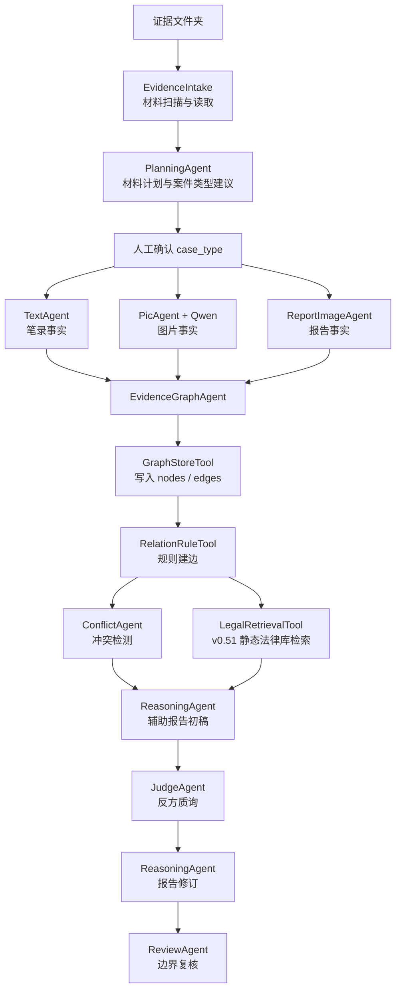
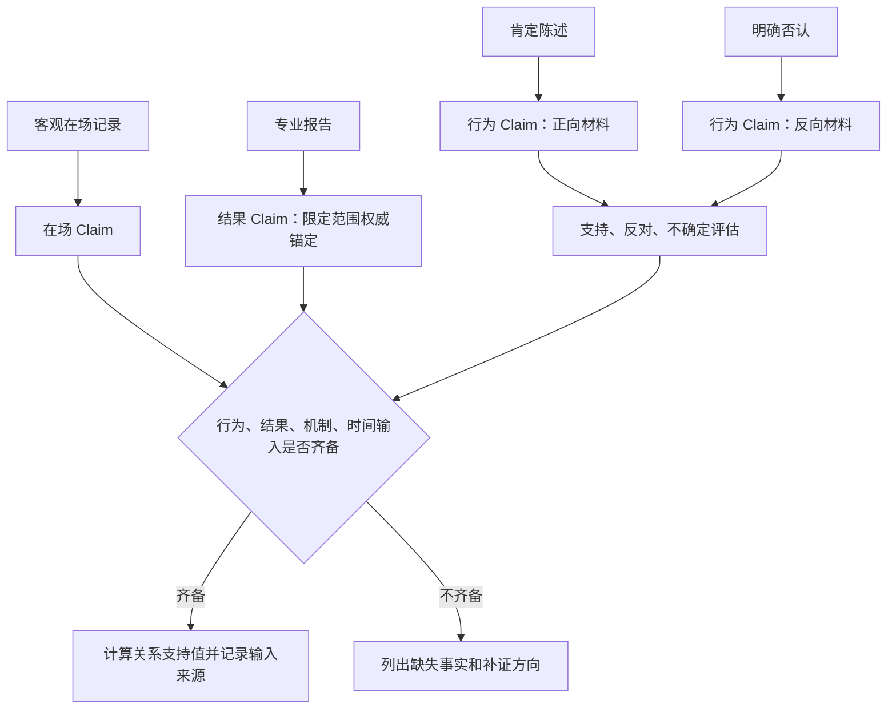
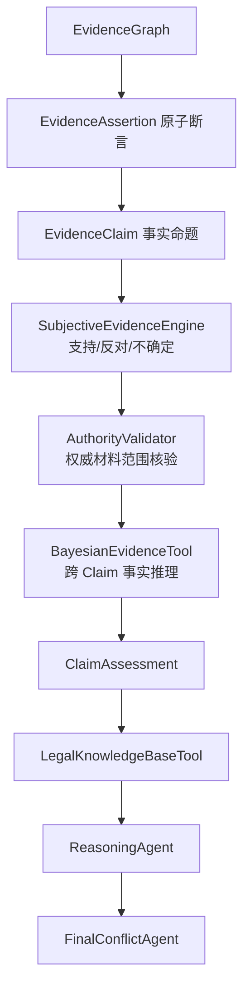
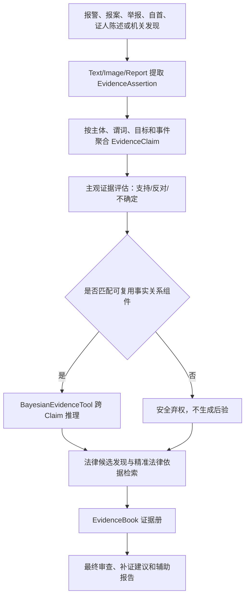
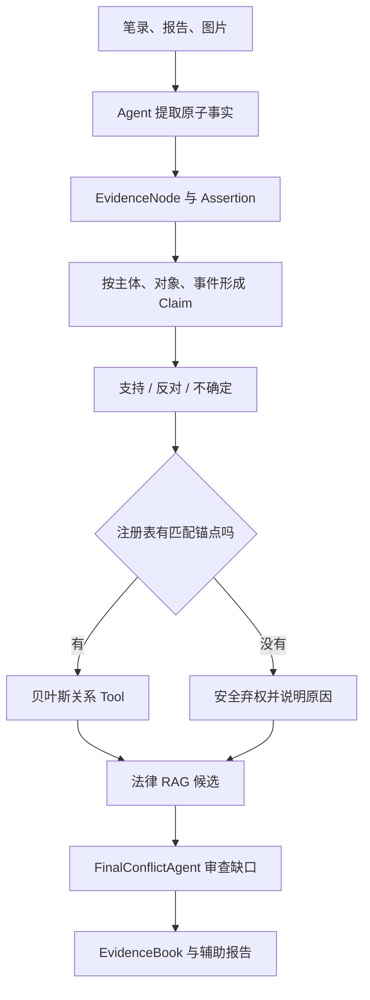

# 案件证据辅助研判系统项目介绍（当前 v0.58，含 v0.51、v0.56 历史基线）

> 领导阅读建议：先阅读下面的“当前项目汇报速览”，再阅读文末“第三部分：v0.58 十案验证更新”。v0.51、v0.56 内容保留用于说明项目演进，当前运行状态以 v0.58 为准。

## 当前项目汇报速览

| 汇报问题 | 当前回答 |
| --- | --- |
| 项目是什么 | 面向笔录、图片、报告和法律材料的案件证据辅助研判系统原型 |
| 本次升级做了什么 | 建立从材料、证据图、事实命题、证据评估、贝叶斯关系、法律检索到证据册的可追溯链路 |
| 与普通大模型总结有什么不同 | 分开保存支持、反对和未知材料；记录来源依赖；条件不足时安全弃权；法律候选能追溯到条文和源文件 |
| 当前交付 | 六个同级事实关系组件、混合法律 RAG、EvidenceBook、可视化插件、参数统计模板、10 个跨法条合成案例、264 项主工程测试和 5 项插件测试 |
| 能否自动定案 | 不能。系统只辅助整理事实、暴露冲突、检索依据和提出补证方向 |
| 当前最重要边界 | 贝叶斯参数仍是未经真实数据校准的专家先验；知识库尚未覆盖全部司法解释和地方规范 |

## 第一部分：v0.51 历史基线与演进起点

## 1. v0.51 当时的项目定位

在 v0.51 的历史基线中，本项目被定位为面向案件材料审查场景的多 Agent 辅助研判演示系统，将笔录、图片证据、报告材料和当时的静态法律库纳入统一流程。

系统定位是“案件材料辅助分析工具”，不替代办案人员、审核人员或司法人员的专业判断，不自动完成案件定性，不输出最终定罪、处罚或责任承担结论。

## 2. v0.51 当时的核心变化

v0.51 已从简单的事实列表升级为兼容旧接口的轻量 EvidenceGraph，并新增 EvidenceClaim、ConfidenceEngine、LegalKnowledgeBaseTool、Domain Affinity 和 FinalConflictAgent。

系统仍保留 `Fact` 和 `.facts`，保证既有流程、测试和 CLI 不被破坏；同时新增：

- `EvidenceNode`：表示材料节点、事实节点等证据图节点；
- `EvidenceEdge`：表示材料与事实、事实与事实之间的关系边；
- `GraphStoreTool`：负责节点和边的增量写入；
- `RelationRuleTool`：负责通过规则生成基础关系边；
- `EvidenceGraph`：兼容 `CaseGraph`，同时包含 `facts`、`nodes`、`edges`、`claims`；
- `EvidenceClaim`：把多个节点聚合成同一事实命题，区分支持和反对节点；
- `ConfidenceEngine`：计算 claim 级综合置信度和解释理由；
- `LegalKnowledgeBaseTool`：支持 txt/md/jsonl 入库、切片、搜索、更新、软删除；
- `Domain Affinity`：为法律条文和案件事实打领域相关度；
- `FinalConflictAgent`：统一输出最终审查问题和补充侦查建议。

这意味着系统现在不只是“提取事实”，还会把事实放入证据图中，并记录来源关系、同人关系、同物关系、同事件关系、支持关系、冲突关系和人工复核提示。

## 3. 建设目标

系统主要服务以下目标：

1. 对分散案件材料进行统一接收和规范化处理。
2. 从笔录、图片、报告中提炼结构化事实。
3. 将事实增量写入 EvidenceGraph，保留来源和关系。
4. 自动提示不同证据之间的冲突、印证和需人工复核事项。
5. 根据人工确认的案件类型检索可能相关的静态法律依据。
6. 生成带有事实来源、冲突提示、法律依据和结论边界的辅助分析报告。
7. 通过 Judge Agent 和 Review Agent 降低过度推断和越界表达风险。

## 4. 业务痛点与系统能力

案件材料审查通常存在材料多、格式杂、事实表达不统一、冲突不易发现等问题。系统通过以下能力降低人工初筛压力：

- 多格式接入：支持笔录文本、Word、PDF，支持图片证据和报告类材料；
- 单材料独立分析：Text Agent 每次只处理一份笔录，图片按文件夹分组处理；
- 结构化事实提取：统一提炼人员、行为、时间、地点、对象、后果、置信度；
- 图谱化组织：将材料和事实写入 EvidenceGraph，形成可追溯的节点和边；
- 关系规则推断：自动生成 `source_of`、`same_person`、`same_object`、`same_event`、`contradicts`、`supports`、`needs_human_check` 等关系；
- 法律依据辅助匹配：从 `legal_library/laws.jsonl` 检索可能相关条文；
- 报告边界控制：拦截“已经构成犯罪”“应当处罚”等最终性法律判断。

## 5. 总体工作流

在 v0.51 的历史流程中，系统在人工确认案件类型后才进入正式执行阶段；该限制已在 v0.56 取消，当前默认采用案件中立运行。

## 6. EvidenceGraph 的业务含义

当前 EvidenceGraph 是一个渐进式证据图，核心对象包括：

### 6.1 节点

- `material`：来源材料节点，例如某份笔录、某组图片、某份报告；
- `fact`：从材料中提炼出的事实节点；
- 预留类型：`report_opinion`、`person`、`object`、`event`、`legal_element`。

当前程序主要落地 `material` 和 `fact` 两类节点。

### 6.2 边

- `source_of`：材料生成某条事实；
- `same_person`：两条事实涉及同一人员；
- `same_object`：两条事实涉及同一对象或后果；
- `same_event`：人员、对象、时间、地点至少两个维度重合；
- `contradicts`：否认事实与正向事实存在冲突；
- `supports`：图片或报告事实与既有事实相互印证；
- `needs_human_check`：低置信度节点需要人工复核。

这些关系边的价值在于把“材料之间有什么关系”显式记录下来，便于后续冲突检测、报告生成和人工审查。

## 7. 置信度说明

当前系统区分“材料抽取质量”和“事实命题的证据支持情况”。两者都不是经过统计校准的真实概率。

主要来源包括：

- DeepSeek 按 prompt 输出结构化事实谓词、立场和证据原文片段；
- Qwen 只提供图片观察和 OCR 结果，之后仍由语义模型形成结构化事实；
- LLM JSON 输出如果带 `confidence`，则读取该字段作为抽取质量提示；
- 当语义模型不可用、调用失败或输出不符合契约时，不再扫描关键词猜测事实，而是生成 `unresolved_observation` 并进入人工复核；
- `EvidenceNode.confidence` 继承对应 `Fact.confidence`；
- `source_of` 边继承事实置信度；
- 关系边只读取已经结构化的 predicate、stance、主体、对象和事件字段，不从原文枚举否定词或案件词汇。

因此，节点 confidence 只表示抽取质量；Claim 的 support、opposition、uncertainty 和 conflict 才表示多源证据的支持结构。任何指标都不能解释为法律意义上的事实真伪概率。

## 8. 模块职责

### Evidence Intake

读取 `evidence_vault` 下的笔录、图片证据、报告材料，并生成统一 `Material`。

### Planning Agent

生成材料处理计划，统计笔录、图片组、报告材料数量，并给出案件类型建议。

### Text Agent

从单份笔录中提取结构化事实，保留否认类陈述，用于后续冲突检测。

### Pic Agent

处理现场照片、图片辨认、证据照片。Qwen 可用时调用视觉模型生成图片描述和 OCR 文本，再提炼事实。

### Report Image Agent

处理法医检测报告、监控研判报告等报告材料，支持图片、Word、PDF。

### EvidenceGraph Agent

把各 Agent 输出的 `Fact` 转为事实节点，创建材料节点和 `source_of` 边，并调用 `RelationRuleTool` 推断基础关系边。

### Conflict Agent

基于图中的兼容 `.facts` 检测冲突，例如否认打架与伤情报告冲突、否认拿取与图片显示拿走冲突。

### Legal Retrieval Tool

保留旧 `retrieve(payload)` 接口。内部优先调用 `LegalKnowledgeBaseTool`，如果知识库没有内容，则回退到 `legal_library/laws.jsonl`。

### LegalKnowledgeBaseTool

支持本地法律知识入库和检索，第一版支持 `.txt`、`.md`、旧 `laws.jsonl`，并提供文档更新、软删除、重新索引、`retrieve_for_case()`、`retrieve_for_review()`。

### FinalConflictAgent

基于 EvidenceGraph、EvidenceClaim 置信度、法律检索结果和报告文本输出 `ValidationIssue`，覆盖证据冲突、证据不足、争议未否定、法律依据缺失、报告越界、低置信图片等问题，并给出补充侦查建议。

### Reasoning Agent

基于 EvidenceGraph、冲突结果和法律依据生成辅助分析报告，不直接读取全部原始材料。

### Judge Agent

对报告进行反方质询，提示证据不足、冲突未回应、法律依据缺失和越界表达。

### Review Agent

对最终报告做边界复核，检查是否出现最终性法律判断、无来源事实或缺少法律依据。

## 9. v0.51 当时已实现能力

- 证据目录初始化和材料扫描；
- 笔录、报告 Word、报告 PDF、图片材料读取；
- Qwen 视觉图片描述和文字识别接入；
- DeepSeek 文本模型接入和规则 fallback；
- 单份笔录独立上下文处理；
- 图片按文件夹分组处理；
- `Fact` 结构化事实提取；
- `EvidenceNode` / `EvidenceEdge` 图结构；
- `GraphStoreTool` 增量写入节点和边；
- `RelationRuleTool` 基础关系建边；
- 兼容旧 `.facts` 的 Conflict、Reasoning、Review 流程；
- v0.51 静态法律库检索；
- Judge 反方质询；
- Review 输出边界复核；
- 当时的单元测试覆盖。

## 10. 系统边界

1. 不替代人工定性和法律判断。
2. 不验证材料真实性、合法性和完整性。
3. 当前法律检索已使用本地 SQLite、FTS5 和中文向量混合召回，但语料范围仍以已入库法律和规范文件为限。
4. 当前关系边主要由规则生成，复杂语义关系尚未交给 RelationAgent。
5. 当前置信度不是司法证明标准，只是辅助排序和复核提示。
6. 图片 OCR 和视觉理解依赖 Qwen API，本地不运行 OCR。

## 11. v0.51 规划与 v0.56 落实情况

| v0.51 当时的演进方向 | v0.56 当前状态 |
| --- | --- |
| 使用人工复核样本校准置信度 | 已建立主观证据、权威锚定、贝叶斯参数统计模板和审批路径；真实参数校准仍待数据积累 |
| 增强 EvidenceGraph 的人员、对象和事件表达 | 已增加 Assertion、Claim、主体、目标、对象和 event_id 契约；独立实体节点仍可继续深化 |
| 使用 RelationAgent 处理复杂语义关系 | 事实语义已由 Agent 结构化输出，跨 Claim 关系交由确定性贝叶斯 Tool；独立 RelationAgent 尚未落地 |
| 为法律知识库增加向量检索和 rerank | 已完成 SQLite、FTS5、中文向量、领域和检索目的加权的混合 RAG |
| 深化 FinalConflictAgent | 已接入 Claim 状态、贝叶斯派生值、权威争议、法律依据和补证提示；程序规范覆盖仍取决于语料 |
| 在报告中区分事实状态 | EvidenceBook 已区分支持、反对、不确定、权威锚定、贝叶斯派生和安全弃权 |

## 12. 总结

从 v0.51 当时的视角看，该版本完成了从“轻量证据图 demo”到“EvidenceGraph + EvidenceClaim + ConfidenceEngine + LegalKnowledgeBase + FinalConflictAgent”的第一阶段升级，并为后续向量 RAG、复杂关系推断和业务化界面预留了演进路径。相关后续能力在 v0.56 的落实情况见下一部分。
## 附录：本次更新补充说明（v0.51）

本次更新是在原有项目介绍之后，对 v0.51 版本能力做补充说明。整体方向是把系统从“材料读取和报告草拟 demo”进一步升级为“证据审查辅助系统”。

### 一、更新后的项目定位

v0.51 版本更强调“审查”和“复核”。系统不只是把材料整理成报告，而是尝试回答三个问题：

1. 哪些事实有多份材料相互支持；
2. 哪些事实存在否认、冲突或证据不足；
3. 当前报告有没有超出材料和法律依据边界。

因此，系统的定位仍然不是替代办案人员定性、定责或作出处理决定，而是帮助工作人员更快找到复核重点。

### 二、本次新增能力

本次新增能力可以概括为五项：

- 证据图谱增强：把笔录、图片、报告中的事实变成节点和边；
- 事实主张聚合：把指向同一事件、对象或伤情的证据聚合为 `EvidenceClaim`；
- 置信度提示：为事实主张生成“多源较强印证”“明显存疑，需补强”等标签；
- 法律知识库：支持本地法律、规范、说明材料入库和检索；
- 最终冲突审查：集中提示证据冲突、证据不足、法律依据缺失和报告越界。

### 三、面向中国法律体系的扩展思路

v0.51 不再把能力限制在某一类案件。系统通过“案件类型 + 证据图谱 + 法律领域亲和度”的方式，为后续扩展到更多中国法律体系案件预留接口。

可逐步扩展的方向包括：

- 刑事案件中的故意伤害、盗窃、故意毁坏财物等；
- 治安管理处罚相关案件；
- 程序合规和证据审查场景；
- 法医鉴定、图像证据、辨认笔录等专门证据审查；
- 单位内部规范文件、地方性工作指引和常用法律依据库。

### 四、使用边界

置信度只是辅助提示，不是证明标准。法律知识库检索只是参考，不是自动适用法律。系统输出的报告和审查问题必须由具备权限和专业能力的人员复核后使用。

## 第二部分：v0.56 更新说明与当前能力

### 领导汇报摘要：v0.56 解决了什么问题

v0.56 的核心变化，不是简单增加一个算法，而是把原来“材料交给多个 Agent 分别处理”的演示流程，升级为一套**可追溯、可解释、会主动暴露不确定性的证据辅助研判链路**。

这里的几个专业词可以先这样理解：

| 专业词 | 通俗解释 |
| --- | --- |
| EvidenceGraph（证据图） | 把“哪份材料说了什么、涉及谁、与哪项事实有关”画成节点和连线。 |
| EvidenceClaim（事实命题） | 把零散材料归并为一个需要判断的问题，例如“是否发生某项行为”“是否存在某个结果”。 |
| 主观证据融合 | 分别计算现有材料对事实的支持、反对和未知程度，而不是只给一个看似精确的总分。 |
| 贝叶斯网络 | 按预先审核的事实关系，对多个 Claim 之间的联系进行计算；它不是自动定罪模型。 |
| RAG（检索增强生成） | 先从法律知识库检索具体条文，再让报告和审查意见引用检索依据，减少凭空生成。 |
| 安全弃权 | 条件不足时明确说明“当前不能计算”，而不是为了给出答案强行猜测。 |

#### 1. 旧流程面临的现实问题

案件材料通常同时包含笔录、图片、鉴定或研判报告、交易记录和法律规范。仅靠大模型总结，容易出现五类风险：

1. 把“材料表达得很清楚”误当成“材料内容一定真实”；
2. 把同一视频的多张截图、引用同一底稿的报告重复计算成多份独立证据；
3. 把专业鉴定对局部技术事实的权威性，错误扩大到行为人、因果关系或法律责任；
4. 把缺少证据和证据互相冲突混成同一种“低置信度”；
5. 面对未预设的案件类型时，强行套入最接近的模板，产生不可靠推断。

v0.56 逐项增加了对应控制：原子事实拆分、来源组去重、权威范围锚定、支持/反对/未知分离、注册表选模和安全弃权。

#### 2. v0.51 与 v0.56 的直观对比

| 对比项 | v0.51 历史基线 | v0.56 当前状态 |
| --- | --- | --- |
| 材料整理 | 主要形成 Fact、节点和边 | 进一步形成 Assertion、Claim 和证据册，可逐层追溯 |
| 置信度 | 以启发式综合分为主 | 分开表示支持、反对、不确定、冲突和来源独立性 |
| 案件类型 | 运行前强调人工确认 | 默认案件中立运行，人工类型仅作为兼容提示 |
| 跨事实推理 | 以固定流程和规则检查为主 | 由六个同级事实关系组件按实际 Claim 动态选择 |
| 未知案件 | 容易依赖既有案件分类 | 继续整理证据和检索法律；无适用关系时安全弃权 |
| 权威材料 | 主要作为高置信来源处理 | 先核验资格、程序和范围，再只锚定专业范围内事实 |
| 法律检索 | 静态 JSONL/关键词原型 | SQLite + FTS5 + 中文向量 + 领域与目的加权的混合 RAG |
| 最终产物 | 辅助分析报告 | EvidenceBook、贝叶斯运行/弃权、法律候选、审查问题和报告 |
| 参数管理 | 以工程启发式参数为主 | 参数文件版本化、哈希审计、统计模板、候选审批和回滚 |

#### 3. 当前系统如何形成研判结果

这条链路强调“每一步都能回到上一层核对”。报告中的事实应能追溯到 Claim，Claim 应能追溯到 Assertion 和 EvidenceNode，贝叶斯派生结果应能追溯到模型版本、输入 Claim 和参数哈希，法律候选应能追溯到具体法律、条号、页码和源文件。

#### 4. 六个关系组件不是六类案件白名单

系统没有把故意伤害、盗窃等罪名写成高低不同的专用模块，而是抽象出六种同级、可组合的事实关系：

| 事实关系组件 | 用通俗语言回答的问题 | 可覆盖的典型场景，但不限于此 |
| --- | --- | --- |
| 行为—结果 `conduct_result` | 某项行为、结果、时间、机制和其他原因之间是否形成联系 | 人身损害、财物损坏、其他行为结果关系 |
| 占有—取得 `property_taking` | 原占有、取得行为、占有转移和财物流向是否闭合 | 财物被取走、占有转移等场景 |
| 公共秩序 `public_order` | 行为是否发生在公共环境并产生运行或秩序影响 | 场所秩序、运营影响、持续或多人参与 |
| 公共安全 `public_safety` | 危险行为、危险状态、暴露范围和控制失效是否形成公共危险 | 危险物、危险状态和多人暴露场景 |
| 身份职责事实 `status_duty` | 资格、职责、行为记录和授权记录是否齐备 | 需要核验身份、职责、权限的事实问题 |
| 欺骗—处分 `deception_disposition` | 陈述、错误认识、财产处分和损失之间是否形成联系 | 虚假陈述与转账、处分、损失场景 |

如果一个新案件只需要整理已有材料，系统可以直接形成 Claim 和 EvidenceBook；如果出现稳定、可复用的新关系，再由专家新增关系组件。系统不会因为“暂时没有组件”就判断没有违法犯罪，也不会自动套用最相近的组件。

#### 5. 一个简化的业务示例

假设材料中出现：一方陈述某项行为已经发生，另一方明确否认；一份客观记录证明相关人员在场；另一份专业报告只确认某个结果存在。

系统不会直接把这些材料相加后输出“事实成立”，而会分开处理：

专业报告可以强支持其专业范围内的“结果存在”，但不能自动证明“谁实施了行为”或“该行为导致该结果”。这正是 v0.56 重点保护的证据边界。

#### 6. 本次更新形成的可交付成果

- 一套从原始材料到 EvidenceBook 的结构化、可追溯流程；
- 六个同级、可组合、可版本化的事实关系组件；
- 支持、反对、不确定、冲突和来源依赖分离的证据评估机制；
- 权威材料专业范围核验和可反驳锚定机制；
- SQLite、FTS5 与中文向量组成的本地法律混合 RAG；
- 可随时移除的只读推理可视化插件；
- 贝叶斯参数采集 Excel、非统计人员说明、候选审批与模型审计路径；
- v0.56 当时形成 230 项自动化测试设计和 6 个确定性语义回放场景；v0.58 已扩展为 264 项主工程测试、10 个跨法条案例，并保留 3 部法律、957 个条文块的当前索引。

#### 7. 对项目价值的准确表述

v0.56 提高的不是“机器自动定案能力”，而是**材料整理效率、事实关系透明度、证据冲突可见性、法律检索可追溯性和人工复核质量**。系统会明确呈现：

- 哪些事实已有支持，哪些存在反向材料；
- 哪些材料可能同源，不能重复计算；
- 哪些结论属于专业意见的有效范围；
- 哪些跨事实关系已经计算，使用了哪些输入；
- 哪些关系因输入不足而弃权；
- 哪些法律条文只是候选，仍需人工判断适用性。

因此，本项目适合定位为“案件证据辅助研判和审查系统原型”，不应表述为自动执法、自动定罪或自动处罚系统。

### 一、本次更新定位

v0.56 在 v0.51 的 EvidenceGraph、EvidenceClaim、法律知识库和最终审查能力之上，新增案件中立的贝叶斯证据推理层。本次更新不改变系统“辅助研判、不替代人工法律判断”的定位，主要解决以下问题：

1. 同一事实存在支持、反对和未知材料时，如何区分证据不足与证据冲突；
2. 同源截图、派生报告和复制材料如何避免重复加权；
3. 经核验的法医鉴定等专业意见如何在限定范围内体现权威性；
4. 不同事实 Claim 之间的行为、结果、机制、时间和其他原因如何形成可审计的派生关系；
5. 如何把案件事实抽象为可复用关系，使不同案件材料都按同级规则选模，而不是依赖罪名或人工案件类型。

### 二、重构后的总体结构

贝叶斯网络被实现为确定性 Tool，而不是自由对话 Agent。它只接收已经聚合和评估的 Claim，不直接读取原始笔录、图片或报告全文。

### 三、六种同级事实关系组件

v0.56 使用注册表动态选择全部匹配组件，所有组件优先级均为 `0`。组件表达跨 Claim 的事实关系，不是罪名、案件类型或封闭白名单：

| 模型 | 主要事实输入 | 派生事实 |
| --- | --- | --- |
| `conduct_result` | 行为、结果、机制、时间、其他原因 | `causation` |
| `property_taking` | 原占有、取得行为、占有转移、财物流向、替代解释 | `taking_supported` |
| `public_order` | 扰乱行为、公共场所、运行影响、持续或多人参与 | `order_disruption` |
| `public_safety` | 危险行为、危险物或状态、暴露范围、控制失效 | `public_danger` |
| `status_duty` | 资格文书、职责记录、行为记录、授权记录缺失 | `status_duty_facts_supported` |
| `deception_disposition` | 虚假陈述、错误认识、财产处分、财产损失、替代解释 | `disposition_link` |

故意伤害不再作为专用贝叶斯模块。它与其他“行为—结果—因果关系”场景一样使用 `conduct_result`，与其他案件族保持同等优先级。

### 四、证据边界保护

为防止模型把不相干证据拼接在一起，v0.56 增加以下约束：

- 按 event_id、锚点行为人和目标/对象建立独立 run；
- 不同事件、不同行为人和不同目标不得混入同一次推断；
- 缺少 event_id 时，不自动连接不同 Claim；
- 同一事件有多个行为人时分别运行；
- 未评估或完全未知的 Claim 被省略，不转换成否定值；
- 一份材料可以拆成多个原子谓词，并按具体谓词判断肯定或否定范围。

例如“鉴定已排除其他合理致伤原因，作用机制吻合”会同时形成“其他原因被否定”和“机制吻合”两个断言，不会把“排除其他原因”误当成存在其他原因。

### 五、权威材料的使用方式

有效法医鉴定、专业检验等材料不与普通陈述简单平均。只有在资格、真实性、程序、对象对应、方法、标准、适用范围和人工核验均通过后，才对专业范围内的 Claim 形成高强度锚定。比如法医鉴定出的轻伤二级鉴定可以锚定损伤等级，但不能自动证明具体行为人、因果关系、主观目的、违法犯罪成立或处罚结论。

### 六、v0.56 证据语义对齐重构

本次更新进一步打通了“材料内容”和“贝叶斯输入”之间的语义链路。TextAgent 和 ReportImageAgent 的结构化结果会保留陈述人、行为人、目标人员、对象、谓词、事件、立场、来源组和原始证据来源。`AssertionNormalizer` 可以把一份材料展开为多个原子 Assertion，`ClaimBuilderV2` 再按事实语义聚合 Claim。

这项重构解决了旧流程中常见的三类问题：

1. 被害人陈述、行为人陈述、监控研判和鉴定报告使用不同表述，无法落入同一事实链；
2. 缺少 event_id 时错误跨事件拼接，或同一事件中的不同财物被合并；
3. 报告中的伤情、机制和时间信息被压缩成单一 Fact，无法作为不同贝叶斯输入使用。

重构后，在原始 DOCX fixture 可用且语义运行时正常时，材料能够形成多组来源支持的行为 Claim；经人工核验的专业结论可以在限定范围内独立权威锚定；`conduct_result` 再对行为、结果、机制和时间进行跨 Claim 推断。系统仍严格禁止由结果反向证明具体行为人。

本轮 v0.56 收尾进一步取消了事实语义层的关键词 fallback：人员、地点、行为类型、肯定/否定立场和案件领域不再由 Python 词表枚举。现有 prompt 内容完整保留，并追加开放谓词、证据原文片段和安全弃权要求。模型不可用或输出不完整时，系统保留原始材料并标记 `unresolved_observation / ambiguous`，不会为保持流程有输出而猜测事实。法律 RAG 中的 FTS、精确法律术语和向量混合召回仍然保留，因为它们属于检索机制，不参与案件事实认定。

### 七、v0.56 法律 RAG 精度更新

法律知识库继续使用 SQLite、FTS5 和 `BAAI/bge-small-zh-v1.5` 中文向量。此次更新重点不是增加更多模型，而是控制查询和候选范围：

- 只用获得正向支持的 Claim 激活法律行为族；
- 证据不足、被否定或反向证据占优的 Claim 不触发对应罪名检索；
- 对三部已入库法律先按检索目的和事实关系形成候选，再做关键词和向量混合召回；
- 对寻衅滋事、绑架、偷越国境、威胁、虚假作证等相邻行为设置独立事实门槛；
- 严重结果条款需要案件材料出现相应后果事实；
- 自定义规范性文件仍保留通用混合检索能力。

这使 RAG 从“语义上有点相似就可能召回”收敛为“案件存在相应受支持事实，才进入相关法律行为族”。

### 八、回归语料的统一验收

项目提供案件语料回放器 `case_agent_demo.case_replay`，并在 pytest 中通过确定性的 `SemanticFixtureRuntime` 驱动真实 workflow，验证 `测试用例/` 下五个传统合成案件和一个不提供人工案件类型的开放事实用例：

| 案件族 | 主要模型 | 主要派生事实 |
| --- | --- | --- |
| 故意伤害 | `conduct_result` | `causation` |
| 盗窃 | `property_taking` | `taking_supported` |
| 毁坏财物 | `conduct_result` | `causation` |
| 扰乱公共秩序 | `public_order` | `order_disruption` |
| 危害公共安全 | `public_safety` | `public_danger` |
| 项目陈述与转账 | `deception_disposition`，并可组合 `property_taking` | `disposition_link` |

这些用例只验证回归行为，不定义系统支持范围。故意伤害没有专用网络，而是复用通用的行为—结果组件；开放事实用例验证无人工案件类型时仍能形成 Claim、选择关系组件、检索法律候选并输出证据册。

### 九、v0.56 当前完成度与边界

v0.58 主工程测试集包含 264 项，覆盖证据语义抽取、EvidenceGraph、EvidenceClaim、主观证据融合、权威范围、通用贝叶斯 Tool、法律混合 RAG、EvidenceBook、最终审查、十案回放、发布文档和验收报告。2026-07-14 本地完整运行 264 项全部通过；可移除可视化插件另有 5 项独立测试全部通过。旧 DOCX 回放已改用用户保留在 `测试用例/伤害/` 的文件，没有恢复已删除的根目录重复件。

贝叶斯参数仍标记为 `expert_prior_unvalidated`，派生值是可审计的证据支持指数，不是违法犯罪成立概率。RAG 当前覆盖《中华人民共和国刑法》《中华人民共和国治安管理处罚法》和《中华人民共和国刑事诉讼法》，尚不能替代全部证据规则、司法解释、鉴定标准和地方裁量规范的完整检索。系统仍定位为辅助研判工程，不直接输出最终事实认定、法律定性或处罚决定。

### 十、v0.56 法律规则边界

v0.56 参考本地《中华人民共和国刑法》《中华人民共和国治安管理处罚法》和《中华人民共和国刑事诉讼法》抽象事实关系与审查目的，但年龄、数额、次数、期限、法律身份、法定义务、授权效力、抗辩、例外、管辖、时效、治安与刑事边界、法律适用和处罚仍由确定性规则与人工法律审查处理。贝叶斯网络只推断事实要素，不生成有罪概率、处罚概率或最终法律结论。

### 十一、v0.56 参数与审计

每次运行记录模型 ID、版本、参数哈希、分组键、锚点 Claim、实际输入 Claim、软证据来源和派生结果。真实数据只用于去标识化后的离线统计、校准、回放和审批，不在单案运行时在线学习。

参数采集材料位于：

- `docs/statistics/bayesian_parameter_collection_template.xlsx`；
- `docs/statistics/BAYESIAN_PARAMETER_COLLECTION_GUIDE.md`；
- `scripts/generate_bayesian_statistics_workbook.py`。

### 十二、v0.56 使用边界

系统宁可因缺少事件关联而不推断，也不会自动拼接无法确认属于同一事件、主体或目标的 Claim。所有派生事实、权威锚定、法律检索结果和补证建议仍需回到原始材料中人工核验。

## v0.56 案件中立运行细化说明

五个传统案件与一个开放事实用例只是回归样本。贝叶斯注册表登记的是可跨案件复用的事实关系组件，不是案件类型目录。

### 十三、案件中立的主流程

人工案件类型不再是运行前提。系统可以保留人工提示作为兼容输入，但贝叶斯选模只看已经形成的事实谓词，不看 `case_type` 标签。控诉是优先线索，而非真实性结论；证人肯定陈述、行为人自认和客观记录同样可以提供正向证据。否认和不确定回答只进入反向或不确定证据，不单独激活正向推理。

### 十四、法理上的重新抽象

本项目把需要处理的内容分成三层：

1. 事实层：谁在何时何地对何人或何物实施了什么行为，出现了什么结果，材料如何支持或反对该命题；
2. 关系层：行为与结果、陈述与错误认识及处分、占有与转移、公共场景与运行影响、身份义务与行为记录之间是否存在可审计联系；
3. 规范层：主体资格、数额、次数、法定身份、违法阻却、程序合法性、法律时效、治安与刑事边界及处罚选择。

前两层可以使用主观证据模型和贝叶斯关系组件辅助评估；第三层必须由现行法律规则、RAG 依据和人工法律审查完成。系统不会把历史角色真实性比例直接变成某个报警人、嫌疑人或证人的个人可信度，也不会输出“有罪概率”。

### 十五、证据册与未知案件

即使事实关系没有注册贝叶斯组件，系统仍输出人员角色、控诉、事实命题、时间地点、指认、客观情况、支持材料、反向材料、不确定材料和法律候选。`no_matching_relation_component` 只表示贝叶斯 Tool 不适用，不表示没有违法行为；`missing_required_inputs` 表示关系组件适用但关键事实输入不足。

证据册只能说明现有材料是否支持、反对或不足以确认具体行为事实。违法、犯罪、责任和处罚仍由有权人员依据完整证据和法律作出判断。

### 十六、法律语料现状

`law_DB/` 已按最新解析器重建为 3 部法律、957 个条文块：刑法 505、治安管理处罚法 144、刑事诉讼法 308。刑诉法用于补充证明标准、非法证据排除等程序和证据审查方向，但语料仍未覆盖全部司法解释、鉴定标准和地方规范，不能将“未检索到”解释成“法律没有规定”。

### 十七、EvidenceBook 的业务结构

系统不再把最终报告作为唯一产物，而是先形成可复核的结构化证据册：

| 证据册部分 | 回答的问题 |
| --- | --- |
| 涉案人员与角色 | 谁报警、谁被指称实施行为、谁作证、谁受到影响 |
| 控诉记录 | 谁针对谁提出了什么具体事实主张 |
| 事实发现 | 每项行为、结果、状态或联系分别有哪些支持、反对和不确定材料 |
| 客观情况 | 监控、交易、鉴定、登记、现场图片等材料直接记录了什么 |
| 指认记录 | 谁指认了谁或什么对象，指认来自哪份材料 |
| 法律候选 | 哪些条款与当前受支持事实可能相关，以及检索依据 |
| 贝叶斯运行与弃权 | 哪些关系被计算、使用了哪些输入，或为什么没有计算 |
| 缺失证据 | 哪些争议需要补充独立来源、原始载体、时间线或程序材料 |

证据册中的“支持”是证据状态，不是法律定性。系统可以表达“当前证据支持某项行为事实”或“现有客观材料不支持该事实”，但不能直接写成“已经构成犯罪”或“应当处罚”。

### 十八、从控诉到事实判断的启动机制

报警人、报案人或被侵害人的肯定控诉是常见的初始事实线索。系统先拆解“谁、在何时何地、对谁或何物、实施何种行为、产生何种结果”，再寻找其他材料中的同向、反向和不确定信息。控诉不会因为角色身份而自动取得更高真实性权重。

以下来源也可以独立提供正向锚点：

- 证人对同一行为的肯定陈述；
- 被指称行为人的明确自认；
- 监控、门禁、交易、定位、检验、鉴定等客观记录；
- 现场照片、原始电子数据及经核验的报告材料。

行为人否认、相反证言和反向客观记录进入反对证据；“记不清”“可能”“无法确认”进入不确定证据。只有正向锚点存在且关系组件所需输入齐备时，才会启动跨 Claim 贝叶斯推理。

### 十九、安全弃权与未知案件

安全弃权是“当前关系不适合计算”，不是“没有违法犯罪行为”。

| 弃权原因 | 系统含义 | 后续动作 |
| --- | --- | --- |
| `no_matching_relation_component` | 有事实 Claim，但尚无适用的跨事实关系组件 | 保留主观证据评估和法律候选，必要时经专家设计新组件 |
| `missing_allegation_anchor` | 已匹配组件，但没有获得正向支持的锚点事实 | 核对是否只有否认、猜测或不确定材料 |
| `missing_required_inputs` | 有锚点，但缺少关系组件声明的关键输入 | 按缺失输入补充证据，不使用先验自动填空 |

因此，未预设的案件仍能完成材料梳理、Claim 评估、法律候选发现和 EvidenceBook 输出，只是不会获得没有依据的贝叶斯后验。

### 二十、当前项目价值

本次重构的重点不是增加更多“案件 Agent”，而是建立一条可复核链路：原始材料能够追溯到 EvidenceNode，节点能够追溯到 Assertion，Assertion 能够聚合为 Claim，Claim 的证据状态能够解释贝叶斯输入，派生关系能够追溯到模型版本和参数哈希，法律候选能够追溯到具体条文和源文件。这样既支持跨案件复用，也为后续人工校准、知识库扩充和业务界面开发保留稳定接口。

## 第三部分：v0.58 十案验证更新

### 一、为什么要做本次更新

v0.56 已经建立了证据图、Claim、主观证据融合、权威范围核验、贝叶斯事实关系和法律 RAG，但“架构能够处理多类案件”仍需要跨法律条文的反例验证。v0.58 采用可复现随机抽样，不挑选最容易演示的案件，而是从本地《中华人民共和国刑法》和《中华人民共和国治安管理处罚法》中各抽五条，再围绕抽中条文设计复杂合成材料。

这次验证回答三个管理问题：

1. 系统能否面对承认、否认、部分承认、证据不足和纠纷边界，而不是只处理完整证据链；
2. 贝叶斯网络能否在输入不足时明确弃权，而不是用先验补出事实；
3. 同一套抽象结构能否覆盖资金、票据、公共秩序、行为结果、账户归属和法定例外等不同事实关系。

### 二、十案覆盖

| 法律 | 抽中条文 | 合成场景 | 主要检验点 |
|---|---|---|---|
| 刑法 | 第三百五十三条 | 引诱行为争议 | 指向性、替代解释、行为人归属 |
| 刑法 | 第一百八十五条 | 资金授权争议 | 资金流水不等于超越授权，缺失授权记录的反向意义 |
| 刑法 | 第一百八十九条 | 票据证据不足 | 业务记录存在但关键结果证据缺失 |
| 刑法 | 第四百二十九条 | 训练救助争议 | 身份、职责、行为和法律义务分层 |
| 刑法 | 第一百八十六条 | 贷款部分承认 | 关联关系、审批行为和违法结论分离 |
| 治安管理处罚法 | 第五十一条 | 行为完整承认 | 多来源行为材料与轻微结果材料分开评估 |
| 治安管理处罚法 | 第五十二条 | 行为与医疗解释 | 行为记录、结果记录和因果解释边界 |
| 治安管理处罚法 | 第三十一条 | 普通活动纠纷 | 合法活动与违法组织行为不能混同 |
| 治安管理处罚法 | 第五十条 | 账号归属争议 | 账号使用痕迹不能自动证明具体操作者 |
| 治安管理处罚法 | 第八十三条 | 主动清除例外 | 基础行为与法定例外事实分开呈现 |

所有材料均带有“合成测试材料”标识，不对应真实人员、单位或案件。随机种子、抽样轨迹、被拒绝的纯处罚条文及替换过程均留痕，便于复核和重放。

### 三、v0.58 如何工作

“安全弃权”不是系统故障，而是指当前材料没有形成某个关系组件所需的锚点或关键输入，系统拒绝用默认先验替代本案事实。例如只有结果报告时，不会倒推出具体行为人；只有账号时，不会倒推出实际操作者。

### 四、本次更新带来的管理价值

- **验证范围更可信**：不以单一伤害案例代表全部能力，而是跨十条法律条文验证通用结构；
- **错误更容易暴露**：黄金语义回放负责验证工程逻辑，真实模型运行负责暴露谓词不统一、事件编号缺失等语义问题；
- **边界更清楚**：法律候选只是供人工审查的资料，不会反向修改事实状态；
- **可以审计**：每案保留材料哈希、Claim 状态、贝叶斯模型版本、参数哈希、法条候选和审查问题；
- **便于迁移**：结构化输入输出可直接封装为 Dify Tool Plugin，不需要在平台内重写推理算法。

### 五、必须正确理解的边界

1. 贝叶斯派生值是专家参数下的关系支持值，不是事实概率、有罪概率或处罚概率。
2. 真实模型的开放谓词可能出现同义表达，必须通过结构化契约和人工复核治理，不能恢复关键词猜测事实。
3. 十案验证证明的是通用链路和安全边界，不代表已经覆盖全部罪名、违法行为、司法解释和地方规范。
4. 事实认定、法律适用、构成判断和处理决定仍由具备权限的人员完成。
