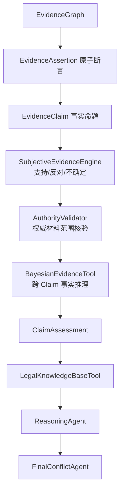

# 案件证据辅助研判系统项目介绍（v0.51）

## 1. 项目定位

本项目是一个面向案件材料审查场景的多 Agent 辅助研判演示系统。系统将笔录、图片证据、报告材料和静态法律库纳入统一流程，自动完成材料读取、事实提取、证据图谱构建、冲突提示、法律依据辅助检索、报告草拟、反方质询和边界复核。

系统定位是“案件材料辅助分析工具”，不替代办案人员、审核人员或司法人员的专业判断，不自动完成案件定性，不输出最终定罪、处罚或责任承担结论。

## 2. 当前版本核心变化

v0.51 已从简单的事实列表升级为兼容旧接口的轻量 EvidenceGraph，并新增 EvidenceClaim、ConfidenceEngine、LegalKnowledgeBaseTool、Domain Affinity 和 FinalConflictAgent。

系统仍保留 `Fact` 和 `.facts`，保证既有流程、测试和 CLI 不被破坏；同时新增：

- `EvidenceNode`：表示材料节点、事实节点等证据图节点；
- `EvidenceEdge`：表示材料与事实、事实与事实之间的关系边；
- `GraphStoreTool`：负责节点和边的增量写入；
- `RelationRuleTool`：负责通过规则生成基础关系边；
- `EvidenceGraph`：兼容 `CaseGraph`，同时包含 `facts`、`nodes`、`edges`、`claims`；
- `EvidenceClaim`：把多个节点聚合成同一事实命题，区分支持和反对节点；
- `ConfidenceEngine`：计算 claim 级综合置信度和解释理由；
- `LegalKnowledgeBaseTool`：支持 txt/md/jsonl 入库、切片、搜索、更新、软删除；
- `Domain Affinity`：为法律条文和案件事实打领域相关度；
- `FinalConflictAgent`：统一输出最终审查问题和补充侦查建议。

这意味着系统现在不只是“提取事实”，还会把事实放入证据图中，并记录来源关系、同人关系、同物关系、同事件关系、支持关系、冲突关系和人工复核提示。

## 3. 建设目标

系统主要服务以下目标：

1. 对分散案件材料进行统一接收和规范化处理。
2. 从笔录、图片、报告中提炼结构化事实。
3. 将事实增量写入 EvidenceGraph，保留来源和关系。
4. 自动提示不同证据之间的冲突、印证和需人工复核事项。
5. 根据人工确认的案件类型检索可能相关的静态法律依据。
6. 生成带有事实来源、冲突提示、法律依据和结论边界的辅助分析报告。
7. 通过 Judge Agent 和 Review Agent 降低过度推断和越界表达风险。

## 4. 业务痛点与系统能力

案件材料审查通常存在材料多、格式杂、事实表达不统一、冲突不易发现等问题。系统通过以下能力降低人工初筛压力：

- 多格式接入：支持笔录文本、Word、PDF，支持图片证据和报告类材料；
- 单材料独立分析：Text Agent 每次只处理一份笔录，图片按文件夹分组处理；
- 结构化事实提取：统一提炼人员、行为、时间、地点、对象、后果、置信度；
- 图谱化组织：将材料和事实写入 EvidenceGraph，形成可追溯的节点和边；
- 关系规则推断：自动生成 `source_of`、`same_person`、`same_object`、`same_event`、`contradicts`、`supports`、`needs_human_check` 等关系；
- 法律依据辅助匹配：从 `legal_library/laws.jsonl` 检索可能相关条文；
- 报告边界控制：拦截“已经构成犯罪”“应当处罚”等最终性法律判断。

## 5. 总体工作流

系统必须在人工确认案件类型后才进入正式执行阶段。`PlanningAgent` 只能建议案件类型，不能替代人工确认。

## 6. EvidenceGraph 的业务含义

当前 EvidenceGraph 是一个渐进式证据图，核心对象包括：

### 6.1 节点

- `material`：来源材料节点，例如某份笔录、某组图片、某份报告；
- `fact`：从材料中提炼出的事实节点；
- 预留类型：`report_opinion`、`person`、`object`、`event`、`legal_element`。

当前程序主要落地 `material` 和 `fact` 两类节点。

### 6.2 边

- `source_of`：材料生成某条事实；
- `same_person`：两条事实涉及同一人员；
- `same_object`：两条事实涉及同一对象或后果；
- `same_event`：人员、对象、时间、地点至少两个维度重合；
- `contradicts`：否认事实与正向事实存在冲突；
- `supports`：图片或报告事实与既有事实相互印证；
- `needs_human_check`：低置信度节点需要人工复核。

这些关系边的价值在于把“材料之间有什么关系”显式记录下来，便于后续冲突检测、报告生成和人工审查。

## 7. 置信度说明

当前置信度是演示系统中的规则/模型输出值，不是经过统计校准的真实概率。

主要来源包括：

- 文本规则 fallback 的普通事实固定为较高演示分；
- 否认类事实使用略低的固定演示分；
- LLM JSON 输出如果带 `confidence`，则读取该字段；
- Qwen 视觉输出如果带 `confidence`，则作为图片事实置信度；
- `EvidenceNode.confidence` 继承对应 `Fact.confidence`；
- `source_of` 边继承事实置信度；
- 规则关系边当前使用固定置信度，例如默认 `0.8`、冲突 `0.9`、人工复核提示 `1.0`。

因此，当前置信度应理解为“当前材料和规则对该事实或关系的支持强度提示”，而不是法律意义上的事实真伪概率。

## 8. 模块职责

### Evidence Intake

读取 `evidence_vault` 下的笔录、图片证据、报告材料，并生成统一 `Material`。

### Planning Agent

生成材料处理计划，统计笔录、图片组、报告材料数量，并给出案件类型建议。

### Text Agent

从单份笔录中提取结构化事实，保留否认类陈述，用于后续冲突检测。

### Pic Agent

处理现场照片、图片辨认、证据照片。Qwen 可用时调用视觉模型生成图片描述和 OCR 文本，再提炼事实。

### Report Image Agent

处理法医检测报告、监控研判报告等报告材料，支持图片、Word、PDF。

### EvidenceGraph Agent

把各 Agent 输出的 `Fact` 转为事实节点，创建材料节点和 `source_of` 边，并调用 `RelationRuleTool` 推断基础关系边。

### Conflict Agent

基于图中的兼容 `.facts` 检测冲突，例如否认打架与伤情报告冲突、否认拿取与图片显示拿走冲突。

### Legal Retrieval Tool

保留旧 `retrieve(payload)` 接口。内部优先调用 `LegalKnowledgeBaseTool`，如果知识库没有内容，则回退到 `legal_library/laws.jsonl`。

### LegalKnowledgeBaseTool

支持本地法律知识入库和检索，第一版支持 `.txt`、`.md`、旧 `laws.jsonl`，并提供文档更新、软删除、重新索引、`retrieve_for_case()`、`retrieve_for_review()`。

### FinalConflictAgent

基于 EvidenceGraph、EvidenceClaim 置信度、法律检索结果和报告文本输出 `ValidationIssue`，覆盖证据冲突、证据不足、争议未否定、法律依据缺失、报告越界、低置信图片等问题，并给出补充侦查建议。

### Reasoning Agent

基于 EvidenceGraph、冲突结果和法律依据生成辅助分析报告，不直接读取全部原始材料。

### Judge Agent

对报告进行反方质询，提示证据不足、冲突未回应、法律依据缺失和越界表达。

### Review Agent

对最终报告做边界复核，检查是否出现最终性法律判断、无来源事实或缺少法律依据。

## 9. 当前已实现能力

- 证据目录初始化和材料扫描；
- 笔录、报告 Word、报告 PDF、图片材料读取；
- Qwen 视觉图片描述和文字识别接入；
- DeepSeek 文本模型接入和规则 fallback；
- 单份笔录独立上下文处理；
- 图片按文件夹分组处理；
- `Fact` 结构化事实提取；
- `EvidenceNode` / `EvidenceEdge` 图结构；
- `GraphStoreTool` 增量写入节点和边；
- `RelationRuleTool` 基础关系建边；
- 兼容旧 `.facts` 的 Conflict、Reasoning、Review 流程；
- 静态法律库检索；
- Judge 反方质询；
- Review 输出边界复核；
- 完整 unittest 覆盖。

## 10. 系统边界

1. 不替代人工定性和法律判断。
2. 不验证材料真实性、合法性和完整性。
3. 当前法律检索支持本地 JSONL/Markdown/TXT 和关键词检索，但还不是完整向量 RAG。
4. 当前关系边主要由规则生成，复杂语义关系尚未交给 RelationAgent。
5. 当前置信度不是司法证明标准，只是辅助排序和复核提示。
6. 图片 OCR 和视觉理解依赖 Qwen API，本地不运行 OCR。

## 11. 后续演进方向

下一阶段建议按以下顺序推进：

1. 完善置信度系统，将初始置信度、来源质量、字段完整度、多证据印证和冲突扣分合并为综合支持强度；
2. 增强 EvidenceGraph，把 `person`、`object`、`event`、`legal_element` 节点逐步落地；
3. 增加 RelationAgent，用 JSON 输出复杂 `supports`、`contradicts`、`causal_hint`、`legal_element_support`；
4. 为 LegalKnowledgeBaseTool 增加向量检索和 rerank；
5. 将 FinalConflictAgent 更深接入报告修订；
6. 在报告中明确区分高支持事实、争议事实、低置信事实和需人工核实事项。

## 12. 总结

v0.51 已完成从“轻量证据图 demo”到“EvidenceGraph + EvidenceClaim + ConfidenceEngine + LegalKnowledgeBase + FinalConflictAgent”的第一阶段升级。系统仍保持简单、可运行、可测试，同时为后续向量 RAG、复杂关系推断和业务化界面预留了清晰演进路径。
## 附录：本次更新补充说明（v0.51）

本次更新是在原有项目介绍之后，对 v0.51 版本能力做补充说明。整体方向是把系统从“材料读取和报告草拟 demo”进一步升级为“证据审查辅助系统”。

### 一、更新后的项目定位

v0.51 版本更强调“审查”和“复核”。系统不只是把材料整理成报告，而是尝试回答三个问题：

1. 哪些事实有多份材料相互支持；
2. 哪些事实存在否认、冲突或证据不足；
3. 当前报告有没有超出材料和法律依据边界。

因此，系统的定位仍然不是替代办案人员定性、定责或作出处理决定，而是帮助工作人员更快找到复核重点。

### 二、本次新增能力

本次新增能力可以概括为五项：

- 证据图谱增强：把笔录、图片、报告中的事实变成节点和边；
- 事实主张聚合：把指向同一事件、对象或伤情的证据聚合为 `EvidenceClaim`；
- 置信度提示：为事实主张生成“多源较强印证”“明显存疑，需补强”等标签；
- 法律知识库：支持本地法律、规范、说明材料入库和检索；
- 最终冲突审查：集中提示证据冲突、证据不足、法律依据缺失和报告越界。

### 三、面向中国法律体系的扩展思路

v0.51 不再把能力限制在某一类案件。系统通过“案件类型 + 证据图谱 + 法律领域亲和度”的方式，为后续扩展到更多中国法律体系案件预留接口。

可逐步扩展的方向包括：

- 刑事案件中的故意伤害、盗窃、故意毁坏财物等；
- 治安管理处罚相关案件；
- 程序合规和证据审查场景；
- 法医鉴定、图像证据、辨认笔录等专门证据审查；
- 单位内部规范文件、地方性工作指引和常用法律依据库。

### 四、领导汇报口径

可以把本次升级概括为：系统从“能读材料、能写初稿”，升级为“能组织证据关系、能提示事实强弱、能辅助检索依据、能发现报告风险”。

这套机制的价值在于提高材料初筛效率，减少人工漏看矛盾点的概率，同时把最终判断权继续留在人手里。

### 五、使用边界

置信度只是辅助提示，不是证明标准。法律知识库检索只是参考，不是自动适用法律。系统输出的报告和审查问题必须由具备权限和专业能力的人员复核后使用。

## v0.56 更新说明：通用贝叶斯证据推理

### 一、本次更新定位

v0.56 在 v0.51 的 EvidenceGraph、EvidenceClaim、法律知识库和最终审查能力之上，新增案件中立的贝叶斯证据推理层。本次更新不改变系统“辅助研判、不替代人工法律判断”的定位，主要解决以下问题：

1. 同一事实存在支持、反对和未知材料时，如何区分证据不足与证据冲突；
2. 同源截图、派生报告和复制材料如何避免重复加权；
3. 经核验的法医鉴定等专业意见如何在限定范围内体现权威性；
4. 不同事实 Claim 之间的行为、结果、机制、时间和其他原因如何形成可审计的派生关系；
5. 如何让故意伤害、财物取得、公共秩序、公共安全等案件类型平等使用推理能力。

### 二、重构后的总体结构

贝叶斯网络被实现为确定性 Tool，而不是自由对话 Agent。它只接收已经聚合和评估的 Claim，不直接读取原始笔录、图片或报告全文。

### 三、五类同级模型

v0.56 使用注册表动态选择全部匹配模型，所有模型优先级均为 `0`：

| 模型 | 主要事实输入 | 派生事实 |
| --- | --- | --- |
| `conduct_result` | 行为、结果、机制、时间、其他原因 | `causation` |
| `property_taking` | 原占有、取得行为、占有转移、财物流向、替代解释 | `taking_supported` |
| `public_order` | 扰乱行为、公共场所、运行影响、持续或多人参与 | `order_disruption` |
| `public_safety` | 危险行为、危险物或状态、暴露范围、控制失效 | `public_danger` |
| `status_duty` | 资格文书、职责记录、行为记录、授权记录缺失 | `status_duty_facts_supported` |

故意伤害不再作为专用贝叶斯模块。它与其他“行为—结果—因果关系”场景一样使用 `conduct_result`，与其他案件族保持同等优先级。

### 四、证据边界保护

为防止模型把不相干证据拼接在一起，v0.56 增加以下约束：

- 按 event_id、锚点行为人和目标/对象建立独立 run；
- 不同事件、不同行为人和不同目标不得混入同一次推断；
- 缺少 event_id 时，不自动连接不同 Claim；
- 同一事件有多个行为人时分别运行；
- 未评估或完全未知的 Claim 被省略，不转换成否定值；
- 一份材料可以拆成多个原子谓词，并按具体谓词判断肯定或否定范围。

例如“鉴定已排除其他合理致伤原因，作用机制吻合”会同时形成“其他原因被否定”和“机制吻合”两个断言，不会把“排除其他原因”误当成存在其他原因。

### 五、权威材料的使用方式

有效法医鉴定、专业检验等材料不与普通陈述简单平均。只有在资格、真实性、程序、对象对应、方法、标准、适用范围和人工核验均通过后，才对专业范围内的 Claim 形成高强度锚定。

轻伤二级鉴定可以锚定损伤等级，但不能自动证明具体行为人、因果关系、主观目的、违法犯罪成立或处罚结论。

### 六、法律规则边界

v0.56 参考本地《中华人民共和国刑法（2023年修正）》和《中华人民共和国治安管理处罚法（2025年修订）》抽象案件事实族，但以下内容仍由确定性规则和人工法律审查处理：

- 年龄、数额、次数和期限；
- 法律身份、法定义务和授权效力；
- 抗辩、例外、管辖和时效；
- 治安违法与刑事犯罪边界；
- 法律适用、责任和处罚。

贝叶斯网络只推断事实要素，不生成有罪概率、处罚概率或最终法律结论。

### 七、参数与审计

当前模型参数标记为 `expert_prior_unvalidated`，属于未经真实历史数据校准的专家先验。每次运行记录模型 ID、版本、参数哈希、分组键、锚点 Claim、实际输入 Claim、软证据来源和派生结果。

真实数据仅用于离线统计和版本校准，不在单案运行时在线训练。项目提供：

- `docs/statistics/bayesian_parameter_collection_template.xlsx`
- `docs/statistics/BAYESIAN_PARAMETER_COLLECTION_GUIDE.md`
- `scripts/generate_bayesian_statistics_workbook.py`

### 八、v0.56 的使用边界

贝叶斯派生值是事实支持指数，不是司法证明概率。系统宁可因缺少事件关联而不推断，也不会自动拼接无法确认属于同一事件、主体或目标的 Claim。所有派生事实、权威锚定和补证建议仍需回到原始材料中人工核验。
